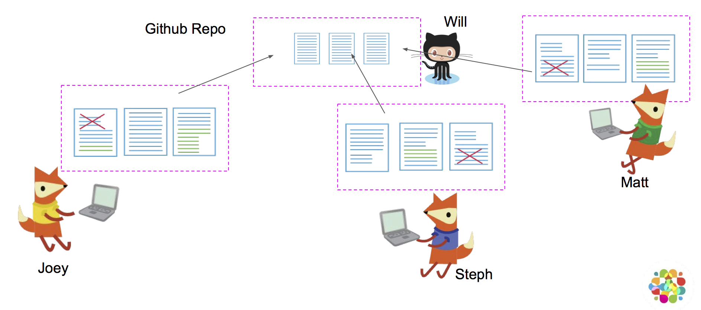
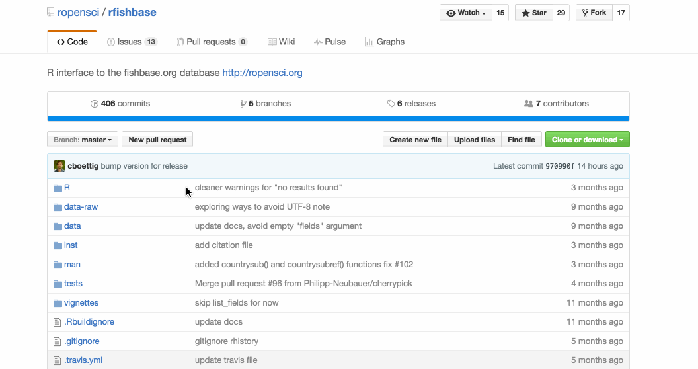
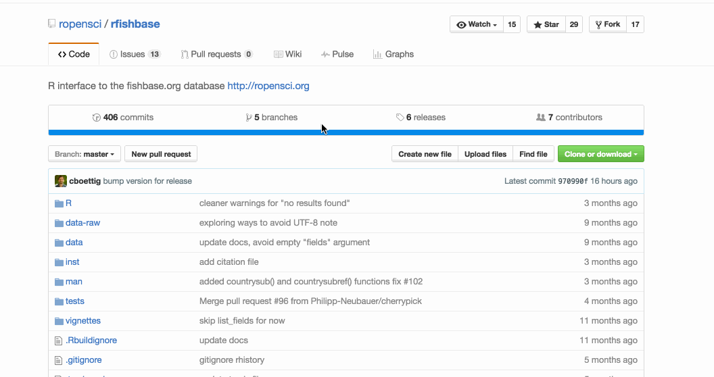
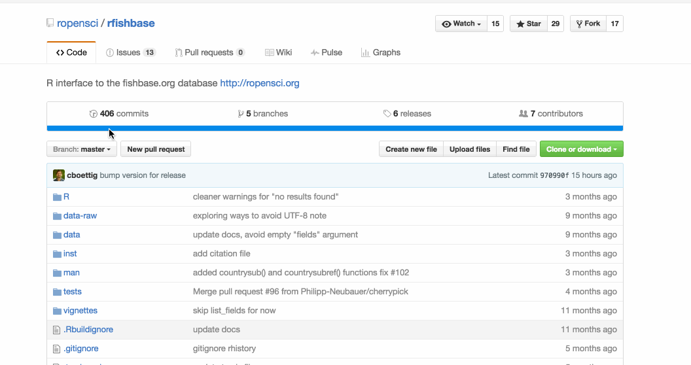
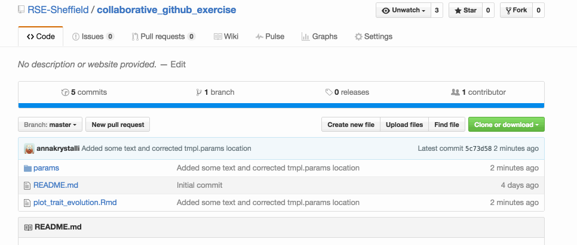
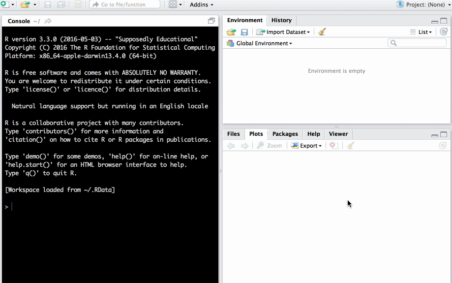
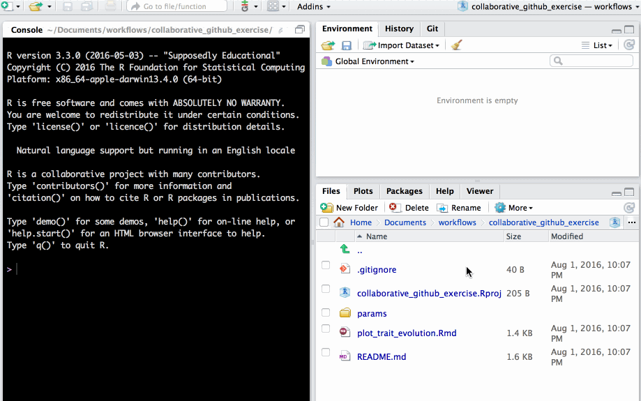
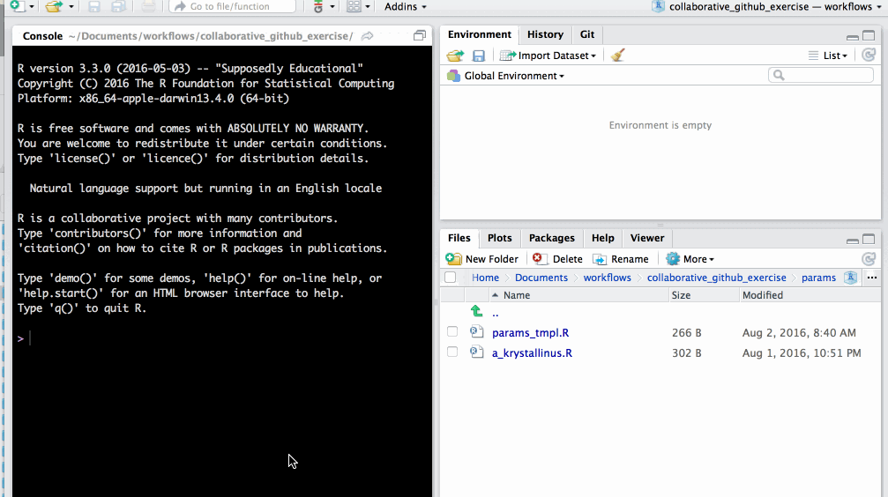

## **Collaborative `github`**

***Anna Krystalli & Mike Croucher***

 
 
 

#### ISBE 2016
##### ***'Challenge for our generation: open, reproducible and reliable science'***

<small>3rd August 2016, University of Exeter</small>

## 

### **github for collaboration (in RStudio)**

## github & science

> The need for a logical way to organize and control revisions has existed for almost as long as writing has existed, but revision control became much more important, and complicated, when the era of computing began.

## version control

- **long been used to maintain code repositories in the software industry**

     > especially in open source software
    
- **science increasingly computational**

    > demands for increased openness

 

## {data-background-iframe="http://billmills.github.io/scienceXpython/"}

 
 

## modern science workflows

***can be overwhelming***

## succesful modern science workflows

***can be extremely powerful***

## github for science

> ideal for managing the full suite of research outputs such as datasets, statistical code, figures, lab notes, and manuscripts.

## Rstudio for r users 

## invest in next generation science skills

 

- ...and super-charge your teams!

- ...or get left behind

# empowering collaboration

## repos

centralising information e.g. [**ROpenSci / rfishbase**](https://github.com/ropensci/rfishbase)

## issues

project management

## commits 

project tracking

# fostering reproducibility

## commits

traceability

## entire process of project evolution reproducible

# demo

## start with a repo

<https://github.com/RSE-Sheffield/collaborative_github_exercise>

## fork repo

- make your **own copy of the repository** on github
        - fork are linked and traceable
        
- **clone it:** copy repo link
    

## 

## create new project

- use repo link to checkout from github
- manage process through **projects** in **Rstudio**

## 

## make a change

- open **`params/params_tmpl.R`**
- save as new `.R` script in **`params/`** folder. Use species name to name new file
- edit file with parameters of your choice

##

## commit

- make small commits often
- write informative messages

##

## push

- push changes up to github

##

## create pull request

- create request to merge fork to master

##

## check merge

- check original repo to see your merged changes

# exercise

## your mission

- fork the repo
- link it up to an Rstudio project
- create a new file params `.R` script. Name it using your initials (use 3 to be safe)
- enter parameters for your species.

## resources

[link to presentation handout](https://github.com/annakrystalli/ISBE_symposium/blob/master/Collaborative_github_test/collab_gh_into.md)

[Karthik Ram's article:](http://scfbm.biomedcentral.com/articles/10.1186/1751-0473-8-7) *'Git can facilitate greater reproducibility and increased transparency in science'*

[Getting started with GitHub](http://jennybc.github.io/2014-05-12-ubc/ubc-r/session2.4_github.html) from materials for a [software carpentry course at UBC](http://jennybc.github.io/2014-05-12-ubc/)

[Slides for lecture](http://kbroman.org/Tools4RR/assets/lectures/04_git_withnotes.pdf)  Karl Broman gave on git/github, with notes

[joeyklee's friendly github intro](https://github.com/joeyklee/friendly-github-intro). *Mozilla Science Lab* workshop

