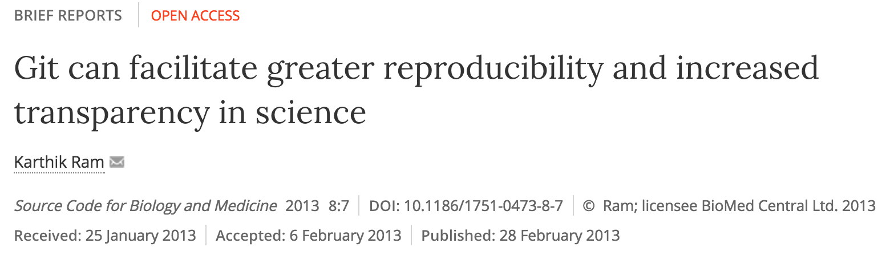

# intro

## github for collaboration (in RStudio)

## github & science

> The need for a logical way to organize and control revisions has existed for almost as long as writing has existed, but revision control became much more important, and complicated, when the era of computing began.

## version control

- long been used to maintain code repositories in the software industry.
    - especially in open source software.
    
- science increasingly computational.
    - demands for increased openness.

 

## {data-background-iframe="http://billmills.github.io/scienceXpython/"}

 
 

http://billmills.github.io/scienceXpython/

## modern science workflows

***can be overwhelming***

## succesful modern science workflows

***can be extremely powerful***

## github for science

> ideal for managing the full suite of research outputs such as datasets, statistical code, figures, lab notes, and manuscripts.

## Rstudio for r users 

## invest in next generation science skills

...or get left behind

# empowering collaboration

## repos

centralising information e.g. [**ROpenSci / rfishbase**](https://github.com/ropensci/rfishbase)

## issues

project management

## commits 

project tracking

# fostering reproducibility

## commits

traceability

## entire process of project evolution reproducible

# demo

## start with a repo

## fork it

- make your **own copy of the repository** on github
- fork are linked and traceable

## 

## clone: copy repo link

- use link to pull down a local copy
- manage process through **projects** in **Rstudio**

## create new project

- checkout from github
- defaults to gthub repo name 

## 

## make a change

- open **`params_tmpl.R`**
- save as new `.R` in **`params/`** folder.

## commit

- make small commits often
- write informative messages

##

## push

- push changes up to github

## create pull request

- create request to merge fork to master

# exercise

## your mission

- fork the repo
- link it up to an Rstudio project
- create a new file params `.R` script. Name it using your initials (use 3 to be safe)
- enter parameters for your species.

ß

$(function () {
    // on page load  replace all src URLs

    $('.animated-gif').each(function (i, e) {
        disableGif(e)
    });
});
Reveal.addEventListener('slidechanged', initAnimatedGifs);
Reveal.addEventListener('ready', initAnimatedGifs);

function initAnimatedGifs(event) {
    $('.animated-gif', event.currentSlide).each(function (i, e) {
        enableGif(e)
    });

    if (event.previousSlide)
        $('.animated-gif', event.previousSlide).each(function (i, e) {
            disableGif(e)

        });
}

function enableGif(e) {
    var src = $(e).attr("src")
    $(e).attr('src', src.replace('-image.gif', '.gif'));

}
function disableGif(e) {
    var src = $(e).attr("src")
    $(e).attr('src', src.replace('.gif', '-image.gif'));

}