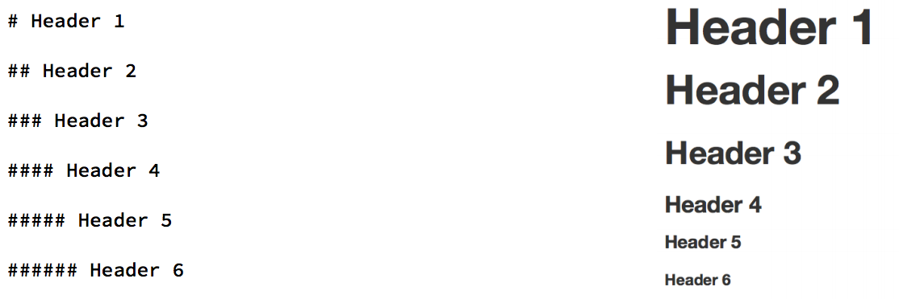
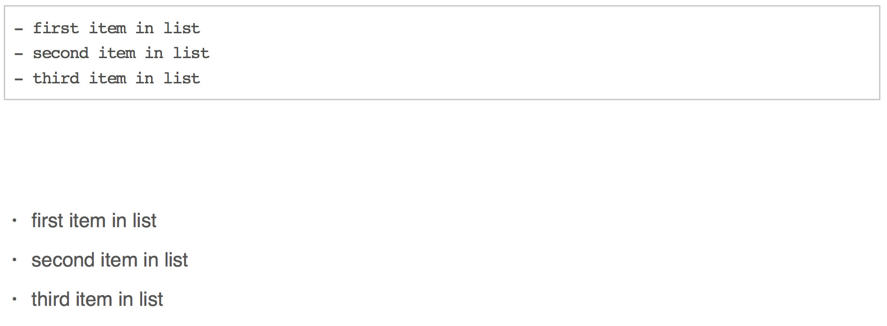
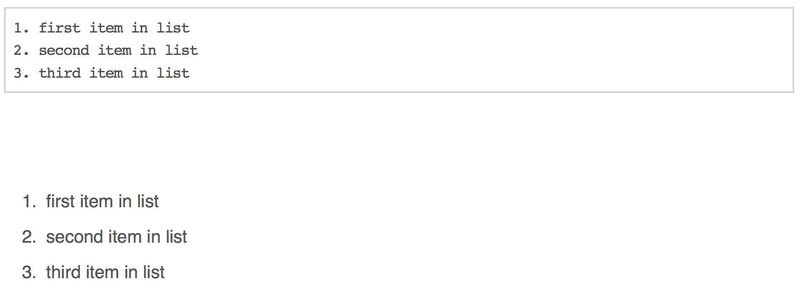

# intro

## markdown `.md`

> stripped down **`html`**

<br>

-  intended to be as **easy-to-read** and **easy-to-write** as possible.
-  intended for one purpose: to be used as a **format for writing for the web.**
-  syntax is very small, corresponding only to a very small subset of HTML tags.

## focus on communicating & disseminating

- formatting handled automatically
- clean and legible across platforms and outputs

## rmarkdown `.Rmd`

#### enables literate programming 

single document to integrate data analysis with textual representations, **linking data, code, and text**

<br>

### `rmarkdown` integrates:

–  **a documentantion language (`.md`)**

with:

–  **a programming language (`R`)**


## outputs


## it's already everywhere!

- [github READMEs; eg rOpensci taxise README](https://github.com/ropensci/taxize)

- [stackoverflow: eg plot coordinates on a map](http://stackoverflow.com/questions/23130604/r-plot-coordinates-on-map)
    
- [github.io websites: eg Andy South's blog](http://andysouth.github.io/blog-setup/)

# `Rmarkdown` & reproducibility

## {data-background="http://49.media.tumblr.com/7daeff1d410bf5dce4c0b30c40b44f77/tumblr_n9dy9olLJe1qav3uso2_500.gif"}

> <span style="color:white"> Computational science has led to exciting new developments:</span>

-  <span style="color:white"><b> Technology is increasing data collection throughput; data are more complex and highdimensional</b></span>
-  <span style="color:white"><b> Existing databases can be merged to become bigger databases</b></span>
-  <span style="color:white"><b> Computing power allows more sophisticated analyses, even on "small" data</b></span>
-  <span style="color:white"><b> For every field "X" there is a "Computational X"</b></span>


## {data-background="https://raw.githubusercontent.com/BillMills/scienceXpython/gh-pages/img/debugging.gif"}

<span style="color:white"><b>Increasing computational complexity of analyses:</b></span>

> <span style="color:white">has exposed limitations in our ability to evaluate published findings.</span>


- <span style="color:white"><b>Even basic analyses difficult to describe</b></span>

- <span style="color:white"><b>Errors more easily introduced into long analysis pipelines</b></span>

- <span style="color:white"><b>Knowledge transfer is inhibited</b></span>

- <span style="color:white"><b>Results are difficult to replicate or reproduce</b></span>

- <span style="color:white"><b>Complicated analyses cannot be trusted</b></span>


## calls for reproducibility

<br>

>  Reproducibility has the potential to serve as a minimum standard for judging scientific claims when full independent replication of a study is not possible.

## 

- fully scripted analyses
- make code and data available


## reproducibility limitations

- top down
- downstream (post publication)
- ultimately does not address the key question: 

    > can we trust these results?


## evidence based science

evdence needs:

- **documenting**
- **linking**
- **communicating**

<br>

`rmarkdown` can integrate **tools, processes** and **outputs** into **evidence streams**

> at all stages of scientific process

## simple tools: 
### low hanging fruit

- begin at the start of the process
- document & interlink evidence streams
- explore and communicate!

> empower your code and data


## examples

### [report](file:///Users/Anna/Google%20Drive/bird%20trait%20networks/outputs/Reports/Results/CorNetwork_plots.html)

### [code documentation](http://rpubs.com/annakrystalli/123196)

### [method collation](file:///Users/Anna/Google%20Drive/bird%20trait%20networks/outputs/Reports/workflow%20documentation/Hierarchical%20Networks.htm)

### [interactive documents](http://rpubs.com/annakrystalli/161760)

### [presentations](http://rpubs.com/annakrystalli/133391)


# md basics

## text

        normal text
normal text

        *italic text*
*italic text*

        **bold text**
**bold text**

        **bold italic text**
***bold italic text***

        superscript^2^
superscript^2^

        ~~strikethrough~~
~~strikethrough~~ 


## headers



## unordered lists



## ordered lists



## quotes & code

    > this text will be quoted
   
 > this text will be quoted
 
    `this text will appear as code` inline

`this text will appear as code` inline


```{r}
a <- 10
```

        the value of parameter *a* is `r a`

the value of parameter *a* is `r a`

## text formatting

## images

        
        
        
        


##

### resize images

        


## basic tables

    Table Header  | Second Header
    ------------- | -------------
    Cell 1        | Cell 2
    Cell 3        | Cell 4 

Table Header  | Second Header
------------- | -------------
Cell 1        | Cell 2
Cell 3        | Cell 4 

[online table to .md converter]()

## links

    [Download R](http://www.r-project.org/)    
    [RStudio](http://www.rstudio.com/)
    

[Download R](http://www.r-project.org/)    

[RStudio](http://www.rstudio.com/)

## `.md` resources

[offical markdown documentation](http://daringfireball.net/projects/markdown/basics)

[Rmarkdown documentation](http://rmarkdown.rstudio.com/)

[Rstudio Rmarkdown cheatsheet](https://www.rstudio.com/wp-content/uploads/2015/02/rmarkdown-cheatsheet.pdf)


[gtihub .md basics](https://help.github.com/articles/basic-writing-and-formatting-syntax/)

    
[github.io websites: eg Andy South's blog](http://andysouth.github.io/blog-setup/)

[Reproducible Research](https://www.coursera.org/learn/reproducible-research) coursera MOOC


# chunks

##

R code chunks can be used as a means render R output into documents or to simply display code for illustration


## options


for more details see <http://yihui.name/knitr/>

# extras

## `knitr::kable()` tables

```{r, warning=FALSE, message=FALSE}
require(knitr)
data(airquality)
kable(airquality, caption = "New York Air Quality Measurements")
```

## `DT::kable()` tables
```{r, warning=FALSE, message=FALSE}
require(DT)
data(airquality)
datatable(airquality, caption = "New York Air Quality Measurements")
```

## plotly

```{r, warning=FALSE, message=FALSE, eval=FALSE}
library(plotly)

set.seed(100)
d <- diamonds[sample(nrow(diamonds), 1000), ]

p <- ggplot(data = d, aes(x = carat, y = price)) +
  geom_point(aes(text = paste("Clarity:", clarity)), size = 1) +
  geom_smooth(aes(colour = cut, fill = cut)) + facet_wrap(~ cut)

ggplotly(p)

```

## 

```{r, warning=FALSE, message=FALSE, echo=FALSE, fig.height=6.8, fig.width=8.3}
library(plotly)

set.seed(100)
d <- diamonds[sample(nrow(diamonds), 1000), ]

p <- ggplot(data = d, aes(x = carat, y = price)) +
  geom_point(aes(text = paste("Clarity:", clarity)), size = 1) +
  geom_smooth(aes(colour = cut, fill = cut)) + facet_wrap(~ cut)

ggplotly(p)

```

## shiny


## outputs


## demo


# Exercise

## your mission

> *create your first `.Rmd`!*

- get data from OSF
- show us some data in a table
- plot some data
- fit a model
- write a bit about what you did

see my example:


