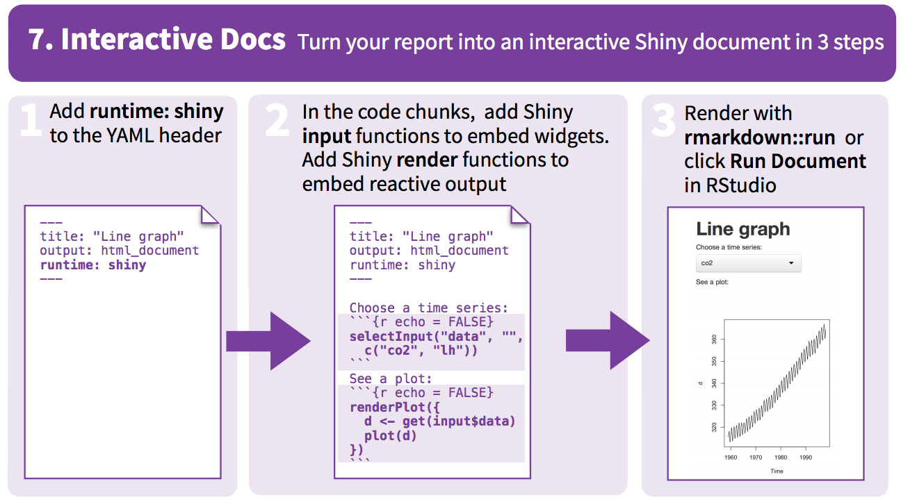

# introduction to r markdown
Anna Krystalli & Mike Croucher  
3 August 2016  

# intro

## markdown `.md`

> stripped down **`html`**

<br>

-  intended to be as **easy-to-read** and **easy-to-write** as possible.
-  intended for one purpose: to be used as a **format for writing for the web.**
-  syntax is very small, corresponding only to a very small subset of HTML tags.

## focus on communicating & disseminating

- formatting handled automatically
- clean and legible across platforms and outputs

## rmarkdown `.Rmd`

#### enables literate programming 

single document to integrate data analysis with textual representations, **linking data, code, and text**

<br>

### `rmarkdown` integrates:

–  **a documentantion language (`.md`)**

with:

–  **a programming language (`R`)**


## outputs


## it's already everywhere!

- [github READMEs; eg rOpensci taxise README](https://github.com/ropensci/taxize)

- [stackoverflow: eg plot coordinates on a map](http://stackoverflow.com/questions/23130604/r-plot-coordinates-on-map)
    
- [github.io websites: eg Andy South's blog](http://andysouth.github.io/blog-setup/)

# `Rmarkdown` & reproducibility

## {data-background="http://49.media.tumblr.com/7daeff1d410bf5dce4c0b30c40b44f77/tumblr_n9dy9olLJe1qav3uso2_500.gif"}

> <span style="color:white"> Computational science has led to exciting new developments:</span>

-  <span style="color:white"><b> Technology is increasing data collection throughput; data are more complex and highdimensional</b></span>
-  <span style="color:white"><b> Existing databases can be merged to become bigger databases</b></span>
-  <span style="color:white"><b> Computing power allows more sophisticated analyses, even on "small" data</b></span>
-  <span style="color:white"><b> For every field "X" there is a "Computational X"</b></span>


## {data-background="https://raw.githubusercontent.com/BillMills/scienceXpython/gh-pages/img/debugging.gif"}

<span style="color:white"><b>Increasing computational complexity of analyses:</b></span>

> <span style="color:white">has exposed limitations in our ability to evaluate published findings.</span>


- <span style="color:white"><b>Even basic analyses difficult to describe</b></span>

- <span style="color:white"><b>Errors more easily introduced into long analysis pipelines</b></span>

- <span style="color:white"><b>Knowledge transfer is inhibited</b></span>

- <span style="color:white"><b>Results are difficult to replicate or reproduce</b></span>

- <span style="color:white"><b>Complicated analyses cannot be trusted</b></span>


## calls for reproducibility

<br>

>  Reproducibility has the potential to serve as a minimum standard for judging scientific claims when full independent replication of a study is not possible.

## 

- fully scripted analyses
- make code and data available


## reproducibility limitations

- top down
- downstream (post publication)
- ultimately does not address the key question: 

    > can we trust these results?


## evidence based science

evdence needs:

- **documenting**
- **linking**
- **communicating**

<br>

`rmarkdown` can integrate **tools, processes** and **outputs** into **evidence streams**

> at all stages of scientific process

## simple tools: 
### low hanging fruit

- begin at the start of the process
- document & interlink evidence streams
- explore and communicate!

> empower your code and data


## examples

### [report](file:///Users/Anna/Google%20Drive/bird%20trait%20networks/outputs/Reports/Results/CorNetwork_plots.html)

### [code documentation](http://rpubs.com/annakrystalli/123196)

### [method collation](file:///Users/Anna/Google%20Drive/bird%20trait%20networks/outputs/Reports/workflow%20documentation/Hierarchical%20Networks.htm)

### [interactive documents](http://rpubs.com/annakrystalli/161760)

### [presentations](http://rpubs.com/annakrystalli/133391)


# md basics

## text

        normal text
normal text

        *italic text*
*italic text*

        **bold text**
**bold text**

        **bold italic text**
***bold italic text***

        superscript^2^
superscript^2^

        ~~strikethrough~~
~~strikethrough~~ 


## headers


## unordered lists


## ordered lists


## quotes & code

    > this text will be quoted
   
 > this text will be quoted
 
    `this text will appear as code` inline

`this text will appear as code` inline


```r
a <- 10
```

        the value of parameter *a* is 10

the value of parameter *a* is 10

## text formatting

## images

        
        
        
        


##

### resize images

        


## basic tables

    Table Header  | Second Header
    ------------- | -------------
    Cell 1        | Cell 2
    Cell 3        | Cell 4 

Table Header  | Second Header
------------- | -------------
Cell 1        | Cell 2
Cell 3        | Cell 4 

[online table to .md converter]()

## links

    [Download R](http://www.r-project.org/)    
    [RStudio](http://www.rstudio.com/)
    

[Download R](http://www.r-project.org/)    

[RStudio](http://www.rstudio.com/)

## `.md` resources

[offical markdown documentation](http://daringfireball.net/projects/markdown/basics)

[Rmarkdown documentation](http://rmarkdown.rstudio.com/)

[Rstudio Rmarkdown cheatsheet](https://www.rstudio.com/wp-content/uploads/2015/02/rmarkdown-cheatsheet.pdf)


[gtihub .md basics](https://help.github.com/articles/basic-writing-and-formatting-syntax/)

    
[github.io websites: eg Andy South's blog](http://andysouth.github.io/blog-setup/)

[Reproducible Research](https://www.coursera.org/learn/reproducible-research) coursera MOOC


# chunks

##

R code chunks can be used as a means render R output into documents or to simply display code for illustration


## options


for more details see <http://yihui.name/knitr/>

# extras

## `knitr::kable()` tables


```r
require(knitr)
data(airquality)
kable(airquality, caption = "New York Air Quality Measurements")
```


Table: New York Air Quality Measurements

 Ozone   Solar.R   Wind   Temp   Month   Day
------  --------  -----  -----  ------  ----
    41       190    7.4     67       5     1
    36       118    8.0     72       5     2
    12       149   12.6     74       5     3
    18       313   11.5     62       5     4
    NA        NA   14.3     56       5     5
    28        NA   14.9     66       5     6
    23       299    8.6     65       5     7
    19        99   13.8     59       5     8
     8        19   20.1     61       5     9
    NA       194    8.6     69       5    10
     7        NA    6.9     74       5    11
    16       256    9.7     69       5    12
    11       290    9.2     66       5    13
    14       274   10.9     68       5    14
    18        65   13.2     58       5    15
    14       334   11.5     64       5    16
    34       307   12.0     66       5    17
     6        78   18.4     57       5    18
    30       322   11.5     68       5    19
    11        44    9.7     62       5    20
     1         8    9.7     59       5    21
    11       320   16.6     73       5    22
     4        25    9.7     61       5    23
    32        92   12.0     61       5    24
    NA        66   16.6     57       5    25
    NA       266   14.9     58       5    26
    NA        NA    8.0     57       5    27
    23        13   12.0     67       5    28
    45       252   14.9     81       5    29
   115       223    5.7     79       5    30
    37       279    7.4     76       5    31
    NA       286    8.6     78       6     1
    NA       287    9.7     74       6     2
    NA       242   16.1     67       6     3
    NA       186    9.2     84       6     4
    NA       220    8.6     85       6     5
    NA       264   14.3     79       6     6
    29       127    9.7     82       6     7
    NA       273    6.9     87       6     8
    71       291   13.8     90       6     9
    39       323   11.5     87       6    10
    NA       259   10.9     93       6    11
    NA       250    9.2     92       6    12
    23       148    8.0     82       6    13
    NA       332   13.8     80       6    14
    NA       322   11.5     79       6    15
    21       191   14.9     77       6    16
    37       284   20.7     72       6    17
    20        37    9.2     65       6    18
    12       120   11.5     73       6    19
    13       137   10.3     76       6    20
    NA       150    6.3     77       6    21
    NA        59    1.7     76       6    22
    NA        91    4.6     76       6    23
    NA       250    6.3     76       6    24
    NA       135    8.0     75       6    25
    NA       127    8.0     78       6    26
    NA        47   10.3     73       6    27
    NA        98   11.5     80       6    28
    NA        31   14.9     77       6    29
    NA       138    8.0     83       6    30
   135       269    4.1     84       7     1
    49       248    9.2     85       7     2
    32       236    9.2     81       7     3
    NA       101   10.9     84       7     4
    64       175    4.6     83       7     5
    40       314   10.9     83       7     6
    77       276    5.1     88       7     7
    97       267    6.3     92       7     8
    97       272    5.7     92       7     9
    85       175    7.4     89       7    10
    NA       139    8.6     82       7    11
    10       264   14.3     73       7    12
    27       175   14.9     81       7    13
    NA       291   14.9     91       7    14
     7        48   14.3     80       7    15
    48       260    6.9     81       7    16
    35       274   10.3     82       7    17
    61       285    6.3     84       7    18
    79       187    5.1     87       7    19
    63       220   11.5     85       7    20
    16         7    6.9     74       7    21
    NA       258    9.7     81       7    22
    NA       295   11.5     82       7    23
    80       294    8.6     86       7    24
   108       223    8.0     85       7    25
    20        81    8.6     82       7    26
    52        82   12.0     86       7    27
    82       213    7.4     88       7    28
    50       275    7.4     86       7    29
    64       253    7.4     83       7    30
    59       254    9.2     81       7    31
    39        83    6.9     81       8     1
     9        24   13.8     81       8     2
    16        77    7.4     82       8     3
    78        NA    6.9     86       8     4
    35        NA    7.4     85       8     5
    66        NA    4.6     87       8     6
   122       255    4.0     89       8     7
    89       229   10.3     90       8     8
   110       207    8.0     90       8     9
    NA       222    8.6     92       8    10
    NA       137   11.5     86       8    11
    44       192   11.5     86       8    12
    28       273   11.5     82       8    13
    65       157    9.7     80       8    14
    NA        64   11.5     79       8    15
    22        71   10.3     77       8    16
    59        51    6.3     79       8    17
    23       115    7.4     76       8    18
    31       244   10.9     78       8    19
    44       190   10.3     78       8    20
    21       259   15.5     77       8    21
     9        36   14.3     72       8    22
    NA       255   12.6     75       8    23
    45       212    9.7     79       8    24
   168       238    3.4     81       8    25
    73       215    8.0     86       8    26
    NA       153    5.7     88       8    27
    76       203    9.7     97       8    28
   118       225    2.3     94       8    29
    84       237    6.3     96       8    30
    85       188    6.3     94       8    31
    96       167    6.9     91       9     1
    78       197    5.1     92       9     2
    73       183    2.8     93       9     3
    91       189    4.6     93       9     4
    47        95    7.4     87       9     5
    32        92   15.5     84       9     6
    20       252   10.9     80       9     7
    23       220   10.3     78       9     8
    21       230   10.9     75       9     9
    24       259    9.7     73       9    10
    44       236   14.9     81       9    11
    21       259   15.5     76       9    12
    28       238    6.3     77       9    13
     9        24   10.9     71       9    14
    13       112   11.5     71       9    15
    46       237    6.9     78       9    16
    18       224   13.8     67       9    17
    13        27   10.3     76       9    18
    24       238   10.3     68       9    19
    16       201    8.0     82       9    20
    13       238   12.6     64       9    21
    23        14    9.2     71       9    22
    36       139   10.3     81       9    23
     7        49   10.3     69       9    24
    14        20   16.6     63       9    25
    30       193    6.9     70       9    26
    NA       145   13.2     77       9    27
    14       191   14.3     75       9    28
    18       131    8.0     76       9    29
    20       223   11.5     68       9    30

## `DT::kable()` tables

```r
require(DT)
data(airquality)
datatable(airquality, caption = "New York Air Quality Measurements")
```

<!--html_preserve--><div id="htmlwidget-5908" style="width:100%;height:auto;" class="datatables html-widget"></div>
<script type="application/json" data-for="htmlwidget-5908">{"x":{"data":[["1","2","3","4","5","6","7","8","9","10","11","12","13","14","15","16","17","18","19","20","21","22","23","24","25","26","27","28","29","30","31","32","33","34","35","36","37","38","39","40","41","42","43","44","45","46","47","48","49","50","51","52","53","54","55","56","57","58","59","60","61","62","63","64","65","66","67","68","69","70","71","72","73","74","75","76","77","78","79","80","81","82","83","84","85","86","87","88","89","90","91","92","93","94","95","96","97","98","99","100","101","102","103","104","105","106","107","108","109","110","111","112","113","114","115","116","117","118","119","120","121","122","123","124","125","126","127","128","129","130","131","132","133","134","135","136","137","138","139","140","141","142","143","144","145","146","147","148","149","150","151","152","153"],[41,36,12,18,null,28,23,19,8,null,7,16,11,14,18,14,34,6,30,11,1,11,4,32,null,null,null,23,45,115,37,null,null,null,null,null,null,29,null,71,39,null,null,23,null,null,21,37,20,12,13,null,null,null,null,null,null,null,null,null,null,135,49,32,null,64,40,77,97,97,85,null,10,27,null,7,48,35,61,79,63,16,null,null,80,108,20,52,82,50,64,59,39,9,16,78,35,66,122,89,110,null,null,44,28,65,null,22,59,23,31,44,21,9,null,45,168,73,null,76,118,84,85,96,78,73,91,47,32,20,23,21,24,44,21,28,9,13,46,18,13,24,16,13,23,36,7,14,30,null,14,18,20],[190,118,149,313,null,null,299,99,19,194,null,256,290,274,65,334,307,78,322,44,8,320,25,92,66,266,null,13,252,223,279,286,287,242,186,220,264,127,273,291,323,259,250,148,332,322,191,284,37,120,137,150,59,91,250,135,127,47,98,31,138,269,248,236,101,175,314,276,267,272,175,139,264,175,291,48,260,274,285,187,220,7,258,295,294,223,81,82,213,275,253,254,83,24,77,null,null,null,255,229,207,222,137,192,273,157,64,71,51,115,244,190,259,36,255,212,238,215,153,203,225,237,188,167,197,183,189,95,92,252,220,230,259,236,259,238,24,112,237,224,27,238,201,238,14,139,49,20,193,145,191,131,223],[7.4,8,12.6,11.5,14.3,14.9,8.6,13.8,20.1,8.6,6.9,9.7,9.2,10.9,13.2,11.5,12,18.4,11.5,9.7,9.7,16.6,9.7,12,16.6,14.9,8,12,14.9,5.7,7.4,8.6,9.7,16.1,9.2,8.6,14.3,9.7,6.9,13.8,11.5,10.9,9.2,8,13.8,11.5,14.9,20.7,9.2,11.5,10.3,6.3,1.7,4.6,6.3,8,8,10.3,11.5,14.9,8,4.1,9.2,9.2,10.9,4.6,10.9,5.1,6.3,5.7,7.4,8.6,14.3,14.9,14.9,14.3,6.9,10.3,6.3,5.1,11.5,6.9,9.7,11.5,8.6,8,8.6,12,7.4,7.4,7.4,9.2,6.9,13.8,7.4,6.9,7.4,4.6,4,10.3,8,8.6,11.5,11.5,11.5,9.7,11.5,10.3,6.3,7.4,10.9,10.3,15.5,14.3,12.6,9.7,3.4,8,5.7,9.7,2.3,6.3,6.3,6.9,5.1,2.8,4.6,7.4,15.5,10.9,10.3,10.9,9.7,14.9,15.5,6.3,10.9,11.5,6.9,13.8,10.3,10.3,8,12.6,9.2,10.3,10.3,16.6,6.9,13.2,14.3,8,11.5],[67,72,74,62,56,66,65,59,61,69,74,69,66,68,58,64,66,57,68,62,59,73,61,61,57,58,57,67,81,79,76,78,74,67,84,85,79,82,87,90,87,93,92,82,80,79,77,72,65,73,76,77,76,76,76,75,78,73,80,77,83,84,85,81,84,83,83,88,92,92,89,82,73,81,91,80,81,82,84,87,85,74,81,82,86,85,82,86,88,86,83,81,81,81,82,86,85,87,89,90,90,92,86,86,82,80,79,77,79,76,78,78,77,72,75,79,81,86,88,97,94,96,94,91,92,93,93,87,84,80,78,75,73,81,76,77,71,71,78,67,76,68,82,64,71,81,69,63,70,77,75,76,68],[5,5,5,5,5,5,5,5,5,5,5,5,5,5,5,5,5,5,5,5,5,5,5,5,5,5,5,5,5,5,5,6,6,6,6,6,6,6,6,6,6,6,6,6,6,6,6,6,6,6,6,6,6,6,6,6,6,6,6,6,6,7,7,7,7,7,7,7,7,7,7,7,7,7,7,7,7,7,7,7,7,7,7,7,7,7,7,7,7,7,7,7,8,8,8,8,8,8,8,8,8,8,8,8,8,8,8,8,8,8,8,8,8,8,8,8,8,8,8,8,8,8,8,9,9,9,9,9,9,9,9,9,9,9,9,9,9,9,9,9,9,9,9,9,9,9,9,9,9,9,9,9,9],[1,2,3,4,5,6,7,8,9,10,11,12,13,14,15,16,17,18,19,20,21,22,23,24,25,26,27,28,29,30,31,1,2,3,4,5,6,7,8,9,10,11,12,13,14,15,16,17,18,19,20,21,22,23,24,25,26,27,28,29,30,1,2,3,4,5,6,7,8,9,10,11,12,13,14,15,16,17,18,19,20,21,22,23,24,25,26,27,28,29,30,31,1,2,3,4,5,6,7,8,9,10,11,12,13,14,15,16,17,18,19,20,21,22,23,24,25,26,27,28,29,30,31,1,2,3,4,5,6,7,8,9,10,11,12,13,14,15,16,17,18,19,20,21,22,23,24,25,26,27,28,29,30]],"container":"<table class=\"display\">\n  <thead>\n    <tr>\n      <th> \u003c/th>\n      <th>Ozone\u003c/th>\n      <th>Solar.R\u003c/th>\n      <th>Wind\u003c/th>\n      <th>Temp\u003c/th>\n      <th>Month\u003c/th>\n      <th>Day\u003c/th>\n    \u003c/tr>\n  \u003c/thead>\n\u003c/table>","options":{"columnDefs":[{"className":"dt-right","targets":[1,2,3,4,5,6]},{"orderable":false,"targets":0}],"order":[],"autoWidth":false,"orderClasses":false},"callback":null,"caption":"<caption>New York Air Quality Measurements\u003c/caption>","filter":"none"},"evals":[],"jsHooks":[]}</script><!--/html_preserve-->

## plotly


```r
library(plotly)

set.seed(100)
d <- diamonds[sample(nrow(diamonds), 1000), ]

p <- ggplot(data = d, aes(x = carat, y = price)) +
  geom_point(aes(text = paste("Clarity:", clarity)), size = 1) +
  geom_smooth(aes(colour = cut, fill = cut)) + facet_wrap(~ cut)

ggplotly(p)
```

## 

<!--html_preserve--><div id="htmlwidget-741" style="width:796.8px;height:652.8px;" class="plotly html-widget"></div>
<script type="application/json" data-for="htmlwidget-741">{"x":{"data":[{"x":[2.1,1.36,1.52,1.5,0.9,0.7,0.96,0.5,0.71,2,0.33,0.5,0.36,1.5,0.9,1.07,0.9,1.01,2.03,0.72,0.41,0.43,0.9,1.01,0.92,0.5,1.04,0.9,0.91,0.67,2.01,1.01,0.9,0.7,0.91,1,0.7,1,0.85,1.47],"y":[15827,4158,7186,7098,3105,2339,4849,1332,2368,11600,922,1280,810,4704,4229,4496,3288,6041,6002,2306,1089,1107,2930,4181,3033,701,5633,3992,4107,1642,15888,5950,3276,1697,2854,3136,1840,10752,2493,6108],"text":["carat: 2.1<br>price: 15827<br>Clarity: SI2","carat: 1.36<br>price: 4158<br>Clarity: SI2","carat: 1.52<br>price: 7186<br>Clarity: VS1","carat: 1.5<br>price: 7098<br>Clarity: SI2","carat: 0.9<br>price: 3105<br>Clarity: SI2","carat: 0.7<br>price: 2339<br>Clarity: SI1","carat: 0.96<br>price: 4849<br>Clarity: SI1","carat: 0.5<br>price: 1332<br>Clarity: VS2","carat: 0.71<br>price: 2368<br>Clarity: VS2","carat: 2<br>price: 11600<br>Clarity: SI2","carat: 0.33<br>price: 922<br>Clarity: VVS2","carat: 0.5<br>price: 1280<br>Clarity: VS1","carat: 0.36<br>price: 810<br>Clarity: VS1","carat: 1.5<br>price: 4704<br>Clarity: SI2","carat: 0.9<br>price: 4229<br>Clarity: VS2","carat: 1.07<br>price: 4496<br>Clarity: SI2","carat: 0.9<br>price: 3288<br>Clarity: VVS2","carat: 1.01<br>price: 6041<br>Clarity: VS2","carat: 2.03<br>price: 6002<br>Clarity: I1","carat: 0.72<br>price: 2306<br>Clarity: VS2","carat: 0.41<br>price: 1089<br>Clarity: VVS2","carat: 0.43<br>price: 1107<br>Clarity: VS2","carat: 0.9<br>price: 2930<br>Clarity: SI2","carat: 1.01<br>price: 4181<br>Clarity: SI1","carat: 0.92<br>price: 3033<br>Clarity: VS2","carat: 0.5<br>price: 701<br>Clarity: I1","carat: 1.04<br>price: 5633<br>Clarity: VS1","carat: 0.9<br>price: 3992<br>Clarity: VS2","carat: 0.91<br>price: 4107<br>Clarity: VS2","carat: 0.67<br>price: 1642<br>Clarity: SI1","carat: 2.01<br>price: 15888<br>Clarity: VS2","carat: 1.01<br>price: 5950<br>Clarity: VS2","carat: 0.9<br>price: 3276<br>Clarity: VS1","carat: 0.7<br>price: 1697<br>Clarity: SI1","carat: 0.91<br>price: 2854<br>Clarity: VS2","carat: 1<br>price: 3136<br>Clarity: SI2","carat: 0.7<br>price: 1840<br>Clarity: SI1","carat: 1<br>price: 10752<br>Clarity: VVS1","carat: 0.85<br>price: 2493<br>Clarity: SI1","carat: 1.47<br>price: 6108<br>Clarity: SI2"],"key":null,"type":"scatter","mode":"markers","marker":{"autocolorscale":false,"color":"rgba(0,0,0,1)","opacity":1,"size":3.77952755905512,"symbol":"circle","line":{"width":1.88976377952756,"color":"rgba(0,0,0,1)"}},"showlegend":false,"xaxis":"x","yaxis":"y","hoverinfo":"text","name":""},{"x":[1.51,0.4,0.9,1.5,0.51,1.31,0.25,0.9,1.4,0.7,0.32,1.01,0.99,0.4,0.5,0.73,0.72,1.51,0.9,1.48,1.52,0.9,0.3,0.3,0.32,0.8,0.7,1.01,1.51,0.43,1.51,0.42,2,0.51,0.51,1.5,0.5,1.01,1.08,1.41,1.19,1.51,0.3,1.12,0.78,0.71,0.51,0.59,1,0.3,0.43,1,0.53,0.52,1,1.01,0.7,0.69,0.53,0.31,0.7,1.01,1.5,0.73,0.3,1.1,1.51,0.7,0.71,0.78,0.9,0.73,1.7,0.24,1.72,1.04,1,1.22,0.35,0.71,0.42,0.9,0.38,1.51,0.31,0.91,1.01,3,1.21,0.9,1.08,1.27,0.55,0.5,1.6,0.7,0.78,0.72],"y":[10696,798,4093,10256,1060,4864,558,2974,11519,2382,801,6407,4052,807,1917,3471,3140,11640,3992,15164,6982,3470,684,638,603,2363,1935,3897,9069,739,7208,653,9193,1220,1895,8316,1333,5756,5927,7738,5825,11560,421,3880,2430,1816,1875,1294,4312,684,976,6389,1363,1605,5864,4692,2150,1846,1224,744,2699,4355,8580,2821,515,4312,9833,2633,2494,2035,2822,1210,8146,492,10084,4191,3991,6713,721,2599,722,2143,713,7476,408,2813,4129,10863,5787,3465,5821,5588,1715,1966,12467,1840,3163,2795],"text":["carat: 1.51<br>price: 10696<br>Clarity: SI1","carat: 0.4<br>price: 798<br>Clarity: SI2","carat: 0.9<br>price: 4093<br>Clarity: VS2","carat: 1.5<br>price: 10256<br>Clarity: VS1","carat: 0.51<br>price: 1060<br>Clarity: SI2","carat: 1.31<br>price: 4864<br>Clarity: SI2","carat: 0.25<br>price: 558<br>Clarity: VS1","carat: 0.9<br>price: 2974<br>Clarity: SI1","carat: 1.4<br>price: 11519<br>Clarity: VVS2","carat: 0.7<br>price: 2382<br>Clarity: SI2","carat: 0.32<br>price: 801<br>Clarity: VVS1","carat: 1.01<br>price: 6407<br>Clarity: VS1","carat: 0.99<br>price: 4052<br>Clarity: SI2","carat: 0.4<br>price: 807<br>Clarity: VS1","carat: 0.5<br>price: 1917<br>Clarity: VVS2","carat: 0.73<br>price: 3471<br>Clarity: VS1","carat: 0.72<br>price: 3140<br>Clarity: VS2","carat: 1.51<br>price: 11640<br>Clarity: VS2","carat: 0.9<br>price: 3992<br>Clarity: SI1","carat: 1.48<br>price: 15164<br>Clarity: IF","carat: 1.52<br>price: 6982<br>Clarity: VS2","carat: 0.9<br>price: 3470<br>Clarity: SI2","carat: 0.3<br>price: 684<br>Clarity: VVS2","carat: 0.3<br>price: 638<br>Clarity: VVS1","carat: 0.32<br>price: 603<br>Clarity: VS2","carat: 0.8<br>price: 2363<br>Clarity: SI2","carat: 0.7<br>price: 1935<br>Clarity: SI2","carat: 1.01<br>price: 3897<br>Clarity: SI2","carat: 1.51<br>price: 9069<br>Clarity: SI1","carat: 0.43<br>price: 739<br>Clarity: SI1","carat: 1.51<br>price: 7208<br>Clarity: SI2","carat: 0.42<br>price: 653<br>Clarity: SI1","carat: 2<br>price: 9193<br>Clarity: SI1","carat: 0.51<br>price: 1220<br>Clarity: SI1","carat: 0.51<br>price: 1895<br>Clarity: VVS2","carat: 1.5<br>price: 8316<br>Clarity: VS2","carat: 0.5<br>price: 1333<br>Clarity: VS2","carat: 1.01<br>price: 5756<br>Clarity: VS2","carat: 1.08<br>price: 5927<br>Clarity: SI1","carat: 1.41<br>price: 7738<br>Clarity: SI1","carat: 1.19<br>price: 5825<br>Clarity: SI1","carat: 1.51<br>price: 11560<br>Clarity: SI1","carat: 0.3<br>price: 421<br>Clarity: SI1","carat: 1.12<br>price: 3880<br>Clarity: SI1","carat: 0.78<br>price: 2430<br>Clarity: SI2","carat: 0.71<br>price: 1816<br>Clarity: SI2","carat: 0.51<br>price: 1875<br>Clarity: VVS2","carat: 0.59<br>price: 1294<br>Clarity: VS2","carat: 1<br>price: 4312<br>Clarity: SI2","carat: 0.3<br>price: 684<br>Clarity: VVS2","carat: 0.43<br>price: 976<br>Clarity: VS2","carat: 1<br>price: 6389<br>Clarity: VS2","carat: 0.53<br>price: 1363<br>Clarity: SI1","carat: 0.52<br>price: 1605<br>Clarity: SI1","carat: 1<br>price: 5864<br>Clarity: VS2","carat: 1.01<br>price: 4692<br>Clarity: SI1","carat: 0.7<br>price: 2150<br>Clarity: SI1","carat: 0.69<br>price: 1846<br>Clarity: VS1","carat: 0.53<br>price: 1224<br>Clarity: SI1","carat: 0.31<br>price: 744<br>Clarity: VS2","carat: 0.7<br>price: 2699<br>Clarity: VS2","carat: 1.01<br>price: 4355<br>Clarity: SI1","carat: 1.5<br>price: 8580<br>Clarity: SI1","carat: 0.73<br>price: 2821<br>Clarity: SI1","carat: 0.3<br>price: 515<br>Clarity: VS2","carat: 1.1<br>price: 4312<br>Clarity: SI1","carat: 1.51<br>price: 9833<br>Clarity: SI2","carat: 0.7<br>price: 2633<br>Clarity: VS2","carat: 0.71<br>price: 2494<br>Clarity: SI1","carat: 0.78<br>price: 2035<br>Clarity: SI1","carat: 0.9<br>price: 2822<br>Clarity: VS2","carat: 0.73<br>price: 1210<br>Clarity: I1","carat: 1.7<br>price: 8146<br>Clarity: VS2","carat: 0.24<br>price: 492<br>Clarity: VVS1","carat: 1.72<br>price: 10084<br>Clarity: SI2","carat: 1.04<br>price: 4191<br>Clarity: SI2","carat: 1<br>price: 3991<br>Clarity: SI2","carat: 1.22<br>price: 6713<br>Clarity: VS1","carat: 0.35<br>price: 721<br>Clarity: VS1","carat: 0.71<br>price: 2599<br>Clarity: VS2","carat: 0.42<br>price: 722<br>Clarity: SI1","carat: 0.9<br>price: 2143<br>Clarity: I1","carat: 0.38<br>price: 713<br>Clarity: VS2","carat: 1.51<br>price: 7476<br>Clarity: VS2","carat: 0.31<br>price: 408<br>Clarity: SI2","carat: 0.91<br>price: 2813<br>Clarity: VS2","carat: 1.01<br>price: 4129<br>Clarity: VS1","carat: 3<br>price: 10863<br>Clarity: I1","carat: 1.21<br>price: 5787<br>Clarity: SI2","carat: 0.9<br>price: 3465<br>Clarity: SI1","carat: 1.08<br>price: 5821<br>Clarity: SI1","carat: 1.27<br>price: 5588<br>Clarity: VS1","carat: 0.55<br>price: 1715<br>Clarity: VS2","carat: 0.5<br>price: 1966<br>Clarity: VVS1","carat: 1.6<br>price: 12467<br>Clarity: SI1","carat: 0.7<br>price: 1840<br>Clarity: SI1","carat: 0.78<br>price: 3163<br>Clarity: VS1","carat: 0.72<br>price: 2795<br>Clarity: VS1"],"key":null,"type":"scatter","mode":"markers","marker":{"autocolorscale":false,"color":"rgba(0,0,0,1)","opacity":1,"size":3.77952755905512,"symbol":"circle","line":{"width":1.88976377952756,"color":"rgba(0,0,0,1)"}},"showlegend":false,"xaxis":"x2","yaxis":"y","hoverinfo":"text","name":""},{"x":[1.01,0.3,1.56,1.16,1.7,0.4,1.47,0.3,0.37,0.55,0.3,1.09,1.09,1.02,0.56,0.74,1.73,0.26,0.43,1,1.36,0.33,0.73,0.5,0.74,0.39,0.81,0.75,0.41,0.8,0.9,0.56,0.58,0.61,1.65,0.28,0.52,0.52,1.06,0.33,0.3,0.55,1.52,1,0.27,2.29,0.41,0.51,0.52,0.77,0.53,1.5,0.23,0.39,0.72,1.02,0.58,0.23,1.02,0.46,1.2,1.17,0.32,0.7,0.51,0.76,0.31,0.3,0.38,0.39,0.53,0.3,2.01,0.41,0.72,2.03,1.63,0.54,0.33,0.71,1.21,0.71,1.02,0.72,0.51,0.7,0.41,1.02,1.5,1.04,0.55,0.31,0.9,0.79,1.13,0.32,0.71,0.58,1.51,2.01,2.1,0.92,0.67,1,0.54,0.42,1.27,1,1.01,1.2,0.31,1.01,0.7,0.23,0.32,0.31,0.5,0.52,0.32,0.3,1.2,0.73,0.3,1.02,0.38,1.51,0.4,0.25,0.7,0.27,1.01,0.54,0.33,1.51,0.58,0.7,0.5,0.91,0.31,0.97,0.71,0.74,0.53,1.5,0.7,0.91,0.3,0.6,0.91,0.71,1.09,0.5,0.39,0.39,1.21,0.71,1.5,0.7,0.31,1.2,0.23,1.01,0.3,1.22,0.52,0.92,0.6,1.01,0.71,1.4,0.59,0.59,1.3,0.31,1,0.41,0.46,0.7,0.33,0.3,1.5,0.4,0.39,1,0.72,0.58,0.4,0.29,0.5,0.59,0.3,0.57,1.54,1.12,0.31,0.31,0.4,0.31,1.42,0.41,1.71,0.31,0.49,0.4,0.51,0.4,0.23,0.54,0.74,0.9,1.11,1.02,0.5,0.76,1,0.5,0.6,1.25],"y":[6630,565,15334,8520,9586,925,8055,684,844,2656,526,4849,5588,5456,1746,1632,13102,453,754,8008,9178,579,3014,1237,2740,958,2493,2840,683,3603,2693,1755,1090,2036,17425,458,1665,1446,4465,1014,499,1580,13001,4704,620,11502,904,1574,1369,3488,1132,7888,465,1107,2337,6432,1234,485,6047,904,9139,4826,505,2042,2041,2873,544,878,883,889,1825,709,9781,647,2667,18630,9556,1079,752,2913,7826,2922,5430,3043,1068,2389,755,7861,9573,5353,1667,553,3724,2633,5052,576,2450,1408,9513,15675,17837,3986,1981,5557,1356,755,7176,5082,6540,9586,625,6956,2421,352,449,489,1410,1389,480,694,5280,2779,526,6632,633,13945,1080,575,2429,620,5294,1662,810,12224,1408,2592,1122,3567,907,4140,2346,2583,1647,18552,2039,3006,473,1777,3664,2147,8650,1351,793,694,6549,2400,7392,2104,779,5226,485,13312,759,6704,1232,4327,1597,4154,3799,11584,2068,1445,7333,523,7507,827,1006,2928,463,613,9895,1078,1065,5766,2333,1979,1075,664,1337,2302,489,1072,14433,9820,640,353,1111,808,9278,835,13818,544,1400,655,1080,810,505,1944,2042,4315,6593,4594,1106,2579,5940,1154,1399,5362],"text":["carat: 1.01<br>price: 6630<br>Clarity: SI1","carat: 0.3<br>price: 565<br>Clarity: VS1","carat: 1.56<br>price: 15334<br>Clarity: VVS1","carat: 1.16<br>price: 8520<br>Clarity: VS2","carat: 1.7<br>price: 9586<br>Clarity: VS2","carat: 0.4<br>price: 925<br>Clarity: VVS2","carat: 1.47<br>price: 8055<br>Clarity: VVS2","carat: 0.3<br>price: 684<br>Clarity: VVS2","carat: 0.37<br>price: 844<br>Clarity: VVS2","carat: 0.55<br>price: 2656<br>Clarity: VVS2","carat: 0.3<br>price: 526<br>Clarity: SI1","carat: 1.09<br>price: 4849<br>Clarity: SI1","carat: 1.09<br>price: 5588<br>Clarity: VVS1","carat: 1.02<br>price: 5456<br>Clarity: SI1","carat: 0.56<br>price: 1746<br>Clarity: SI1","carat: 0.74<br>price: 1632<br>Clarity: SI2","carat: 1.73<br>price: 13102<br>Clarity: VS2","carat: 0.26<br>price: 453<br>Clarity: VS1","carat: 0.43<br>price: 754<br>Clarity: SI1","carat: 1<br>price: 8008<br>Clarity: VVS1","carat: 1.36<br>price: 9178<br>Clarity: VS1","carat: 0.33<br>price: 579<br>Clarity: VS2","carat: 0.73<br>price: 3014<br>Clarity: SI1","carat: 0.5<br>price: 1237<br>Clarity: SI1","carat: 0.74<br>price: 2740<br>Clarity: SI2","carat: 0.39<br>price: 958<br>Clarity: VVS2","carat: 0.81<br>price: 2493<br>Clarity: SI2","carat: 0.75<br>price: 2840<br>Clarity: SI2","carat: 0.41<br>price: 683<br>Clarity: SI2","carat: 0.8<br>price: 3603<br>Clarity: VS1","carat: 0.9<br>price: 2693<br>Clarity: SI2","carat: 0.56<br>price: 1755<br>Clarity: VS2","carat: 0.58<br>price: 1090<br>Clarity: VS2","carat: 0.61<br>price: 2036<br>Clarity: VS2","carat: 1.65<br>price: 17425<br>Clarity: VS1","carat: 0.28<br>price: 458<br>Clarity: VS1","carat: 0.52<br>price: 1665<br>Clarity: VS2","carat: 0.52<br>price: 1446<br>Clarity: VS2","carat: 1.06<br>price: 4465<br>Clarity: SI2","carat: 0.33<br>price: 1014<br>Clarity: IF","carat: 0.3<br>price: 499<br>Clarity: SI1","carat: 0.55<br>price: 1580<br>Clarity: SI1","carat: 1.52<br>price: 13001<br>Clarity: VS2","carat: 1<br>price: 4704<br>Clarity: SI2","carat: 0.27<br>price: 620<br>Clarity: VVS2","carat: 2.29<br>price: 11502<br>Clarity: SI2","carat: 0.41<br>price: 904<br>Clarity: SI1","carat: 0.51<br>price: 1574<br>Clarity: VS2","carat: 0.52<br>price: 1369<br>Clarity: SI1","carat: 0.77<br>price: 3488<br>Clarity: VS1","carat: 0.53<br>price: 1132<br>Clarity: SI2","carat: 1.5<br>price: 7888<br>Clarity: SI2","carat: 0.23<br>price: 465<br>Clarity: VVS2","carat: 0.39<br>price: 1107<br>Clarity: VVS1","carat: 0.72<br>price: 2337<br>Clarity: VS2","carat: 1.02<br>price: 6432<br>Clarity: VS2","carat: 0.58<br>price: 1234<br>Clarity: SI2","carat: 0.23<br>price: 485<br>Clarity: VVS1","carat: 1.02<br>price: 6047<br>Clarity: VS2","carat: 0.46<br>price: 904<br>Clarity: SI1","carat: 1.2<br>price: 9139<br>Clarity: VVS1","carat: 1.17<br>price: 4826<br>Clarity: SI2","carat: 0.32<br>price: 505<br>Clarity: VS2","carat: 0.7<br>price: 2042<br>Clarity: VVS1","carat: 0.51<br>price: 2041<br>Clarity: VVS2","carat: 0.76<br>price: 2873<br>Clarity: VS2","carat: 0.31<br>price: 544<br>Clarity: VS1","carat: 0.3<br>price: 878<br>Clarity: VVS1","carat: 0.38<br>price: 883<br>Clarity: VS1","carat: 0.39<br>price: 889<br>Clarity: VS2","carat: 0.53<br>price: 1825<br>Clarity: VS2","carat: 0.3<br>price: 709<br>Clarity: VVS1","carat: 2.01<br>price: 9781<br>Clarity: SI2","carat: 0.41<br>price: 647<br>Clarity: VS1","carat: 0.72<br>price: 2667<br>Clarity: VS2","carat: 2.03<br>price: 18630<br>Clarity: SI1","carat: 1.63<br>price: 9556<br>Clarity: SI2","carat: 0.54<br>price: 1079<br>Clarity: SI1","carat: 0.33<br>price: 752<br>Clarity: VVS2","carat: 0.71<br>price: 2913<br>Clarity: SI1","carat: 1.21<br>price: 7826<br>Clarity: VS2","carat: 0.71<br>price: 2922<br>Clarity: VS2","carat: 1.02<br>price: 5430<br>Clarity: SI1","carat: 0.72<br>price: 3043<br>Clarity: VVS2","carat: 0.51<br>price: 1068<br>Clarity: SI1","carat: 0.7<br>price: 2389<br>Clarity: VS1","carat: 0.41<br>price: 755<br>Clarity: SI1","carat: 1.02<br>price: 7861<br>Clarity: VVS1","carat: 1.5<br>price: 9573<br>Clarity: SI1","carat: 1.04<br>price: 5353<br>Clarity: VS2","carat: 0.55<br>price: 1667<br>Clarity: VS1","carat: 0.31<br>price: 553<br>Clarity: SI1","carat: 0.9<br>price: 3724<br>Clarity: SI1","carat: 0.79<br>price: 2633<br>Clarity: SI1","carat: 1.13<br>price: 5052<br>Clarity: SI2","carat: 0.32<br>price: 576<br>Clarity: VS2","carat: 0.71<br>price: 2450<br>Clarity: VVS2","carat: 0.58<br>price: 1408<br>Clarity: SI1","carat: 1.51<br>price: 9513<br>Clarity: SI2","carat: 2.01<br>price: 15675<br>Clarity: VS2","carat: 2.1<br>price: 17837<br>Clarity: VS2","carat: 0.92<br>price: 3986<br>Clarity: SI1","carat: 0.67<br>price: 1981<br>Clarity: VS1","carat: 1<br>price: 5557<br>Clarity: VS1","carat: 0.54<br>price: 1356<br>Clarity: SI1","carat: 0.42<br>price: 755<br>Clarity: VS2","carat: 1.27<br>price: 7176<br>Clarity: VS2","carat: 1<br>price: 5082<br>Clarity: SI1","carat: 1.01<br>price: 6540<br>Clarity: VS2","carat: 1.2<br>price: 9586<br>Clarity: VS1","carat: 0.31<br>price: 625<br>Clarity: VVS2","carat: 1.01<br>price: 6956<br>Clarity: VS2","carat: 0.7<br>price: 2421<br>Clarity: VS1","carat: 0.23<br>price: 352<br>Clarity: VS2","carat: 0.32<br>price: 449<br>Clarity: SI1","carat: 0.31<br>price: 489<br>Clarity: VS1","carat: 0.5<br>price: 1410<br>Clarity: VS1","carat: 0.52<br>price: 1389<br>Clarity: VS2","carat: 0.32<br>price: 480<br>Clarity: SI2","carat: 0.3<br>price: 694<br>Clarity: VVS1","carat: 1.2<br>price: 5280<br>Clarity: SI2","carat: 0.73<br>price: 2779<br>Clarity: VS2","carat: 0.3<br>price: 526<br>Clarity: VVS2","carat: 1.02<br>price: 6632<br>Clarity: VS2","carat: 0.38<br>price: 633<br>Clarity: SI2","carat: 1.51<br>price: 13945<br>Clarity: VS2","carat: 0.4<br>price: 1080<br>Clarity: VVS1","carat: 0.25<br>price: 575<br>Clarity: VVS2","carat: 0.7<br>price: 2429<br>Clarity: VS2","carat: 0.27<br>price: 620<br>Clarity: VVS1","carat: 1.01<br>price: 5294<br>Clarity: VS2","carat: 0.54<br>price: 1662<br>Clarity: VS2","carat: 0.33<br>price: 810<br>Clarity: VVS2","carat: 1.51<br>price: 12224<br>Clarity: SI1","carat: 0.58<br>price: 1408<br>Clarity: VS2","carat: 0.7<br>price: 2592<br>Clarity: SI1","carat: 0.5<br>price: 1122<br>Clarity: SI1","carat: 0.91<br>price: 3567<br>Clarity: VS2","carat: 0.31<br>price: 907<br>Clarity: VVS2","carat: 0.97<br>price: 4140<br>Clarity: SI1","carat: 0.71<br>price: 2346<br>Clarity: SI1","carat: 0.74<br>price: 2583<br>Clarity: SI1","carat: 0.53<br>price: 1647<br>Clarity: VS2","carat: 1.5<br>price: 18552<br>Clarity: IF","carat: 0.7<br>price: 2039<br>Clarity: SI1","carat: 0.91<br>price: 3006<br>Clarity: SI2","carat: 0.3<br>price: 473<br>Clarity: VS1","carat: 0.6<br>price: 1777<br>Clarity: SI1","carat: 0.91<br>price: 3664<br>Clarity: VS2","carat: 0.71<br>price: 2147<br>Clarity: SI1","carat: 1.09<br>price: 8650<br>Clarity: IF","carat: 0.5<br>price: 1351<br>Clarity: VS2","carat: 0.39<br>price: 793<br>Clarity: VS2","carat: 0.39<br>price: 694<br>Clarity: SI1","carat: 1.21<br>price: 6549<br>Clarity: SI1","carat: 0.71<br>price: 2400<br>Clarity: VVS2","carat: 1.5<br>price: 7392<br>Clarity: SI2","carat: 0.7<br>price: 2104<br>Clarity: SI2","carat: 0.31<br>price: 779<br>Clarity: VVS1","carat: 1.2<br>price: 5226<br>Clarity: VS1","carat: 0.23<br>price: 485<br>Clarity: VVS2","carat: 1.01<br>price: 13312<br>Clarity: VVS1","carat: 0.3<br>price: 759<br>Clarity: VVS2","carat: 1.22<br>price: 6704<br>Clarity: SI1","carat: 0.52<br>price: 1232<br>Clarity: SI1","carat: 0.92<br>price: 4327<br>Clarity: SI2","carat: 0.6<br>price: 1597<br>Clarity: VS2","carat: 1.01<br>price: 4154<br>Clarity: SI2","carat: 0.71<br>price: 3799<br>Clarity: VVS2","carat: 1.4<br>price: 11584<br>Clarity: VS1","carat: 0.59<br>price: 2068<br>Clarity: VS2","carat: 0.59<br>price: 1445<br>Clarity: VS2","carat: 1.3<br>price: 7333<br>Clarity: VS1","carat: 0.31<br>price: 523<br>Clarity: SI2","carat: 1<br>price: 7507<br>Clarity: VVS1","carat: 0.41<br>price: 827<br>Clarity: VS2","carat: 0.46<br>price: 1006<br>Clarity: SI1","carat: 0.7<br>price: 2928<br>Clarity: VS2","carat: 0.33<br>price: 463<br>Clarity: VS2","carat: 0.3<br>price: 613<br>Clarity: VVS2","carat: 1.5<br>price: 9895<br>Clarity: SI1","carat: 0.4<br>price: 1078<br>Clarity: VVS2","carat: 0.39<br>price: 1065<br>Clarity: VS2","carat: 1<br>price: 5766<br>Clarity: VS2","carat: 0.72<br>price: 2333<br>Clarity: SI1","carat: 0.58<br>price: 1979<br>Clarity: VVS1","carat: 0.4<br>price: 1075<br>Clarity: VVS2","carat: 0.29<br>price: 664<br>Clarity: VVS2","carat: 0.5<br>price: 1337<br>Clarity: VS2","carat: 0.59<br>price: 2302<br>Clarity: VVS2","carat: 0.3<br>price: 489<br>Clarity: SI1","carat: 0.57<br>price: 1072<br>Clarity: VS2","carat: 1.54<br>price: 14433<br>Clarity: VS1","carat: 1.12<br>price: 9820<br>Clarity: IF","carat: 0.31<br>price: 640<br>Clarity: VS1","carat: 0.31<br>price: 353<br>Clarity: SI1","carat: 0.4<br>price: 1111<br>Clarity: VVS1","carat: 0.31<br>price: 808<br>Clarity: VVS1","carat: 1.42<br>price: 9278<br>Clarity: SI1","carat: 0.41<br>price: 835<br>Clarity: VS2","carat: 1.71<br>price: 13818<br>Clarity: VS2","carat: 0.31<br>price: 544<br>Clarity: VS1","carat: 0.49<br>price: 1400<br>Clarity: SI1","carat: 0.4<br>price: 655<br>Clarity: VS2","carat: 0.51<br>price: 1080<br>Clarity: VS2","carat: 0.4<br>price: 810<br>Clarity: VS1","carat: 0.23<br>price: 505<br>Clarity: VVS2","carat: 0.54<br>price: 1944<br>Clarity: SI1","carat: 0.74<br>price: 2042<br>Clarity: SI2","carat: 0.9<br>price: 4315<br>Clarity: SI1","carat: 1.11<br>price: 6593<br>Clarity: VS2","carat: 1.02<br>price: 4594<br>Clarity: SI1","carat: 0.5<br>price: 1106<br>Clarity: SI1","carat: 0.76<br>price: 2579<br>Clarity: SI1","carat: 1<br>price: 5940<br>Clarity: VS2","carat: 0.5<br>price: 1154<br>Clarity: SI2","carat: 0.6<br>price: 1399<br>Clarity: SI1","carat: 1.25<br>price: 5362<br>Clarity: SI2"],"key":null,"type":"scatter","mode":"markers","marker":{"autocolorscale":false,"color":"rgba(0,0,0,1)","opacity":1,"size":3.77952755905512,"symbol":"circle","line":{"width":1.88976377952756,"color":"rgba(0,0,0,1)"}},"showlegend":false,"xaxis":"x3","yaxis":"y","hoverinfo":"text","name":""},{"x":[2.06,0.51,0.32,0.53,1.21,0.74,1.06,0.3,0.3,0.72,2.12,1.57,0.41,1.07,0.41,1.14,1.54,1.42,0.43,0.62,0.71,1.73,0.74,0.9,1.13,0.32,1.91,0.36,1.19,0.7,0.9,1.01,1.61,1.09,1.05,1.02,0.51,0.32,0.34,0.91,0.75,0.3,1.01,1.06,1.08,1.53,0.9,0.31,1.23,1.46,0.35,2.68,0.55,0.41,1.21,1.23,0.83,1.03,0.44,1.03,0.72,1.01,1,1.02,0.63,0.47,1.4,1.03,0.41,0.3,2.19,2.18,2.14,0.31,2.01,1.01,1.05,1,1.16,0.3,0.4,1.7,0.91,0.38,1.01,1.5,1.21,0.93,1.22,0.42,2.04,0.91,0.71,1.19,1.01,0.54,0.4,1.09,1.51,0.94,0.68,1.1,1,0.33,1.94,0.41,0.34,0.52,0.3,0.52,1.06,1.6,1.58,0.7,0.4,1,1.75,2.01,0.3,0.37,0.7,0.71,1.02,1.12,1,0.58,0.33,0.32,1,0.92,1.1,1.51,0.7,0.53,0.51,1.2,0.4,0.36,0.32,0.7,1.58,0.42,0.51,0.7,1.06,0.27,0.9,0.47,0.3,0.43,1.21,1.06,1.02,1.76,1.51,2.02,0.32,1,0.55,1.54,2.01,1.01,0.89,0.31,0.4,0.39,0.59,1.07,1.07,0.62,1.51,1.54,1.05,1.62,1.14,0.7,0.7,0.35,1,0.7,0.43,0.3,0.94,1.02,0.31,1.3,1.06,0.3,1.5,0.8,1,0.9,1.04,1.1,0.5,0.9,1.09,0.31,0.37,0.55,2.04,0.59,1.89,2.03,0.25,0.9,0.7,0.37,1.04,1.7,0.35,2.01,0.5,1.09,0.3,1.22,0.71,1.02,0.42,0.9,0.3,0.4,0.51,0.81,1.11,0.7,0.32,2.05,0.55,0.54,0.3,0.34,1.08,0.44,0.5,1.51,1,0.57,0.54,0.7,0.33,1.35,0.3,1.21,0.32,2.18,0.51],"y":[13912,1443,702,1132,6031,2201,4654,776,878,2405,12140,8001,1079,6471,1079,4980,12308,8102,739,1415,2443,9494,2999,3841,5338,756,13367,932,4078,2167,4232,4525,14833,4456,7056,6220,1036,540,477,3911,2415,608,8416,7541,5078,12851,3084,734,5841,6387,706,8419,1668,827,9541,8810,2311,5087,1028,6479,2364,6843,4170,7351,1996,1143,5723,4974,1107,905,15801,12631,16390,816,17014,4578,5433,8602,4958,506,855,13256,2564,700,6425,9055,8877,4229,5773,992,9905,4816,2443,6363,5988,1662,855,4395,17936,4817,2326,3388,6468,723,18735,1241,803,2012,844,1694,8003,9017,7592,2633,772,5322,12529,15908,844,746,2777,2623,4958,3942,5058,1636,780,471,6989,2730,4916,9301,1982,1015,1781,5699,900,537,1080,2354,13995,810,2203,2369,4372,603,4321,867,620,1209,10245,6838,4061,13867,6851,15987,936,8154,1832,9926,13199,4022,2815,872,1035,1010,2578,6471,4278,1579,7553,11815,7244,14447,5925,2777,1890,956,3780,2999,830,911,5980,6169,523,7621,5549,684,6048,3312,5197,3175,4316,4354,1715,2927,4303,571,1041,1698,9727,1912,10055,12492,740,4579,2513,1010,3861,10662,647,14948,1610,5640,1013,5671,2169,5346,963,4435,552,855,1443,3084,5395,3199,720,15109,1580,1013,641,596,4740,990,1624,6342,6048,1728,1340,2020,631,9471,675,6566,624,17841,1546],"text":["carat: 2.06<br>price: 13912<br>Clarity: SI2","carat: 0.51<br>price: 1443<br>Clarity: SI1","carat: 0.32<br>price: 702<br>Clarity: VS2","carat: 0.53<br>price: 1132<br>Clarity: SI1","carat: 1.21<br>price: 6031<br>Clarity: SI2","carat: 0.74<br>price: 2201<br>Clarity: SI1","carat: 1.06<br>price: 4654<br>Clarity: SI2","carat: 0.3<br>price: 776<br>Clarity: VVS2","carat: 0.3<br>price: 878<br>Clarity: VVS2","carat: 0.72<br>price: 2405<br>Clarity: VS2","carat: 2.12<br>price: 12140<br>Clarity: SI2","carat: 1.57<br>price: 8001<br>Clarity: SI2","carat: 0.41<br>price: 1079<br>Clarity: VS1","carat: 1.07<br>price: 6471<br>Clarity: VS2","carat: 0.41<br>price: 1079<br>Clarity: VS1","carat: 1.14<br>price: 4980<br>Clarity: SI1","carat: 1.54<br>price: 12308<br>Clarity: VS2","carat: 1.42<br>price: 8102<br>Clarity: SI1","carat: 0.43<br>price: 739<br>Clarity: SI1","carat: 0.62<br>price: 1415<br>Clarity: VVS2","carat: 0.71<br>price: 2443<br>Clarity: VS2","carat: 1.73<br>price: 9494<br>Clarity: SI2","carat: 0.74<br>price: 2999<br>Clarity: VS1","carat: 0.9<br>price: 3841<br>Clarity: SI1","carat: 1.13<br>price: 5338<br>Clarity: SI1","carat: 0.32<br>price: 756<br>Clarity: SI1","carat: 1.91<br>price: 13367<br>Clarity: SI1","carat: 0.36<br>price: 932<br>Clarity: VS2","carat: 1.19<br>price: 4078<br>Clarity: SI2","carat: 0.7<br>price: 2167<br>Clarity: SI2","carat: 0.9<br>price: 4232<br>Clarity: SI1","carat: 1.01<br>price: 4525<br>Clarity: SI1","carat: 1.61<br>price: 14833<br>Clarity: VS2","carat: 1.09<br>price: 4456<br>Clarity: SI2","carat: 1.05<br>price: 7056<br>Clarity: VS2","carat: 1.02<br>price: 6220<br>Clarity: VS2","carat: 0.51<br>price: 1036<br>Clarity: SI2","carat: 0.32<br>price: 540<br>Clarity: SI2","carat: 0.34<br>price: 477<br>Clarity: SI2","carat: 0.91<br>price: 3911<br>Clarity: SI1","carat: 0.75<br>price: 2415<br>Clarity: SI1","carat: 0.3<br>price: 608<br>Clarity: VS1","carat: 1.01<br>price: 8416<br>Clarity: VS1","carat: 1.06<br>price: 7541<br>Clarity: VS2","carat: 1.08<br>price: 5078<br>Clarity: SI1","carat: 1.53<br>price: 12851<br>Clarity: SI1","carat: 0.9<br>price: 3084<br>Clarity: SI2","carat: 0.31<br>price: 734<br>Clarity: VS1","carat: 1.23<br>price: 5841<br>Clarity: SI2","carat: 1.46<br>price: 6387<br>Clarity: SI2","carat: 0.35<br>price: 706<br>Clarity: VVS2","carat: 2.68<br>price: 8419<br>Clarity: I1","carat: 0.55<br>price: 1668<br>Clarity: SI1","carat: 0.41<br>price: 827<br>Clarity: VVS2","carat: 1.21<br>price: 9541<br>Clarity: VS1","carat: 1.23<br>price: 8810<br>Clarity: VVS2","carat: 0.83<br>price: 2311<br>Clarity: SI1","carat: 1.03<br>price: 5087<br>Clarity: SI1","carat: 0.44<br>price: 1028<br>Clarity: SI2","carat: 1.03<br>price: 6479<br>Clarity: VS1","carat: 0.72<br>price: 2364<br>Clarity: SI2","carat: 1.01<br>price: 6843<br>Clarity: VVS2","carat: 1<br>price: 4170<br>Clarity: SI2","carat: 1.02<br>price: 7351<br>Clarity: VS1","carat: 0.63<br>price: 1996<br>Clarity: VS1","carat: 0.47<br>price: 1143<br>Clarity: VS1","carat: 1.4<br>price: 5723<br>Clarity: SI2","carat: 1.03<br>price: 4974<br>Clarity: SI2","carat: 0.41<br>price: 1107<br>Clarity: VS2","carat: 0.3<br>price: 905<br>Clarity: VVS1","carat: 2.19<br>price: 15801<br>Clarity: SI1","carat: 2.18<br>price: 12631<br>Clarity: SI2","carat: 2.14<br>price: 16390<br>Clarity: VS2","carat: 0.31<br>price: 816<br>Clarity: VVS2","carat: 2.01<br>price: 17014<br>Clarity: SI2","carat: 1.01<br>price: 4578<br>Clarity: SI1","carat: 1.05<br>price: 5433<br>Clarity: SI1","carat: 1<br>price: 8602<br>Clarity: VVS2","carat: 1.16<br>price: 4958<br>Clarity: VS2","carat: 0.3<br>price: 506<br>Clarity: VS1","carat: 0.4<br>price: 855<br>Clarity: SI2","carat: 1.7<br>price: 13256<br>Clarity: SI1","carat: 0.91<br>price: 2564<br>Clarity: SI2","carat: 0.38<br>price: 700<br>Clarity: VS2","carat: 1.01<br>price: 6425<br>Clarity: VS2","carat: 1.5<br>price: 9055<br>Clarity: VS2","carat: 1.21<br>price: 8877<br>Clarity: VS2","carat: 0.93<br>price: 4229<br>Clarity: SI1","carat: 1.22<br>price: 5773<br>Clarity: VS1","carat: 0.42<br>price: 992<br>Clarity: SI1","carat: 2.04<br>price: 9905<br>Clarity: I1","carat: 0.91<br>price: 4816<br>Clarity: SI1","carat: 0.71<br>price: 2443<br>Clarity: VS2","carat: 1.19<br>price: 6363<br>Clarity: VS2","carat: 1.01<br>price: 5988<br>Clarity: VS2","carat: 0.54<br>price: 1662<br>Clarity: VS2","carat: 0.4<br>price: 855<br>Clarity: SI1","carat: 1.09<br>price: 4395<br>Clarity: SI2","carat: 1.51<br>price: 17936<br>Clarity: VS1","carat: 0.94<br>price: 4817<br>Clarity: SI1","carat: 0.68<br>price: 2326<br>Clarity: VS1","carat: 1.1<br>price: 3388<br>Clarity: SI2","carat: 1<br>price: 6468<br>Clarity: VS2","carat: 0.33<br>price: 723<br>Clarity: VS2","carat: 1.94<br>price: 18735<br>Clarity: SI1","carat: 0.41<br>price: 1241<br>Clarity: VVS1","carat: 0.34<br>price: 803<br>Clarity: SI1","carat: 0.52<br>price: 2012<br>Clarity: VVS2","carat: 0.3<br>price: 844<br>Clarity: VS2","carat: 0.52<br>price: 1694<br>Clarity: VS2","carat: 1.06<br>price: 8003<br>Clarity: VVS2","carat: 1.6<br>price: 9017<br>Clarity: SI1","carat: 1.58<br>price: 7592<br>Clarity: VVS2","carat: 0.7<br>price: 2633<br>Clarity: VS2","carat: 0.4<br>price: 772<br>Clarity: SI1","carat: 1<br>price: 5322<br>Clarity: VS2","carat: 1.75<br>price: 12529<br>Clarity: VS1","carat: 2.01<br>price: 15908<br>Clarity: VS2","carat: 0.3<br>price: 844<br>Clarity: VS1","carat: 0.37<br>price: 746<br>Clarity: VS1","carat: 0.7<br>price: 2777<br>Clarity: SI1","carat: 0.71<br>price: 2623<br>Clarity: VS2","carat: 1.02<br>price: 4958<br>Clarity: VS2","carat: 1.12<br>price: 3942<br>Clarity: I1","carat: 1<br>price: 5058<br>Clarity: SI1","carat: 0.58<br>price: 1636<br>Clarity: VVS1","carat: 0.33<br>price: 780<br>Clarity: SI1","carat: 0.32<br>price: 471<br>Clarity: VS2","carat: 1<br>price: 6989<br>Clarity: VS1","carat: 0.92<br>price: 2730<br>Clarity: SI1","carat: 1.1<br>price: 4916<br>Clarity: SI1","carat: 1.51<br>price: 9301<br>Clarity: VS2","carat: 0.7<br>price: 1982<br>Clarity: SI2","carat: 0.53<br>price: 1015<br>Clarity: SI2","carat: 0.51<br>price: 1781<br>Clarity: VS2","carat: 1.2<br>price: 5699<br>Clarity: VS2","carat: 0.4<br>price: 900<br>Clarity: SI1","carat: 0.36<br>price: 537<br>Clarity: SI2","carat: 0.32<br>price: 1080<br>Clarity: VVS1","carat: 0.7<br>price: 2354<br>Clarity: SI2","carat: 1.58<br>price: 13995<br>Clarity: SI1","carat: 0.42<br>price: 810<br>Clarity: SI1","carat: 0.51<br>price: 2203<br>Clarity: VS1","carat: 0.7<br>price: 2369<br>Clarity: VS2","carat: 1.06<br>price: 4372<br>Clarity: SI2","carat: 0.27<br>price: 603<br>Clarity: VS1","carat: 0.9<br>price: 4321<br>Clarity: VS2","carat: 0.47<br>price: 867<br>Clarity: SI2","carat: 0.3<br>price: 620<br>Clarity: VVS1","carat: 0.43<br>price: 1209<br>Clarity: VS1","carat: 1.21<br>price: 10245<br>Clarity: VS1","carat: 1.06<br>price: 6838<br>Clarity: VS2","carat: 1.02<br>price: 4061<br>Clarity: SI2","carat: 1.76<br>price: 13867<br>Clarity: SI2","carat: 1.51<br>price: 6851<br>Clarity: SI1","carat: 2.02<br>price: 15987<br>Clarity: VS2","carat: 0.32<br>price: 936<br>Clarity: VVS1","carat: 1<br>price: 8154<br>Clarity: VVS1","carat: 0.55<br>price: 1832<br>Clarity: VS1","carat: 1.54<br>price: 9926<br>Clarity: SI1","carat: 2.01<br>price: 13199<br>Clarity: SI2","carat: 1.01<br>price: 4022<br>Clarity: SI2","carat: 0.89<br>price: 2815<br>Clarity: SI2","carat: 0.31<br>price: 872<br>Clarity: VS2","carat: 0.4<br>price: 1035<br>Clarity: VS1","carat: 0.39<br>price: 1010<br>Clarity: VS1","carat: 0.59<br>price: 2578<br>Clarity: VS2","carat: 1.07<br>price: 6471<br>Clarity: VS2","carat: 1.07<br>price: 4278<br>Clarity: SI2","carat: 0.62<br>price: 1579<br>Clarity: SI2","carat: 1.51<br>price: 7553<br>Clarity: VS2","carat: 1.54<br>price: 11815<br>Clarity: VS2","carat: 1.05<br>price: 7244<br>Clarity: VS2","carat: 1.62<br>price: 14447<br>Clarity: VS1","carat: 1.14<br>price: 5925<br>Clarity: SI1","carat: 0.7<br>price: 2777<br>Clarity: SI1","carat: 0.7<br>price: 1890<br>Clarity: SI2","carat: 0.35<br>price: 956<br>Clarity: VVS1","carat: 1<br>price: 3780<br>Clarity: SI1","carat: 0.7<br>price: 2999<br>Clarity: VVS2","carat: 0.43<br>price: 830<br>Clarity: SI1","carat: 0.3<br>price: 911<br>Clarity: VS2","carat: 0.94<br>price: 5980<br>Clarity: VS1","carat: 1.02<br>price: 6169<br>Clarity: VS2","carat: 0.31<br>price: 523<br>Clarity: SI2","carat: 1.3<br>price: 7621<br>Clarity: IF","carat: 1.06<br>price: 5549<br>Clarity: VS1","carat: 0.3<br>price: 684<br>Clarity: VVS2","carat: 1.5<br>price: 6048<br>Clarity: SI2","carat: 0.8<br>price: 3312<br>Clarity: SI1","carat: 1<br>price: 5197<br>Clarity: SI1","carat: 0.9<br>price: 3175<br>Clarity: SI2","carat: 1.04<br>price: 4316<br>Clarity: SI1","carat: 1.1<br>price: 4354<br>Clarity: SI1","carat: 0.5<br>price: 1715<br>Clarity: VS1","carat: 0.9<br>price: 2927<br>Clarity: SI2","carat: 1.09<br>price: 4303<br>Clarity: VS1","carat: 0.31<br>price: 571<br>Clarity: SI1","carat: 0.37<br>price: 1041<br>Clarity: VS2","carat: 0.55<br>price: 1698<br>Clarity: SI1","carat: 2.04<br>price: 9727<br>Clarity: I1","carat: 0.59<br>price: 1912<br>Clarity: SI1","carat: 1.89<br>price: 10055<br>Clarity: SI2","carat: 2.03<br>price: 12492<br>Clarity: SI1","carat: 0.25<br>price: 740<br>Clarity: VVS2","carat: 0.9<br>price: 4579<br>Clarity: VS1","carat: 0.7<br>price: 2513<br>Clarity: VVS1","carat: 0.37<br>price: 1010<br>Clarity: VVS2","carat: 1.04<br>price: 3861<br>Clarity: SI2","carat: 1.7<br>price: 10662<br>Clarity: VS2","carat: 0.35<br>price: 647<br>Clarity: SI1","carat: 2.01<br>price: 14948<br>Clarity: SI2","carat: 0.5<br>price: 1610<br>Clarity: SI1","carat: 1.09<br>price: 5640<br>Clarity: SI1","carat: 0.3<br>price: 1013<br>Clarity: VVS2","carat: 1.22<br>price: 5671<br>Clarity: SI2","carat: 0.71<br>price: 2169<br>Clarity: SI2","carat: 1.02<br>price: 5346<br>Clarity: VS2","carat: 0.42<br>price: 963<br>Clarity: VVS2","carat: 0.9<br>price: 4435<br>Clarity: SI1","carat: 0.3<br>price: 552<br>Clarity: SI1","carat: 0.4<br>price: 855<br>Clarity: SI2","carat: 0.51<br>price: 1443<br>Clarity: SI1","carat: 0.81<br>price: 3084<br>Clarity: VVS2","carat: 1.11<br>price: 5395<br>Clarity: VS2","carat: 0.7<br>price: 3199<br>Clarity: VS2","carat: 0.32<br>price: 720<br>Clarity: VS2","carat: 2.05<br>price: 15109<br>Clarity: VS1","carat: 0.55<br>price: 1580<br>Clarity: VS2","carat: 0.54<br>price: 1013<br>Clarity: SI2","carat: 0.3<br>price: 641<br>Clarity: SI1","carat: 0.34<br>price: 596<br>Clarity: VS1","carat: 1.08<br>price: 4740<br>Clarity: SI1","carat: 0.44<br>price: 990<br>Clarity: VS2","carat: 0.5<br>price: 1624<br>Clarity: VS1","carat: 1.51<br>price: 6342<br>Clarity: SI2","carat: 1<br>price: 6048<br>Clarity: VS2","carat: 0.57<br>price: 1728<br>Clarity: SI1","carat: 0.54<br>price: 1340<br>Clarity: SI1","carat: 0.7<br>price: 2020<br>Clarity: SI1","carat: 0.33<br>price: 631<br>Clarity: SI1","carat: 1.35<br>price: 9471<br>Clarity: VS2","carat: 0.3<br>price: 675<br>Clarity: SI1","carat: 1.21<br>price: 6566<br>Clarity: SI1","carat: 0.32<br>price: 624<br>Clarity: SI1","carat: 2.18<br>price: 17841<br>Clarity: SI2","carat: 0.51<br>price: 1546<br>Clarity: VS2"],"key":null,"type":"scatter","mode":"markers","marker":{"autocolorscale":false,"color":"rgba(0,0,0,1)","opacity":1,"size":3.77952755905512,"symbol":"circle","line":{"width":1.88976377952756,"color":"rgba(0,0,0,1)"}},"showlegend":false,"xaxis":"x","yaxis":"y2","hoverinfo":"text","name":""},{"x":[0.9,0.3,1.08,0.3,0.51,1.24,0.58,0.91,1.21,0.31,0.53,0.31,1.01,0.42,0.52,0.35,1.51,0.55,0.35,0.59,0.47,0.54,2.37,0.61,0.23,1,1,1.01,0.26,1.2,0.28,0.35,0.34,2.01,0.31,1.28,1.63,0.51,1.16,0.33,0.72,0.31,0.32,0.41,0.97,0.59,0.72,0.79,0.32,0.55,0.5,0.31,1.02,0.3,0.54,1.05,0.51,0.42,1,2.02,0.3,1.72,0.78,0.35,1.57,0.7,2.05,0.78,0.3,0.71,0.26,0.54,0.76,0.54,0.5,0.75,0.39,0.31,0.92,0.58,1.2,0.34,0.3,0.85,0.63,0.7,1.21,0.77,0.31,0.54,0.62,1.01,0.59,1.53,0.29,0.3,0.41,0.74,1.2,0.33,0.42,0.32,0.76,1,1.23,0.54,0.51,0.31,0.43,1.25,1.19,0.6,0.41,0.43,0.3,1.04,0.3,1.1,1.17,0.38,0.32,1.09,1,0.33,1.13,1.01,0.47,0.31,0.52,0.71,0.32,1.38,0.7,0.43,0.71,1.02,0.31,0.44,0.31,0.72,0.33,0.5,0.72,1.01,0.3,0.41,1.53,0.36,2.5,0.3,1.06,0.39,1.01,1.01,0.37,0.33,0.41,1.55,1.24,1.2,0.51,0.25,1.2,0.36,1.51,0.71,1.5,0.33,0.41,0.45,0.31,1.03,1.18,0.39,0.28,1.13,0.3,0.5,0.72,0.39,0.37,0.33,0.55,2.02,0.87,0.51,1.07,0.53,0.31,1.2,0.4,1.03,0.41,0.4,0.54,0.51,1.1,1.12,0.23,0.51,0.71,0.78,0.77,0.71,0.72,1.2,1.09,1.28,0.91,1.24,0.34,0.32,0.71,1.51,1.25,0.31,0.35,0.32,0.32,0.7,0.31,0.43,0.31,0.77,1.51,0.59,0.5,0.41,0.56,0.58,0.51,0.54,0.73,0.32,1.43,1.3,0.5,2.1,0.32,0.42,0.32,1.21,0.54,1.09,0.42,1.07,0.42,0.36,0.51,0.53,1.07,1.03,0.4,0.34,0.9,0.67,0.27,1.26,0.59,1.51,0.71,1.11,1.5,1.1,0.51,1.01,0.31,1.12,1.01,0.53,0.83,1.01,0.3,0.72,0.37,0.56,1.2,0.55,0.25,1.1,0.56,1.01,0.31,0.55,1.43,1.23,0.82,0.41,0.3,0.41,0.35,0.38,0.53,1.21,1.01,0.54,0.4,1.21,0.75,0.52,0.7,0.3,1.04,0.8,0.61,0.59,0.31,1.61,0.42,0.42,0.53,0.42,0.3,1.21,0.3,0.3,0.54,2.61,1.27,1.51,0.36,0.41,0.32,1.23,1.53,1.12,0.58,0.55,0.7,0.58,0.71,0.79,0.8,0.34,2.24,0.41,0.43,1.25,0.52,1.01,0.4,0.36,0.34,0.41,0.26,0.56,0.28,2.48,0.71,0.52,0.72,1.2,0.42,0.31,0.53,0.7,0.55,1.58,0.4,0.52,0.36,0.3,0.31,0.24,1.21,0.57,2.72,1.5,0.35,0.32,0.31,0.31,1.04,0.55,0.55,0.68,0.79,0.53,0.85,0.31,0.57,0.55,0.5,0.28,1.24,0.53,0.36,0.34,0.3,1.05,0.64,1.42,0.32,0.51,0.33,0.52,0.71],"y":[5656,709,4544,838,1875,6076,1196,4919,8001,975,1020,687,4559,1235,1872,706,7693,2374,984,1916,1261,1607,16059,1270,530,4956,6612,7179,599,5964,598,788,596,13498,942,12841,12155,983,7113,743,2458,907,834,1243,3729,2125,2591,3107,602,2030,2025,652,3142,1000,1637,5361,2093,1656,9294,14182,764,7802,2386,707,16570,2872,14111,3159,844,3674,580,1065,3170,1452,1306,2903,988,734,3697,1742,10454,765,886,4089,1641,2657,4880,4039,789,1304,2062,6855,1834,10698,607,789,899,3537,8442,992,908,1018,3363,6048,8509,1662,1678,816,1318,6944,3665,2358,1107,935,1069,4543,936,7453,8648,721,943,4465,4172,854,7147,6499,1163,707,1689,2326,816,15968,2499,783,2308,8303,791,1207,661,2642,631,1286,2731,5751,684,753,11525,587,14502,1125,4541,857,4479,5317,1041,946,1163,13171,4916,5765,1591,363,9317,878,7145,2265,8770,723,647,1027,647,8020,11415,1368,481,4371,605,2145,2393,1004,839,1114,2132,16290,3090,1882,4458,1690,871,7761,895,5337,1079,918,1057,2075,8796,8251,493,2720,2637,3613,3253,3281,2650,7930,8422,7109,3863,8299,1211,449,2974,14844,11511,421,1065,900,825,2353,942,1580,414,3750,12100,1743,1676,863,1819,1705,1656,1368,2519,715,14429,9060,1746,18124,730,1087,466,10568,1340,5496,938,7564,885,807,1100,2158,6648,3738,596,745,4101,2010,470,6277,1782,9334,3007,4969,8580,6630,1909,4209,921,7091,5274,1243,3933,4796,776,3122,1071,1963,11530,1101,633,4897,2032,8133,921,1980,10129,5407,3306,876,475,613,522,963,1928,13661,7179,2039,945,8774,2821,1019,2777,731,3588,3774,3625,1789,942,15819,898,771,2015,1179,499,12230,475,408,1914,18756,5405,8678,985,775,523,6557,12616,6918,1965,1604,3172,1811,3217,3075,4043,495,17989,876,1304,7423,1919,7900,631,439,790,1276,447,1729,642,12883,3136,1767,3478,5766,773,489,1721,3191,1890,17329,1163,1919,560,873,625,559,6180,1448,17801,14199,706,645,707,400,7220,2242,2383,2526,3167,1038,2442,891,1728,1611,2352,646,5714,1727,945,765,863,5586,2587,18682,449,1656,579,1651,2930],"text":["carat: 0.9<br>price: 5656<br>Clarity: SI1","carat: 0.3<br>price: 709<br>Clarity: SI1","carat: 1.08<br>price: 4544<br>Clarity: SI2","carat: 0.3<br>price: 838<br>Clarity: VVS1","carat: 0.51<br>price: 1875<br>Clarity: VVS2","carat: 1.24<br>price: 6076<br>Clarity: VS2","carat: 0.58<br>price: 1196<br>Clarity: VS2","carat: 0.91<br>price: 4919<br>Clarity: SI1","carat: 1.21<br>price: 8001<br>Clarity: VS2","carat: 0.31<br>price: 975<br>Clarity: VVS1","carat: 0.53<br>price: 1020<br>Clarity: SI2","carat: 0.31<br>price: 687<br>Clarity: VVS1","carat: 1.01<br>price: 4559<br>Clarity: SI1","carat: 0.42<br>price: 1235<br>Clarity: VVS1","carat: 0.52<br>price: 1872<br>Clarity: VS1","carat: 0.35<br>price: 706<br>Clarity: VS2","carat: 1.51<br>price: 7693<br>Clarity: SI2","carat: 0.55<br>price: 2374<br>Clarity: VVS2","carat: 0.35<br>price: 984<br>Clarity: IF","carat: 0.59<br>price: 1916<br>Clarity: VS1","carat: 0.47<br>price: 1261<br>Clarity: VS2","carat: 0.54<br>price: 1607<br>Clarity: SI1","carat: 2.37<br>price: 16059<br>Clarity: VS2","carat: 0.61<br>price: 1270<br>Clarity: SI2","carat: 0.23<br>price: 530<br>Clarity: VVS1","carat: 1<br>price: 4956<br>Clarity: SI1","carat: 1<br>price: 6612<br>Clarity: VS2","carat: 1.01<br>price: 7179<br>Clarity: VS2","carat: 0.26<br>price: 599<br>Clarity: VVS2","carat: 1.2<br>price: 5964<br>Clarity: SI2","carat: 0.28<br>price: 598<br>Clarity: VS1","carat: 0.35<br>price: 788<br>Clarity: SI1","carat: 0.34<br>price: 596<br>Clarity: SI1","carat: 2.01<br>price: 13498<br>Clarity: SI2","carat: 0.31<br>price: 942<br>Clarity: VS2","carat: 1.28<br>price: 12841<br>Clarity: VVS2","carat: 1.63<br>price: 12155<br>Clarity: VS2","carat: 0.51<br>price: 983<br>Clarity: SI2","carat: 1.16<br>price: 7113<br>Clarity: VS2","carat: 0.33<br>price: 743<br>Clarity: VS1","carat: 0.72<br>price: 2458<br>Clarity: SI1","carat: 0.31<br>price: 907<br>Clarity: VVS2","carat: 0.32<br>price: 834<br>Clarity: VVS2","carat: 0.41<br>price: 1243<br>Clarity: VVS2","carat: 0.97<br>price: 3729<br>Clarity: SI2","carat: 0.59<br>price: 2125<br>Clarity: VVS2","carat: 0.72<br>price: 2591<br>Clarity: VVS2","carat: 0.79<br>price: 3107<br>Clarity: SI1","carat: 0.32<br>price: 602<br>Clarity: VS1","carat: 0.55<br>price: 2030<br>Clarity: VS2","carat: 0.5<br>price: 2025<br>Clarity: VS1","carat: 0.31<br>price: 652<br>Clarity: IF","carat: 1.02<br>price: 3142<br>Clarity: SI2","carat: 0.3<br>price: 1000<br>Clarity: VVS1","carat: 0.54<br>price: 1637<br>Clarity: SI1","carat: 1.05<br>price: 5361<br>Clarity: SI1","carat: 0.51<br>price: 2093<br>Clarity: VVS2","carat: 0.42<br>price: 1656<br>Clarity: VVS1","carat: 1<br>price: 9294<br>Clarity: VVS2","carat: 2.02<br>price: 14182<br>Clarity: VS2","carat: 0.3<br>price: 764<br>Clarity: VVS1","carat: 1.72<br>price: 7802<br>Clarity: I1","carat: 0.78<br>price: 2386<br>Clarity: SI2","carat: 0.35<br>price: 707<br>Clarity: VS2","carat: 1.57<br>price: 16570<br>Clarity: VS2","carat: 0.7<br>price: 2872<br>Clarity: SI1","carat: 2.05<br>price: 14111<br>Clarity: VS2","carat: 0.78<br>price: 3159<br>Clarity: VS2","carat: 0.3<br>price: 844<br>Clarity: VS2","carat: 0.71<br>price: 3674<br>Clarity: SI1","carat: 0.26<br>price: 580<br>Clarity: VS1","carat: 0.54<br>price: 1065<br>Clarity: SI1","carat: 0.76<br>price: 3170<br>Clarity: SI1","carat: 0.54<br>price: 1452<br>Clarity: VS1","carat: 0.5<br>price: 1306<br>Clarity: VS2","carat: 0.75<br>price: 2903<br>Clarity: SI1","carat: 0.39<br>price: 988<br>Clarity: VVS2","carat: 0.31<br>price: 734<br>Clarity: VS2","carat: 0.92<br>price: 3697<br>Clarity: SI2","carat: 0.58<br>price: 1742<br>Clarity: SI1","carat: 1.2<br>price: 10454<br>Clarity: VVS2","carat: 0.34<br>price: 765<br>Clarity: VS2","carat: 0.3<br>price: 886<br>Clarity: IF","carat: 0.85<br>price: 4089<br>Clarity: SI1","carat: 0.63<br>price: 1641<br>Clarity: VS2","carat: 0.7<br>price: 2657<br>Clarity: VS2","carat: 1.21<br>price: 4880<br>Clarity: SI2","carat: 0.77<br>price: 4039<br>Clarity: VS1","carat: 0.31<br>price: 789<br>Clarity: VVS1","carat: 0.54<br>price: 1304<br>Clarity: VS1","carat: 0.62<br>price: 2062<br>Clarity: SI1","carat: 1.01<br>price: 6855<br>Clarity: VS2","carat: 0.59<br>price: 1834<br>Clarity: VS2","carat: 1.53<br>price: 10698<br>Clarity: SI2","carat: 0.29<br>price: 607<br>Clarity: VVS1","carat: 0.3<br>price: 789<br>Clarity: VVS1","carat: 0.41<br>price: 899<br>Clarity: VS1","carat: 0.74<br>price: 3537<br>Clarity: VVS1","carat: 1.2<br>price: 8442<br>Clarity: VS1","carat: 0.33<br>price: 992<br>Clarity: IF","carat: 0.42<br>price: 908<br>Clarity: VS2","carat: 0.32<br>price: 1018<br>Clarity: IF","carat: 0.76<br>price: 3363<br>Clarity: VVS1","carat: 1<br>price: 6048<br>Clarity: VS2","carat: 1.23<br>price: 8509<br>Clarity: VVS2","carat: 0.54<br>price: 1662<br>Clarity: VS2","carat: 0.51<br>price: 1678<br>Clarity: VS2","carat: 0.31<br>price: 816<br>Clarity: VVS2","carat: 0.43<br>price: 1318<br>Clarity: IF","carat: 1.25<br>price: 6944<br>Clarity: VS2","carat: 1.19<br>price: 3665<br>Clarity: I1","carat: 0.6<br>price: 2358<br>Clarity: VS2","carat: 0.41<br>price: 1107<br>Clarity: VVS1","carat: 0.43<br>price: 935<br>Clarity: SI2","carat: 0.3<br>price: 1069<br>Clarity: VVS1","carat: 1.04<br>price: 4543<br>Clarity: SI1","carat: 0.3<br>price: 936<br>Clarity: VS1","carat: 1.1<br>price: 7453<br>Clarity: VS2","carat: 1.17<br>price: 8648<br>Clarity: VS1","carat: 0.38<br>price: 721<br>Clarity: VVS2","carat: 0.32<br>price: 943<br>Clarity: IF","carat: 1.09<br>price: 4465<br>Clarity: SI1","carat: 1<br>price: 4172<br>Clarity: VS2","carat: 0.33<br>price: 854<br>Clarity: VS2","carat: 1.13<br>price: 7147<br>Clarity: VS2","carat: 1.01<br>price: 6499<br>Clarity: VS1","carat: 0.47<br>price: 1163<br>Clarity: SI1","carat: 0.31<br>price: 707<br>Clarity: SI1","carat: 0.52<br>price: 1689<br>Clarity: VS2","carat: 0.71<br>price: 2326<br>Clarity: SI1","carat: 0.32<br>price: 816<br>Clarity: VVS2","carat: 1.38<br>price: 15968<br>Clarity: VVS1","carat: 0.7<br>price: 2499<br>Clarity: SI1","carat: 0.43<br>price: 783<br>Clarity: SI1","carat: 0.71<br>price: 2308<br>Clarity: SI1","carat: 1.02<br>price: 8303<br>Clarity: VS1","carat: 0.31<br>price: 791<br>Clarity: VVS2","carat: 0.44<br>price: 1207<br>Clarity: VVS1","carat: 0.31<br>price: 661<br>Clarity: VVS2","carat: 0.72<br>price: 2642<br>Clarity: SI1","carat: 0.33<br>price: 631<br>Clarity: SI2","carat: 0.5<br>price: 1286<br>Clarity: SI1","carat: 0.72<br>price: 2731<br>Clarity: SI1","carat: 1.01<br>price: 5751<br>Clarity: SI1","carat: 0.3<br>price: 684<br>Clarity: VVS2","carat: 0.41<br>price: 753<br>Clarity: VS1","carat: 1.53<br>price: 11525<br>Clarity: SI1","carat: 0.36<br>price: 587<br>Clarity: VS2","carat: 2.5<br>price: 14502<br>Clarity: SI2","carat: 0.3<br>price: 1125<br>Clarity: VVS2","carat: 1.06<br>price: 4541<br>Clarity: SI2","carat: 0.39<br>price: 857<br>Clarity: VS2","carat: 1.01<br>price: 4479<br>Clarity: SI2","carat: 1.01<br>price: 5317<br>Clarity: VS2","carat: 0.37<br>price: 1041<br>Clarity: VS2","carat: 0.33<br>price: 946<br>Clarity: IF","carat: 0.41<br>price: 1163<br>Clarity: VS2","carat: 1.55<br>price: 13171<br>Clarity: SI1","carat: 1.24<br>price: 4916<br>Clarity: SI1","carat: 1.2<br>price: 5765<br>Clarity: VS1","carat: 0.51<br>price: 1591<br>Clarity: VS2","carat: 0.25<br>price: 363<br>Clarity: SI1","carat: 1.2<br>price: 9317<br>Clarity: SI1","carat: 0.36<br>price: 878<br>Clarity: VS2","carat: 1.51<br>price: 7145<br>Clarity: SI1","carat: 0.71<br>price: 2265<br>Clarity: VS2","carat: 1.5<br>price: 8770<br>Clarity: SI1","carat: 0.33<br>price: 723<br>Clarity: VS2","carat: 0.41<br>price: 647<br>Clarity: VS1","carat: 0.45<br>price: 1027<br>Clarity: SI1","carat: 0.31<br>price: 647<br>Clarity: VVS2","carat: 1.03<br>price: 8020<br>Clarity: VVS2","carat: 1.18<br>price: 11415<br>Clarity: VVS2","carat: 0.39<br>price: 1368<br>Clarity: IF","carat: 0.28<br>price: 481<br>Clarity: SI1","carat: 1.13<br>price: 4371<br>Clarity: SI2","carat: 0.3<br>price: 605<br>Clarity: VS2","carat: 0.5<br>price: 2145<br>Clarity: VVS1","carat: 0.72<br>price: 2393<br>Clarity: SI2","carat: 0.39<br>price: 1004<br>Clarity: VVS1","carat: 0.37<br>price: 839<br>Clarity: VVS2","carat: 0.33<br>price: 1114<br>Clarity: IF","carat: 0.55<br>price: 2132<br>Clarity: VS1","carat: 2.02<br>price: 16290<br>Clarity: SI2","carat: 0.87<br>price: 3090<br>Clarity: SI2","carat: 0.51<br>price: 1882<br>Clarity: VS2","carat: 1.07<br>price: 4458<br>Clarity: VS2","carat: 0.53<br>price: 1690<br>Clarity: VS2","carat: 0.31<br>price: 871<br>Clarity: IF","carat: 1.2<br>price: 7761<br>Clarity: SI1","carat: 0.4<br>price: 895<br>Clarity: VVS2","carat: 1.03<br>price: 5337<br>Clarity: SI1","carat: 0.41<br>price: 1079<br>Clarity: VS1","carat: 0.4<br>price: 918<br>Clarity: VS1","carat: 0.54<br>price: 1057<br>Clarity: SI1","carat: 0.51<br>price: 2075<br>Clarity: VS1","carat: 1.1<br>price: 8796<br>Clarity: VS1","carat: 1.12<br>price: 8251<br>Clarity: VS2","carat: 0.23<br>price: 493<br>Clarity: VS2","carat: 0.51<br>price: 2720<br>Clarity: VVS1","carat: 0.71<br>price: 2637<br>Clarity: SI2","carat: 0.78<br>price: 3613<br>Clarity: VS2","carat: 0.77<br>price: 3253<br>Clarity: SI1","carat: 0.71<br>price: 3281<br>Clarity: VS1","carat: 0.72<br>price: 2650<br>Clarity: VS2","carat: 1.2<br>price: 7930<br>Clarity: VS2","carat: 1.09<br>price: 8422<br>Clarity: VS1","carat: 1.28<br>price: 7109<br>Clarity: SI1","carat: 0.91<br>price: 3863<br>Clarity: VS1","carat: 1.24<br>price: 8299<br>Clarity: VS1","carat: 0.34<br>price: 1211<br>Clarity: VVS1","carat: 0.32<br>price: 449<br>Clarity: VS2","carat: 0.71<br>price: 2974<br>Clarity: VS2","carat: 1.51<br>price: 14844<br>Clarity: VS2","carat: 1.25<br>price: 11511<br>Clarity: IF","carat: 0.31<br>price: 421<br>Clarity: VS2","carat: 0.35<br>price: 1065<br>Clarity: VS1","carat: 0.32<br>price: 900<br>Clarity: VS2","carat: 0.32<br>price: 825<br>Clarity: VS1","carat: 0.7<br>price: 2353<br>Clarity: VVS2","carat: 0.31<br>price: 942<br>Clarity: VS2","carat: 0.43<br>price: 1580<br>Clarity: IF","carat: 0.31<br>price: 414<br>Clarity: SI1","carat: 0.77<br>price: 3750<br>Clarity: VS1","carat: 1.51<br>price: 12100<br>Clarity: VS2","carat: 0.59<br>price: 1743<br>Clarity: VS2","carat: 0.5<br>price: 1676<br>Clarity: VS2","carat: 0.41<br>price: 863<br>Clarity: VS2","carat: 0.56<br>price: 1819<br>Clarity: VS2","carat: 0.58<br>price: 1705<br>Clarity: SI1","carat: 0.51<br>price: 1656<br>Clarity: VS2","carat: 0.54<br>price: 1368<br>Clarity: SI1","carat: 0.73<br>price: 2519<br>Clarity: VVS2","carat: 0.32<br>price: 715<br>Clarity: SI1","carat: 1.43<br>price: 14429<br>Clarity: VVS2","carat: 1.3<br>price: 9060<br>Clarity: VS2","carat: 0.5<br>price: 1746<br>Clarity: VS2","carat: 2.1<br>price: 18124<br>Clarity: SI2","carat: 0.32<br>price: 730<br>Clarity: VVS1","carat: 0.42<br>price: 1087<br>Clarity: VS2","carat: 0.32<br>price: 466<br>Clarity: VS2","carat: 1.21<br>price: 10568<br>Clarity: VVS2","carat: 0.54<br>price: 1340<br>Clarity: SI2","carat: 1.09<br>price: 5496<br>Clarity: SI1","carat: 0.42<br>price: 938<br>Clarity: VVS2","carat: 1.07<br>price: 7564<br>Clarity: VS2","carat: 0.42<br>price: 885<br>Clarity: SI1","carat: 0.36<br>price: 807<br>Clarity: VS2","carat: 0.51<br>price: 1100<br>Clarity: SI2","carat: 0.53<br>price: 2158<br>Clarity: VVS2","carat: 1.07<br>price: 6648<br>Clarity: VS2","carat: 1.03<br>price: 3738<br>Clarity: SI1","carat: 0.4<br>price: 596<br>Clarity: SI2","carat: 0.34<br>price: 745<br>Clarity: VS1","carat: 0.9<br>price: 4101<br>Clarity: SI2","carat: 0.67<br>price: 2010<br>Clarity: VS2","carat: 0.27<br>price: 470<br>Clarity: VS1","carat: 1.26<br>price: 6277<br>Clarity: SI2","carat: 0.59<br>price: 1782<br>Clarity: SI1","carat: 1.51<br>price: 9334<br>Clarity: VVS2","carat: 0.71<br>price: 3007<br>Clarity: VVS2","carat: 1.11<br>price: 4969<br>Clarity: SI2","carat: 1.5<br>price: 8580<br>Clarity: SI2","carat: 1.1<br>price: 6630<br>Clarity: VS1","carat: 0.51<br>price: 1909<br>Clarity: VS2","carat: 1.01<br>price: 4209<br>Clarity: SI2","carat: 0.31<br>price: 921<br>Clarity: IF","carat: 1.12<br>price: 7091<br>Clarity: VVS2","carat: 1.01<br>price: 5274<br>Clarity: SI1","carat: 0.53<br>price: 1243<br>Clarity: VS2","carat: 0.83<br>price: 3933<br>Clarity: SI1","carat: 1.01<br>price: 4796<br>Clarity: SI2","carat: 0.3<br>price: 776<br>Clarity: VS2","carat: 0.72<br>price: 3122<br>Clarity: VS2","carat: 0.37<br>price: 1071<br>Clarity: VVS2","carat: 0.56<br>price: 1963<br>Clarity: VS2","carat: 1.2<br>price: 11530<br>Clarity: VVS2","carat: 0.55<br>price: 1101<br>Clarity: SI1","carat: 0.25<br>price: 633<br>Clarity: VVS2","carat: 1.1<br>price: 4897<br>Clarity: SI2","carat: 0.56<br>price: 2032<br>Clarity: VS1","carat: 1.01<br>price: 8133<br>Clarity: VS1","carat: 0.31<br>price: 921<br>Clarity: IF","carat: 0.55<br>price: 1980<br>Clarity: VS1","carat: 1.43<br>price: 10129<br>Clarity: VVS2","carat: 1.23<br>price: 5407<br>Clarity: SI1","carat: 0.82<br>price: 3306<br>Clarity: VS1","carat: 0.41<br>price: 876<br>Clarity: SI2","carat: 0.3<br>price: 475<br>Clarity: SI1","carat: 0.41<br>price: 613<br>Clarity: VS2","carat: 0.35<br>price: 522<br>Clarity: SI2","carat: 0.38<br>price: 963<br>Clarity: VVS2","carat: 0.53<br>price: 1928<br>Clarity: VS1","carat: 1.21<br>price: 13661<br>Clarity: VVS2","carat: 1.01<br>price: 7179<br>Clarity: VS2","carat: 0.54<br>price: 2039<br>Clarity: VS1","carat: 0.4<br>price: 945<br>Clarity: SI1","carat: 1.21<br>price: 8774<br>Clarity: VS1","carat: 0.75<br>price: 2821<br>Clarity: SI1","carat: 0.52<br>price: 1019<br>Clarity: SI1","carat: 0.7<br>price: 2777<br>Clarity: SI1","carat: 0.3<br>price: 731<br>Clarity: VVS2","carat: 1.04<br>price: 3588<br>Clarity: SI2","carat: 0.8<br>price: 3774<br>Clarity: IF","carat: 0.61<br>price: 3625<br>Clarity: VVS1","carat: 0.59<br>price: 1789<br>Clarity: SI1","carat: 0.31<br>price: 942<br>Clarity: VS2","carat: 1.61<br>price: 15819<br>Clarity: VS2","carat: 0.42<br>price: 898<br>Clarity: SI2","carat: 0.42<br>price: 771<br>Clarity: VS1","carat: 0.53<br>price: 2015<br>Clarity: VVS1","carat: 0.42<br>price: 1179<br>Clarity: VVS1","carat: 0.3<br>price: 499<br>Clarity: SI1","carat: 1.21<br>price: 12230<br>Clarity: VVS1","carat: 0.3<br>price: 475<br>Clarity: SI1","carat: 0.3<br>price: 408<br>Clarity: SI2","carat: 0.54<br>price: 1914<br>Clarity: VVS2","carat: 2.61<br>price: 18756<br>Clarity: SI2","carat: 1.27<br>price: 5405<br>Clarity: SI2","carat: 1.51<br>price: 8678<br>Clarity: VS1","carat: 0.36<br>price: 985<br>Clarity: IF","carat: 0.41<br>price: 775<br>Clarity: VS1","carat: 0.32<br>price: 523<br>Clarity: VS2","carat: 1.23<br>price: 6557<br>Clarity: SI1","carat: 1.53<br>price: 12616<br>Clarity: SI1","carat: 1.12<br>price: 6918<br>Clarity: VS1","carat: 0.58<br>price: 1965<br>Clarity: VS1","carat: 0.55<br>price: 1604<br>Clarity: VS2","carat: 0.7<br>price: 3172<br>Clarity: VS2","carat: 0.58<br>price: 1811<br>Clarity: VS2","carat: 0.71<br>price: 3217<br>Clarity: VS2","carat: 0.79<br>price: 3075<br>Clarity: SI1","carat: 0.8<br>price: 4043<br>Clarity: VS2","carat: 0.34<br>price: 495<br>Clarity: VS2","carat: 2.24<br>price: 17989<br>Clarity: SI2","carat: 0.41<br>price: 876<br>Clarity: SI2","carat: 0.43<br>price: 1304<br>Clarity: VVS2","carat: 1.25<br>price: 7423<br>Clarity: SI1","carat: 0.52<br>price: 1919<br>Clarity: VS2","carat: 1.01<br>price: 7900<br>Clarity: VS2","carat: 0.4<br>price: 631<br>Clarity: VS1","carat: 0.36<br>price: 439<br>Clarity: SI2","carat: 0.34<br>price: 790<br>Clarity: VS1","carat: 0.41<br>price: 1276<br>Clarity: IF","carat: 0.26<br>price: 447<br>Clarity: SI1","carat: 0.56<br>price: 1729<br>Clarity: VS2","carat: 0.28<br>price: 642<br>Clarity: VVS2","carat: 2.48<br>price: 12883<br>Clarity: SI2","carat: 0.71<br>price: 3136<br>Clarity: VS1","carat: 0.52<br>price: 1767<br>Clarity: VS2","carat: 0.72<br>price: 3478<br>Clarity: VS1","carat: 1.2<br>price: 5766<br>Clarity: VS1","carat: 0.42<br>price: 773<br>Clarity: SI1","carat: 0.31<br>price: 489<br>Clarity: VS2","carat: 0.53<br>price: 1721<br>Clarity: VS2","carat: 0.7<br>price: 3191<br>Clarity: VVS2","carat: 0.55<br>price: 1890<br>Clarity: VS1","carat: 1.58<br>price: 17329<br>Clarity: IF","carat: 0.4<br>price: 1163<br>Clarity: VVS2","carat: 0.52<br>price: 1919<br>Clarity: VS2","carat: 0.36<br>price: 560<br>Clarity: SI1","carat: 0.3<br>price: 873<br>Clarity: IF","carat: 0.31<br>price: 625<br>Clarity: VVS2","carat: 0.24<br>price: 559<br>Clarity: VVS1","carat: 1.21<br>price: 6180<br>Clarity: SI1","carat: 0.57<br>price: 1448<br>Clarity: VS1","carat: 2.72<br>price: 17801<br>Clarity: SI2","carat: 1.5<br>price: 14199<br>Clarity: VS2","carat: 0.35<br>price: 706<br>Clarity: VS2","carat: 0.32<br>price: 645<br>Clarity: VS1","carat: 0.31<br>price: 707<br>Clarity: VVS2","carat: 0.31<br>price: 400<br>Clarity: VS2","carat: 1.04<br>price: 7220<br>Clarity: VS2","carat: 0.55<br>price: 2242<br>Clarity: VVS2","carat: 0.55<br>price: 2383<br>Clarity: IF","carat: 0.68<br>price: 2526<br>Clarity: VS1","carat: 0.79<br>price: 3167<br>Clarity: SI1","carat: 0.53<br>price: 1038<br>Clarity: VS2","carat: 0.85<br>price: 2442<br>Clarity: VS2","carat: 0.31<br>price: 891<br>Clarity: IF","carat: 0.57<br>price: 1728<br>Clarity: SI1","carat: 0.55<br>price: 1611<br>Clarity: SI1","carat: 0.5<br>price: 2352<br>Clarity: IF","carat: 0.28<br>price: 646<br>Clarity: VVS2","carat: 1.24<br>price: 5714<br>Clarity: SI1","carat: 0.53<br>price: 1727<br>Clarity: VS2","carat: 0.36<br>price: 945<br>Clarity: VVS1","carat: 0.34<br>price: 765<br>Clarity: VS2","carat: 0.3<br>price: 863<br>Clarity: IF","carat: 1.05<br>price: 5586<br>Clarity: SI1","carat: 0.64<br>price: 2587<br>Clarity: VVS2","carat: 1.42<br>price: 18682<br>Clarity: VVS1","carat: 0.32<br>price: 449<br>Clarity: SI2","carat: 0.51<br>price: 1656<br>Clarity: VS1","carat: 0.33<br>price: 579<br>Clarity: VS2","carat: 0.52<br>price: 1651<br>Clarity: VS2","carat: 0.71<br>price: 2930<br>Clarity: VS1"],"key":null,"type":"scatter","mode":"markers","marker":{"autocolorscale":false,"color":"rgba(0,0,0,1)","opacity":1,"size":3.77952755905512,"symbol":"circle","line":{"width":1.88976377952756,"color":"rgba(0,0,0,1)"}},"showlegend":false,"xaxis":"x2","yaxis":"y2","hoverinfo":"text","name":""},{"x":[0.33,0.352405063291139,0.374810126582279,0.397215189873418,0.419620253164557,0.442025316455696,0.464430379746835,0.486835443037975,0.509240506329114,0.531645569620253,0.554050632911392,0.576455696202532,0.598860759493671,0.62126582278481,0.643670886075949,0.666075949367089,0.688481012658228,0.710886075949367,0.733291139240506,0.755696202531646,0.778101265822785,0.800506329113924,0.822911392405063,0.845316455696203,0.867721518987342,0.890126582278481,0.91253164556962,0.934936708860759,0.957341772151899,0.979746835443038,1.00215189873418,1.02455696202532,1.04696202531646,1.06936708860759,1.09177215189873,1.11417721518987,1.13658227848101,1.15898734177215,1.18139240506329,1.20379746835443,1.22620253164557,1.24860759493671,1.27101265822785,1.29341772151899,1.31582278481013,1.33822784810127,1.36063291139241,1.38303797468354,1.40544303797468,1.42784810126582,1.45025316455696,1.4726582278481,1.49506329113924,1.51746835443038,1.53987341772152,1.56227848101266,1.5846835443038,1.60708860759494,1.62949367088608,1.65189873417722,1.67430379746835,1.69670886075949,1.71911392405063,1.74151898734177,1.76392405063291,1.78632911392405,1.80873417721519,1.83113924050633,1.85354430379747,1.87594936708861,1.89835443037975,1.92075949367089,1.94316455696203,1.96556962025316,1.9879746835443,2.01037974683544,2.03278481012658,2.05518987341772,2.07759493670886,2.1],"y":[911.963231155531,919.100115441313,933.757434016942,955.867885864629,985.364169966584,1022.17892918565,1066.31975956428,1117.90351973603,1176.30681608499,1235.80682657573,1296.92299976859,1361.8079314349,1432.61421734595,1511.49445327307,1600.60123498756,1702.08715826074,1818.10481886392,1949.62276270517,2091.50703260778,2245.19444694127,2413.47566574797,2599.1413490702,2804.98215695026,3033.78874943047,3286.52499596271,3556.44347483252,3839.70213176148,4139.92740097334,4433.57433022554,4694.01017630383,4894.7862540305,5044.57670089506,5182.32932276005,5302.30419409168,5399.57323831654,5476.75493011925,5536.46774418444,5581.33015519676,5613.96063784084,5636.97766680129,5652.99971676277,5664.6452624099,5674.53277842732,5685.28073949966,5699.50762031154,5719.83189554761,5748.8720398925,5789.24652803084,5843.57383464726,5914.47243442639,6004.56080205288,6116.45741221134,6252.78073958642,6409.88614705455,6575.21403066348,6748.37460597332,6929.45784926413,7118.55373681598,7315.75224490893,7521.14334982303,7734.81702783836,7956.86325523498,8187.37200829295,8426.43326329232,8674.13699651318,8930.57318423556,9195.83180273955,9470.00282830521,9753.17623721258,10045.4420057417,10346.8901101728,10657.6105267857,10977.6932318606,11307.2282016775,11646.3054125166,11995.0148406578,12353.4464623812,12721.690253967,13099.836191695,13487.9742518455],"text":["carat: 0.33<br>price: 911.96<br>cut: Fair<br>cut: Fair","carat: 0.35<br>price: 919.1<br>cut: Fair<br>cut: Fair","carat: 0.37<br>price: 933.76<br>cut: Fair<br>cut: Fair","carat: 0.4<br>price: 955.87<br>cut: Fair<br>cut: Fair","carat: 0.42<br>price: 985.36<br>cut: Fair<br>cut: Fair","carat: 0.44<br>price: 1022.18<br>cut: Fair<br>cut: Fair","carat: 0.46<br>price: 1066.32<br>cut: Fair<br>cut: Fair","carat: 0.49<br>price: 1117.9<br>cut: Fair<br>cut: Fair","carat: 0.51<br>price: 1176.31<br>cut: Fair<br>cut: Fair","carat: 0.53<br>price: 1235.81<br>cut: Fair<br>cut: Fair","carat: 0.55<br>price: 1296.92<br>cut: Fair<br>cut: Fair","carat: 0.58<br>price: 1361.81<br>cut: Fair<br>cut: Fair","carat: 0.6<br>price: 1432.61<br>cut: Fair<br>cut: Fair","carat: 0.62<br>price: 1511.49<br>cut: Fair<br>cut: Fair","carat: 0.64<br>price: 1600.6<br>cut: Fair<br>cut: Fair","carat: 0.67<br>price: 1702.09<br>cut: Fair<br>cut: Fair","carat: 0.69<br>price: 1818.1<br>cut: Fair<br>cut: Fair","carat: 0.71<br>price: 1949.62<br>cut: Fair<br>cut: Fair","carat: 0.73<br>price: 2091.51<br>cut: Fair<br>cut: Fair","carat: 0.76<br>price: 2245.19<br>cut: Fair<br>cut: Fair","carat: 0.78<br>price: 2413.48<br>cut: Fair<br>cut: Fair","carat: 0.8<br>price: 2599.14<br>cut: Fair<br>cut: Fair","carat: 0.82<br>price: 2804.98<br>cut: Fair<br>cut: Fair","carat: 0.85<br>price: 3033.79<br>cut: Fair<br>cut: Fair","carat: 0.87<br>price: 3286.52<br>cut: Fair<br>cut: Fair","carat: 0.89<br>price: 3556.44<br>cut: Fair<br>cut: Fair","carat: 0.91<br>price: 3839.7<br>cut: Fair<br>cut: Fair","carat: 0.93<br>price: 4139.93<br>cut: Fair<br>cut: Fair","carat: 0.96<br>price: 4433.57<br>cut: Fair<br>cut: Fair","carat: 0.98<br>price: 4694.01<br>cut: Fair<br>cut: Fair","carat: 1<br>price: 4894.79<br>cut: Fair<br>cut: Fair","carat: 1.02<br>price: 5044.58<br>cut: Fair<br>cut: Fair","carat: 1.05<br>price: 5182.33<br>cut: Fair<br>cut: Fair","carat: 1.07<br>price: 5302.3<br>cut: Fair<br>cut: Fair","carat: 1.09<br>price: 5399.57<br>cut: Fair<br>cut: Fair","carat: 1.11<br>price: 5476.75<br>cut: Fair<br>cut: Fair","carat: 1.14<br>price: 5536.47<br>cut: Fair<br>cut: Fair","carat: 1.16<br>price: 5581.33<br>cut: Fair<br>cut: Fair","carat: 1.18<br>price: 5613.96<br>cut: Fair<br>cut: Fair","carat: 1.2<br>price: 5636.98<br>cut: Fair<br>cut: Fair","carat: 1.23<br>price: 5653<br>cut: Fair<br>cut: Fair","carat: 1.25<br>price: 5664.65<br>cut: Fair<br>cut: Fair","carat: 1.27<br>price: 5674.53<br>cut: Fair<br>cut: Fair","carat: 1.29<br>price: 5685.28<br>cut: Fair<br>cut: Fair","carat: 1.32<br>price: 5699.51<br>cut: Fair<br>cut: Fair","carat: 1.34<br>price: 5719.83<br>cut: Fair<br>cut: Fair","carat: 1.36<br>price: 5748.87<br>cut: Fair<br>cut: Fair","carat: 1.38<br>price: 5789.25<br>cut: Fair<br>cut: Fair","carat: 1.41<br>price: 5843.57<br>cut: Fair<br>cut: Fair","carat: 1.43<br>price: 5914.47<br>cut: Fair<br>cut: Fair","carat: 1.45<br>price: 6004.56<br>cut: Fair<br>cut: Fair","carat: 1.47<br>price: 6116.46<br>cut: Fair<br>cut: Fair","carat: 1.5<br>price: 6252.78<br>cut: Fair<br>cut: Fair","carat: 1.52<br>price: 6409.89<br>cut: Fair<br>cut: Fair","carat: 1.54<br>price: 6575.21<br>cut: Fair<br>cut: Fair","carat: 1.56<br>price: 6748.37<br>cut: Fair<br>cut: Fair","carat: 1.58<br>price: 6929.46<br>cut: Fair<br>cut: Fair","carat: 1.61<br>price: 7118.55<br>cut: Fair<br>cut: Fair","carat: 1.63<br>price: 7315.75<br>cut: Fair<br>cut: Fair","carat: 1.65<br>price: 7521.14<br>cut: Fair<br>cut: Fair","carat: 1.67<br>price: 7734.82<br>cut: Fair<br>cut: Fair","carat: 1.7<br>price: 7956.86<br>cut: Fair<br>cut: Fair","carat: 1.72<br>price: 8187.37<br>cut: Fair<br>cut: Fair","carat: 1.74<br>price: 8426.43<br>cut: Fair<br>cut: Fair","carat: 1.76<br>price: 8674.14<br>cut: Fair<br>cut: Fair","carat: 1.79<br>price: 8930.57<br>cut: Fair<br>cut: Fair","carat: 1.81<br>price: 9195.83<br>cut: Fair<br>cut: Fair","carat: 1.83<br>price: 9470<br>cut: Fair<br>cut: Fair","carat: 1.85<br>price: 9753.18<br>cut: Fair<br>cut: Fair","carat: 1.88<br>price: 10045.44<br>cut: Fair<br>cut: Fair","carat: 1.9<br>price: 10346.89<br>cut: Fair<br>cut: Fair","carat: 1.92<br>price: 10657.61<br>cut: Fair<br>cut: Fair","carat: 1.94<br>price: 10977.69<br>cut: Fair<br>cut: Fair","carat: 1.97<br>price: 11307.23<br>cut: Fair<br>cut: Fair","carat: 1.99<br>price: 11646.31<br>cut: Fair<br>cut: Fair","carat: 2.01<br>price: 11995.01<br>cut: Fair<br>cut: Fair","carat: 2.03<br>price: 12353.45<br>cut: Fair<br>cut: Fair","carat: 2.06<br>price: 12721.69<br>cut: Fair<br>cut: Fair","carat: 2.08<br>price: 13099.84<br>cut: Fair<br>cut: Fair","carat: 2.1<br>price: 13487.97<br>cut: Fair<br>cut: Fair"],"key":null,"type":"scatter","mode":"lines","name":"(Fair,Fair)","line":{"width":3.77952755905512,"color":"rgba(248,118,109,1)","dash":"solid"},"legendgroup":"(Fair,Fair)","showlegend":true,"xaxis":"x","yaxis":"y","hoverinfo":"text"},{"x":[0.24,0.274936708860759,0.309873417721519,0.344810126582278,0.379746835443038,0.414683544303797,0.449620253164557,0.484556962025316,0.519493670886076,0.554430379746835,0.589367088607595,0.624303797468354,0.659240506329114,0.694177215189873,0.729113924050633,0.764050632911392,0.798987341772152,0.833924050632911,0.868860759493671,0.90379746835443,0.93873417721519,0.973670886075949,1.00860759493671,1.04354430379747,1.07848101265823,1.11341772151899,1.14835443037975,1.18329113924051,1.21822784810127,1.25316455696203,1.28810126582278,1.32303797468354,1.3579746835443,1.39291139240506,1.42784810126582,1.46278481012658,1.49772151898734,1.5326582278481,1.56759493670886,1.60253164556962,1.63746835443038,1.67240506329114,1.7073417721519,1.74227848101266,1.77721518987342,1.81215189873418,1.84708860759494,1.8820253164557,1.91696202531646,1.95189873417721,1.98683544303797,2.02177215189873,2.05670886075949,2.09164556962025,2.12658227848101,2.16151898734177,2.19645569620253,2.23139240506329,2.26632911392405,2.30126582278481,2.33620253164557,2.37113924050633,2.40607594936709,2.44101265822785,2.47594936708861,2.51088607594937,2.54582278481013,2.58075949367089,2.61569620253165,2.6506329113924,2.68556962025316,2.72050632911392,2.75544303797468,2.79037974683544,2.8253164556962,2.86025316455696,2.89518987341772,2.93012658227848,2.96506329113924,3],"y":[396.401329029751,503.021140416058,615.763964111912,734.273278285219,858.192561103886,986.620392127708,1119.92172837523,1259.67749027031,1406.85242427429,1552.5851220642,1698.10805274199,1849.47499310488,2012.7397199501,2193.95601007486,2390.39167988383,2596.98719258933,2827.70345258816,3084.72402547066,3360.14028993459,3645.74265104368,3933.32151386163,4214.66728345215,4482.34233386181,4750.13646228372,5033.00569427494,5340.35009905919,5677.24124179396,6035.71983930848,6408.99901880314,6790.43022624129,7173.36490758621,7551.15450880126,7917.15047584972,8264.70425469494,8587.16729130023,8877.89103162891,9130.22692164429,9354.34396978449,9569.33208528314,9775.26481594726,9972.1385606721,10159.9497183529,10338.694687885,10508.3698681636,10668.9716580839,10820.4964565413,10962.9406624309,11096.3006746481,11220.5728920881,11335.7537136462,11441.8395382176,11538.8267646976,11626.7117919814,11705.4910189644,11775.1608445417,11835.7176676087,11887.1578870606,11929.4779017926,11962.6741107,11986.7429126781,12001.6807066222,12007.4838914274,12004.1488659892,11991.6720292026,11970.049779963,11939.2785171657,11899.3546397058,11850.2745464788,11792.0346363797,11724.6313083039,11648.0609611467,11562.3199938033,11467.404805169,11363.3117941389,11250.0373596085,11127.5779004729,10995.9298156275,10855.0895039674,10705.0533643879,10545.8177957843],"text":["carat: 0.24<br>price: 396.4<br>cut: Good<br>cut: Good","carat: 0.27<br>price: 503.02<br>cut: Good<br>cut: Good","carat: 0.31<br>price: 615.76<br>cut: Good<br>cut: Good","carat: 0.34<br>price: 734.27<br>cut: Good<br>cut: Good","carat: 0.38<br>price: 858.19<br>cut: Good<br>cut: Good","carat: 0.41<br>price: 986.62<br>cut: Good<br>cut: Good","carat: 0.45<br>price: 1119.92<br>cut: Good<br>cut: Good","carat: 0.48<br>price: 1259.68<br>cut: Good<br>cut: Good","carat: 0.52<br>price: 1406.85<br>cut: Good<br>cut: Good","carat: 0.55<br>price: 1552.59<br>cut: Good<br>cut: Good","carat: 0.59<br>price: 1698.11<br>cut: Good<br>cut: Good","carat: 0.62<br>price: 1849.47<br>cut: Good<br>cut: Good","carat: 0.66<br>price: 2012.74<br>cut: Good<br>cut: Good","carat: 0.69<br>price: 2193.96<br>cut: Good<br>cut: Good","carat: 0.73<br>price: 2390.39<br>cut: Good<br>cut: Good","carat: 0.76<br>price: 2596.99<br>cut: Good<br>cut: Good","carat: 0.8<br>price: 2827.7<br>cut: Good<br>cut: Good","carat: 0.83<br>price: 3084.72<br>cut: Good<br>cut: Good","carat: 0.87<br>price: 3360.14<br>cut: Good<br>cut: Good","carat: 0.9<br>price: 3645.74<br>cut: Good<br>cut: Good","carat: 0.94<br>price: 3933.32<br>cut: Good<br>cut: Good","carat: 0.97<br>price: 4214.67<br>cut: Good<br>cut: Good","carat: 1.01<br>price: 4482.34<br>cut: Good<br>cut: Good","carat: 1.04<br>price: 4750.14<br>cut: Good<br>cut: Good","carat: 1.08<br>price: 5033.01<br>cut: Good<br>cut: Good","carat: 1.11<br>price: 5340.35<br>cut: Good<br>cut: Good","carat: 1.15<br>price: 5677.24<br>cut: Good<br>cut: Good","carat: 1.18<br>price: 6035.72<br>cut: Good<br>cut: Good","carat: 1.22<br>price: 6409<br>cut: Good<br>cut: Good","carat: 1.25<br>price: 6790.43<br>cut: Good<br>cut: Good","carat: 1.29<br>price: 7173.36<br>cut: Good<br>cut: Good","carat: 1.32<br>price: 7551.15<br>cut: Good<br>cut: Good","carat: 1.36<br>price: 7917.15<br>cut: Good<br>cut: Good","carat: 1.39<br>price: 8264.7<br>cut: Good<br>cut: Good","carat: 1.43<br>price: 8587.17<br>cut: Good<br>cut: Good","carat: 1.46<br>price: 8877.89<br>cut: Good<br>cut: Good","carat: 1.5<br>price: 9130.23<br>cut: Good<br>cut: Good","carat: 1.53<br>price: 9354.34<br>cut: Good<br>cut: Good","carat: 1.57<br>price: 9569.33<br>cut: Good<br>cut: Good","carat: 1.6<br>price: 9775.26<br>cut: Good<br>cut: Good","carat: 1.64<br>price: 9972.14<br>cut: Good<br>cut: Good","carat: 1.67<br>price: 10159.95<br>cut: Good<br>cut: Good","carat: 1.71<br>price: 10338.69<br>cut: Good<br>cut: Good","carat: 1.74<br>price: 10508.37<br>cut: Good<br>cut: Good","carat: 1.78<br>price: 10668.97<br>cut: Good<br>cut: Good","carat: 1.81<br>price: 10820.5<br>cut: Good<br>cut: Good","carat: 1.85<br>price: 10962.94<br>cut: Good<br>cut: Good","carat: 1.88<br>price: 11096.3<br>cut: Good<br>cut: Good","carat: 1.92<br>price: 11220.57<br>cut: Good<br>cut: Good","carat: 1.95<br>price: 11335.75<br>cut: Good<br>cut: Good","carat: 1.99<br>price: 11441.84<br>cut: Good<br>cut: Good","carat: 2.02<br>price: 11538.83<br>cut: Good<br>cut: Good","carat: 2.06<br>price: 11626.71<br>cut: Good<br>cut: Good","carat: 2.09<br>price: 11705.49<br>cut: Good<br>cut: Good","carat: 2.13<br>price: 11775.16<br>cut: Good<br>cut: Good","carat: 2.16<br>price: 11835.72<br>cut: Good<br>cut: Good","carat: 2.2<br>price: 11887.16<br>cut: Good<br>cut: Good","carat: 2.23<br>price: 11929.48<br>cut: Good<br>cut: Good","carat: 2.27<br>price: 11962.67<br>cut: Good<br>cut: Good","carat: 2.3<br>price: 11986.74<br>cut: Good<br>cut: Good","carat: 2.34<br>price: 12001.68<br>cut: Good<br>cut: Good","carat: 2.37<br>price: 12007.48<br>cut: Good<br>cut: Good","carat: 2.41<br>price: 12004.15<br>cut: Good<br>cut: Good","carat: 2.44<br>price: 11991.67<br>cut: Good<br>cut: Good","carat: 2.48<br>price: 11970.05<br>cut: Good<br>cut: Good","carat: 2.51<br>price: 11939.28<br>cut: Good<br>cut: Good","carat: 2.55<br>price: 11899.35<br>cut: Good<br>cut: Good","carat: 2.58<br>price: 11850.27<br>cut: Good<br>cut: Good","carat: 2.62<br>price: 11792.03<br>cut: Good<br>cut: Good","carat: 2.65<br>price: 11724.63<br>cut: Good<br>cut: Good","carat: 2.69<br>price: 11648.06<br>cut: Good<br>cut: Good","carat: 2.72<br>price: 11562.32<br>cut: Good<br>cut: Good","carat: 2.76<br>price: 11467.4<br>cut: Good<br>cut: Good","carat: 2.79<br>price: 11363.31<br>cut: Good<br>cut: Good","carat: 2.83<br>price: 11250.04<br>cut: Good<br>cut: Good","carat: 2.86<br>price: 11127.58<br>cut: Good<br>cut: Good","carat: 2.9<br>price: 10995.93<br>cut: Good<br>cut: Good","carat: 2.93<br>price: 10855.09<br>cut: Good<br>cut: Good","carat: 2.97<br>price: 10705.05<br>cut: Good<br>cut: Good","carat: 3<br>price: 10545.82<br>cut: Good<br>cut: Good"],"key":null,"type":"scatter","mode":"lines","name":"(Good,Good)","line":{"width":3.77952755905512,"color":"rgba(163,165,0,1)","dash":"solid"},"legendgroup":"(Good,Good)","showlegend":true,"xaxis":"x2","yaxis":"y","hoverinfo":"text"},{"x":[0.23,0.256075949367089,0.282151898734177,0.308227848101266,0.334303797468354,0.360379746835443,0.386455696202532,0.41253164556962,0.438607594936709,0.464683544303797,0.490759493670886,0.516835443037975,0.542911392405063,0.568987341772152,0.595063291139241,0.621139240506329,0.647215189873418,0.673291139240506,0.699367088607595,0.725443037974684,0.751518987341772,0.777594936708861,0.803670886075949,0.829746835443038,0.855822784810127,0.881898734177215,0.907974683544304,0.934050632911392,0.960126582278481,0.98620253164557,1.01227848101266,1.03835443037975,1.06443037974684,1.09050632911392,1.11658227848101,1.1426582278481,1.16873417721519,1.19481012658228,1.22088607594937,1.24696202531646,1.27303797468354,1.29911392405063,1.32518987341772,1.35126582278481,1.3773417721519,1.40341772151899,1.42949367088608,1.45556962025316,1.48164556962025,1.50772151898734,1.53379746835443,1.55987341772152,1.58594936708861,1.6120253164557,1.63810126582278,1.66417721518987,1.69025316455696,1.71632911392405,1.74240506329114,1.76848101265823,1.79455696202532,1.8206329113924,1.84670886075949,1.87278481012658,1.89886075949367,1.92493670886076,1.95101265822785,1.97708860759494,2.00316455696203,2.02924050632911,2.0553164556962,2.08139240506329,2.10746835443038,2.13354430379747,2.15962025316456,2.18569620253165,2.21177215189873,2.23784810126582,2.26392405063291,2.29],"y":[443.723147425092,493.975082012661,551.136934641142,615.912729937988,688.013941889915,767.040504011807,852.764575276648,945.568311908944,1045.93585036434,1153.14330192626,1266.45010515103,1385.40554952636,1514.11854066457,1650.71884411418,1790.6977606584,1928.44565724455,2064.3107937511,2206.54272377127,2363.52807606295,2543.65347938402,2755.28172731365,2996.59498440943,3258.74834597976,3537.21816729757,3827.48080363576,4125.01261026726,4425.28994246498,4723.78915550184,5015.98660465075,5297.35864518464,5563.49313549968,5827.43696191896,6099.61455117366,6378.735696585,6663.5101914742,6952.64782916246,7244.858402971,7538.85170622105,7833.3375322338,8127.02567433049,8418.61148171202,8705.78532806523,8987.53089869676,9263.82769783861,9534.65522972276,9799.99299858122,10059.820508646,10314.117264149,10562.8627693224,10806.036528398,11043.6180456079,11275.5868251841,11501.9223713586,11722.6041883633,11937.6117804303,12146.9246517915,12350.522306679,12548.3842493248,12740.4899839608,12926.819014819,13107.3508461315,13282.0649821302,13450.9409270472,13613.9581851143,13771.0962605637,13922.3346576273,14067.6528805371,14207.0304335251,14340.4468208233,14467.8815466636,14589.3141152782,14704.724030899,14814.0907977579,14917.3939200871,15014.6129021184,15105.7272480838,15190.7164622155,15269.5600487452,15342.2375119052,15408.7283559273],"text":["carat: 0.23<br>price: 443.72<br>cut: Very Good<br>cut: Very Good","carat: 0.26<br>price: 493.98<br>cut: Very Good<br>cut: Very Good","carat: 0.28<br>price: 551.14<br>cut: Very Good<br>cut: Very Good","carat: 0.31<br>price: 615.91<br>cut: Very Good<br>cut: Very Good","carat: 0.33<br>price: 688.01<br>cut: Very Good<br>cut: Very Good","carat: 0.36<br>price: 767.04<br>cut: Very Good<br>cut: Very Good","carat: 0.39<br>price: 852.76<br>cut: Very Good<br>cut: Very Good","carat: 0.41<br>price: 945.57<br>cut: Very Good<br>cut: Very Good","carat: 0.44<br>price: 1045.94<br>cut: Very Good<br>cut: Very Good","carat: 0.46<br>price: 1153.14<br>cut: Very Good<br>cut: Very Good","carat: 0.49<br>price: 1266.45<br>cut: Very Good<br>cut: Very Good","carat: 0.52<br>price: 1385.41<br>cut: Very Good<br>cut: Very Good","carat: 0.54<br>price: 1514.12<br>cut: Very Good<br>cut: Very Good","carat: 0.57<br>price: 1650.72<br>cut: Very Good<br>cut: Very Good","carat: 0.6<br>price: 1790.7<br>cut: Very Good<br>cut: Very Good","carat: 0.62<br>price: 1928.45<br>cut: Very Good<br>cut: Very Good","carat: 0.65<br>price: 2064.31<br>cut: Very Good<br>cut: Very Good","carat: 0.67<br>price: 2206.54<br>cut: Very Good<br>cut: Very Good","carat: 0.7<br>price: 2363.53<br>cut: Very Good<br>cut: Very Good","carat: 0.73<br>price: 2543.65<br>cut: Very Good<br>cut: Very Good","carat: 0.75<br>price: 2755.28<br>cut: Very Good<br>cut: Very Good","carat: 0.78<br>price: 2996.59<br>cut: Very Good<br>cut: Very Good","carat: 0.8<br>price: 3258.75<br>cut: Very Good<br>cut: Very Good","carat: 0.83<br>price: 3537.22<br>cut: Very Good<br>cut: Very Good","carat: 0.86<br>price: 3827.48<br>cut: Very Good<br>cut: Very Good","carat: 0.88<br>price: 4125.01<br>cut: Very Good<br>cut: Very Good","carat: 0.91<br>price: 4425.29<br>cut: Very Good<br>cut: Very Good","carat: 0.93<br>price: 4723.79<br>cut: Very Good<br>cut: Very Good","carat: 0.96<br>price: 5015.99<br>cut: Very Good<br>cut: Very Good","carat: 0.99<br>price: 5297.36<br>cut: Very Good<br>cut: Very Good","carat: 1.01<br>price: 5563.49<br>cut: Very Good<br>cut: Very Good","carat: 1.04<br>price: 5827.44<br>cut: Very Good<br>cut: Very Good","carat: 1.06<br>price: 6099.61<br>cut: Very Good<br>cut: Very Good","carat: 1.09<br>price: 6378.74<br>cut: Very Good<br>cut: Very Good","carat: 1.12<br>price: 6663.51<br>cut: Very Good<br>cut: Very Good","carat: 1.14<br>price: 6952.65<br>cut: Very Good<br>cut: Very Good","carat: 1.17<br>price: 7244.86<br>cut: Very Good<br>cut: Very Good","carat: 1.19<br>price: 7538.85<br>cut: Very Good<br>cut: Very Good","carat: 1.22<br>price: 7833.34<br>cut: Very Good<br>cut: Very Good","carat: 1.25<br>price: 8127.03<br>cut: Very Good<br>cut: Very Good","carat: 1.27<br>price: 8418.61<br>cut: Very Good<br>cut: Very Good","carat: 1.3<br>price: 8705.79<br>cut: Very Good<br>cut: Very Good","carat: 1.33<br>price: 8987.53<br>cut: Very Good<br>cut: Very Good","carat: 1.35<br>price: 9263.83<br>cut: Very Good<br>cut: Very Good","carat: 1.38<br>price: 9534.66<br>cut: Very Good<br>cut: Very Good","carat: 1.4<br>price: 9799.99<br>cut: Very Good<br>cut: Very Good","carat: 1.43<br>price: 10059.82<br>cut: Very Good<br>cut: Very Good","carat: 1.46<br>price: 10314.12<br>cut: Very Good<br>cut: Very Good","carat: 1.48<br>price: 10562.86<br>cut: Very Good<br>cut: Very Good","carat: 1.51<br>price: 10806.04<br>cut: Very Good<br>cut: Very Good","carat: 1.53<br>price: 11043.62<br>cut: Very Good<br>cut: Very Good","carat: 1.56<br>price: 11275.59<br>cut: Very Good<br>cut: Very Good","carat: 1.59<br>price: 11501.92<br>cut: Very Good<br>cut: Very Good","carat: 1.61<br>price: 11722.6<br>cut: Very Good<br>cut: Very Good","carat: 1.64<br>price: 11937.61<br>cut: Very Good<br>cut: Very Good","carat: 1.66<br>price: 12146.92<br>cut: Very Good<br>cut: Very Good","carat: 1.69<br>price: 12350.52<br>cut: Very Good<br>cut: Very Good","carat: 1.72<br>price: 12548.38<br>cut: Very Good<br>cut: Very Good","carat: 1.74<br>price: 12740.49<br>cut: Very Good<br>cut: Very Good","carat: 1.77<br>price: 12926.82<br>cut: Very Good<br>cut: Very Good","carat: 1.79<br>price: 13107.35<br>cut: Very Good<br>cut: Very Good","carat: 1.82<br>price: 13282.06<br>cut: Very Good<br>cut: Very Good","carat: 1.85<br>price: 13450.94<br>cut: Very Good<br>cut: Very Good","carat: 1.87<br>price: 13613.96<br>cut: Very Good<br>cut: Very Good","carat: 1.9<br>price: 13771.1<br>cut: Very Good<br>cut: Very Good","carat: 1.92<br>price: 13922.33<br>cut: Very Good<br>cut: Very Good","carat: 1.95<br>price: 14067.65<br>cut: Very Good<br>cut: Very Good","carat: 1.98<br>price: 14207.03<br>cut: Very Good<br>cut: Very Good","carat: 2<br>price: 14340.45<br>cut: Very Good<br>cut: Very Good","carat: 2.03<br>price: 14467.88<br>cut: Very Good<br>cut: Very Good","carat: 2.06<br>price: 14589.31<br>cut: Very Good<br>cut: Very Good","carat: 2.08<br>price: 14704.72<br>cut: Very Good<br>cut: Very Good","carat: 2.11<br>price: 14814.09<br>cut: Very Good<br>cut: Very Good","carat: 2.13<br>price: 14917.39<br>cut: Very Good<br>cut: Very Good","carat: 2.16<br>price: 15014.61<br>cut: Very Good<br>cut: Very Good","carat: 2.19<br>price: 15105.73<br>cut: Very Good<br>cut: Very Good","carat: 2.21<br>price: 15190.72<br>cut: Very Good<br>cut: Very Good","carat: 2.24<br>price: 15269.56<br>cut: Very Good<br>cut: Very Good","carat: 2.26<br>price: 15342.24<br>cut: Very Good<br>cut: Very Good","carat: 2.29<br>price: 15408.73<br>cut: Very Good<br>cut: Very Good"],"key":null,"type":"scatter","mode":"lines","name":"(Very Good,Very Good)","line":{"width":3.77952755905512,"color":"rgba(0,191,125,1)","dash":"solid"},"legendgroup":"(Very Good,Very Good)","showlegend":true,"xaxis":"x3","yaxis":"y","hoverinfo":"text"},{"x":[0.25,0.280759493670886,0.311518987341772,0.342278481012658,0.373037974683544,0.40379746835443,0.434556962025316,0.465316455696203,0.496075949367089,0.526835443037975,0.557594936708861,0.588354430379747,0.619113924050633,0.649873417721519,0.680632911392405,0.711392405063291,0.742151898734177,0.772911392405063,0.803670886075949,0.834430379746836,0.865189873417722,0.895949367088608,0.926708860759494,0.95746835443038,0.988227848101266,1.01898734177215,1.04974683544304,1.08050632911392,1.11126582278481,1.1420253164557,1.17278481012658,1.20354430379747,1.23430379746835,1.26506329113924,1.29582278481013,1.32658227848101,1.3573417721519,1.38810126582278,1.41886075949367,1.44962025316456,1.48037974683544,1.51113924050633,1.54189873417722,1.5726582278481,1.60341772151899,1.63417721518987,1.66493670886076,1.69569620253165,1.72645569620253,1.75721518987342,1.7879746835443,1.81873417721519,1.84949367088608,1.88025316455696,1.91101265822785,1.94177215189873,1.97253164556962,2.00329113924051,2.03405063291139,2.06481012658228,2.09556962025316,2.12632911392405,2.15708860759494,2.18784810126582,2.21860759493671,2.2493670886076,2.28012658227848,2.31088607594937,2.34164556962025,2.37240506329114,2.40316455696203,2.43392405063291,2.4646835443038,2.49544303797468,2.52620253164557,2.55696202531646,2.58772151898734,2.61848101265823,2.64924050632911,2.68],"y":[626.035937109598,672.042787867329,729.163613210681,795.530411654494,871.912451922674,959.315935395819,1058.44080209414,1168.048256224,1285.58157972514,1412.43951327144,1550.11455180885,1700.09919028333,1863.88592364082,2042.96724682728,2238.84065823703,2463.31337157324,2719.63439643111,2997.89299768838,3288.17844022278,3580.57998891204,3865.1869086339,4132.08846426609,4387.86779220494,4651.25519720885,4915.73934002463,5174.43827001555,5428.01739504066,5684.35105002094,5946.13549203013,6216.04964142556,6493.43622392646,6775.86755504451,7062.47565886201,7352.39255946127,7644.7502809246,7938.6808473343,8233.31628277267,8527.78861132201,8821.22985706464,9112.77204408286,9401.54719645897,9686.68733827527,9967.32449361407,10242.5752008693,10509.3305974375,10765.6924278665,11011.6062010433,11247.017425855,11471.8716111884,11686.1142659307,11889.6908989688,12082.5470191897,12264.6281354804,12435.8797567279,12596.2473918192,12745.6765496413,12884.1127390813,13011.501469026,13127.7882483625,13232.9185859779,13326.837990759,13409.491971593,13480.8260373667,13540.7856969673,13589.3164592816,13626.3638331967,13651.8733275997,13665.7904513774,13668.0607134169,13658.6296226052,13637.4426878293,13604.4454179762,13559.5833219329,13502.8019085864,13434.0466868236,13353.2631655317,13260.3968535975,13155.3932599081,13038.1978933505,12908.7562628117],"text":["carat: 0.25<br>price: 626.04<br>cut: Premium<br>cut: Premium","carat: 0.28<br>price: 672.04<br>cut: Premium<br>cut: Premium","carat: 0.31<br>price: 729.16<br>cut: Premium<br>cut: Premium","carat: 0.34<br>price: 795.53<br>cut: Premium<br>cut: Premium","carat: 0.37<br>price: 871.91<br>cut: Premium<br>cut: Premium","carat: 0.4<br>price: 959.32<br>cut: Premium<br>cut: Premium","carat: 0.43<br>price: 1058.44<br>cut: Premium<br>cut: Premium","carat: 0.47<br>price: 1168.05<br>cut: Premium<br>cut: Premium","carat: 0.5<br>price: 1285.58<br>cut: Premium<br>cut: Premium","carat: 0.53<br>price: 1412.44<br>cut: Premium<br>cut: Premium","carat: 0.56<br>price: 1550.11<br>cut: Premium<br>cut: Premium","carat: 0.59<br>price: 1700.1<br>cut: Premium<br>cut: Premium","carat: 0.62<br>price: 1863.89<br>cut: Premium<br>cut: Premium","carat: 0.65<br>price: 2042.97<br>cut: Premium<br>cut: Premium","carat: 0.68<br>price: 2238.84<br>cut: Premium<br>cut: Premium","carat: 0.71<br>price: 2463.31<br>cut: Premium<br>cut: Premium","carat: 0.74<br>price: 2719.63<br>cut: Premium<br>cut: Premium","carat: 0.77<br>price: 2997.89<br>cut: Premium<br>cut: Premium","carat: 0.8<br>price: 3288.18<br>cut: Premium<br>cut: Premium","carat: 0.83<br>price: 3580.58<br>cut: Premium<br>cut: Premium","carat: 0.87<br>price: 3865.19<br>cut: Premium<br>cut: Premium","carat: 0.9<br>price: 4132.09<br>cut: Premium<br>cut: Premium","carat: 0.93<br>price: 4387.87<br>cut: Premium<br>cut: Premium","carat: 0.96<br>price: 4651.26<br>cut: Premium<br>cut: Premium","carat: 0.99<br>price: 4915.74<br>cut: Premium<br>cut: Premium","carat: 1.02<br>price: 5174.44<br>cut: Premium<br>cut: Premium","carat: 1.05<br>price: 5428.02<br>cut: Premium<br>cut: Premium","carat: 1.08<br>price: 5684.35<br>cut: Premium<br>cut: Premium","carat: 1.11<br>price: 5946.14<br>cut: Premium<br>cut: Premium","carat: 1.14<br>price: 6216.05<br>cut: Premium<br>cut: Premium","carat: 1.17<br>price: 6493.44<br>cut: Premium<br>cut: Premium","carat: 1.2<br>price: 6775.87<br>cut: Premium<br>cut: Premium","carat: 1.23<br>price: 7062.48<br>cut: Premium<br>cut: Premium","carat: 1.27<br>price: 7352.39<br>cut: Premium<br>cut: Premium","carat: 1.3<br>price: 7644.75<br>cut: Premium<br>cut: Premium","carat: 1.33<br>price: 7938.68<br>cut: Premium<br>cut: Premium","carat: 1.36<br>price: 8233.32<br>cut: Premium<br>cut: Premium","carat: 1.39<br>price: 8527.79<br>cut: Premium<br>cut: Premium","carat: 1.42<br>price: 8821.23<br>cut: Premium<br>cut: Premium","carat: 1.45<br>price: 9112.77<br>cut: Premium<br>cut: Premium","carat: 1.48<br>price: 9401.55<br>cut: Premium<br>cut: Premium","carat: 1.51<br>price: 9686.69<br>cut: Premium<br>cut: Premium","carat: 1.54<br>price: 9967.32<br>cut: Premium<br>cut: Premium","carat: 1.57<br>price: 10242.58<br>cut: Premium<br>cut: Premium","carat: 1.6<br>price: 10509.33<br>cut: Premium<br>cut: Premium","carat: 1.63<br>price: 10765.69<br>cut: Premium<br>cut: Premium","carat: 1.66<br>price: 11011.61<br>cut: Premium<br>cut: Premium","carat: 1.7<br>price: 11247.02<br>cut: Premium<br>cut: Premium","carat: 1.73<br>price: 11471.87<br>cut: Premium<br>cut: Premium","carat: 1.76<br>price: 11686.11<br>cut: Premium<br>cut: Premium","carat: 1.79<br>price: 11889.69<br>cut: Premium<br>cut: Premium","carat: 1.82<br>price: 12082.55<br>cut: Premium<br>cut: Premium","carat: 1.85<br>price: 12264.63<br>cut: Premium<br>cut: Premium","carat: 1.88<br>price: 12435.88<br>cut: Premium<br>cut: Premium","carat: 1.91<br>price: 12596.25<br>cut: Premium<br>cut: Premium","carat: 1.94<br>price: 12745.68<br>cut: Premium<br>cut: Premium","carat: 1.97<br>price: 12884.11<br>cut: Premium<br>cut: Premium","carat: 2<br>price: 13011.5<br>cut: Premium<br>cut: Premium","carat: 2.03<br>price: 13127.79<br>cut: Premium<br>cut: Premium","carat: 2.06<br>price: 13232.92<br>cut: Premium<br>cut: Premium","carat: 2.1<br>price: 13326.84<br>cut: Premium<br>cut: Premium","carat: 2.13<br>price: 13409.49<br>cut: Premium<br>cut: Premium","carat: 2.16<br>price: 13480.83<br>cut: Premium<br>cut: Premium","carat: 2.19<br>price: 13540.79<br>cut: Premium<br>cut: Premium","carat: 2.22<br>price: 13589.32<br>cut: Premium<br>cut: Premium","carat: 2.25<br>price: 13626.36<br>cut: Premium<br>cut: Premium","carat: 2.28<br>price: 13651.87<br>cut: Premium<br>cut: Premium","carat: 2.31<br>price: 13665.79<br>cut: Premium<br>cut: Premium","carat: 2.34<br>price: 13668.06<br>cut: Premium<br>cut: Premium","carat: 2.37<br>price: 13658.63<br>cut: Premium<br>cut: Premium","carat: 2.4<br>price: 13637.44<br>cut: Premium<br>cut: Premium","carat: 2.43<br>price: 13604.45<br>cut: Premium<br>cut: Premium","carat: 2.46<br>price: 13559.58<br>cut: Premium<br>cut: Premium","carat: 2.5<br>price: 13502.8<br>cut: Premium<br>cut: Premium","carat: 2.53<br>price: 13434.05<br>cut: Premium<br>cut: Premium","carat: 2.56<br>price: 13353.26<br>cut: Premium<br>cut: Premium","carat: 2.59<br>price: 13260.4<br>cut: Premium<br>cut: Premium","carat: 2.62<br>price: 13155.39<br>cut: Premium<br>cut: Premium","carat: 2.65<br>price: 13038.2<br>cut: Premium<br>cut: Premium","carat: 2.68<br>price: 12908.76<br>cut: Premium<br>cut: Premium"],"key":null,"type":"scatter","mode":"lines","name":"(Premium,Premium)","line":{"width":3.77952755905512,"color":"rgba(0,176,246,1)","dash":"solid"},"legendgroup":"(Premium,Premium)","showlegend":true,"xaxis":"x","yaxis":"y2","hoverinfo":"text"},{"x":[0.23,0.261518987341772,0.293037974683544,0.324556962025316,0.356075949367089,0.387594936708861,0.419113924050633,0.450632911392405,0.482151898734177,0.513670886075949,0.545189873417722,0.576708860759494,0.608227848101266,0.639746835443038,0.67126582278481,0.702784810126582,0.734303797468355,0.765822784810127,0.797341772151899,0.828860759493671,0.860379746835443,0.891898734177215,0.923417721518987,0.95493670886076,0.986455696202532,1.0179746835443,1.04949367088608,1.08101265822785,1.11253164556962,1.14405063291139,1.17556962025316,1.20708860759494,1.23860759493671,1.27012658227848,1.30164556962025,1.33316455696203,1.3646835443038,1.39620253164557,1.42772151898734,1.45924050632911,1.49075949367089,1.52227848101266,1.55379746835443,1.5853164556962,1.61683544303797,1.64835443037975,1.67987341772152,1.71139240506329,1.74291139240506,1.77443037974684,1.80594936708861,1.83746835443038,1.86898734177215,1.90050632911392,1.9320253164557,1.96354430379747,1.99506329113924,2.02658227848101,2.05810126582279,2.08962025316456,2.12113924050633,2.1526582278481,2.18417721518987,2.21569620253165,2.24721518987342,2.27873417721519,2.31025316455696,2.34177215189873,2.37329113924051,2.40481012658228,2.43632911392405,2.46784810126582,2.4993670886076,2.53088607594937,2.56240506329114,2.59392405063291,2.62544303797468,2.65696202531646,2.68848101265823,2.72],"y":[492.253339739069,568.938562071422,656.182223036075,754.740758775785,863.944687222502,983.602810161825,1113.88980835956,1254.38626020442,1404.66511429593,1565.09411274192,1737.54666608614,1915.18154436968,2099.93332577399,2294.31433152472,2500.78698004423,2721.81368975486,2959.22785473948,3209.93800238544,3472.83688606886,3747.58930966513,4033.86007704963,4331.31399209776,4639.61585868492,4958.43048068648,5287.42266197784,5626.49046676156,5979.44745354912,6344.96768604503,6719.3819425,7099.02100116475,7480.21564028997,7859.2966381264,8232.10895628318,8596.54418685347,8952.63161479095,9300.41083071376,9639.92142524,9971.20298898779,10294.2951125752,10609.2373866205,10916.0694017416,11214.8307485567,11505.5610176839,11788.2997997414,12063.0866853472,12329.9612651195,12588.9631296763,12840.1318696359,13083.5070756162,13319.1283382355,13547.0352481118,13767.2673958632,13979.8643721079,14184.865767464,14382.3111725496,14572.2401779827,14754.6923743816,14929.7073523644,15097.324702549,15257.5840155538,15410.5248819967,15556.1868924959,15694.6096376695,15825.8327081356,15949.8956945123,16066.8381874178,16176.6997774702,16279.5200552875,16375.3386114879,16464.1950366896,16546.1289215105,16621.1798565689,16689.3874324828,16750.7912398704,16805.4308693497,16853.345911539,16894.5759570562,16929.1605965196,16957.1394205472,16978.5520197571],"text":["carat: 0.23<br>price: 492.25<br>cut: Ideal<br>cut: Ideal","carat: 0.26<br>price: 568.94<br>cut: Ideal<br>cut: Ideal","carat: 0.29<br>price: 656.18<br>cut: Ideal<br>cut: Ideal","carat: 0.32<br>price: 754.74<br>cut: Ideal<br>cut: Ideal","carat: 0.36<br>price: 863.94<br>cut: Ideal<br>cut: Ideal","carat: 0.39<br>price: 983.6<br>cut: Ideal<br>cut: Ideal","carat: 0.42<br>price: 1113.89<br>cut: Ideal<br>cut: Ideal","carat: 0.45<br>price: 1254.39<br>cut: Ideal<br>cut: Ideal","carat: 0.48<br>price: 1404.67<br>cut: Ideal<br>cut: Ideal","carat: 0.51<br>price: 1565.09<br>cut: Ideal<br>cut: Ideal","carat: 0.55<br>price: 1737.55<br>cut: Ideal<br>cut: Ideal","carat: 0.58<br>price: 1915.18<br>cut: Ideal<br>cut: Ideal","carat: 0.61<br>price: 2099.93<br>cut: Ideal<br>cut: Ideal","carat: 0.64<br>price: 2294.31<br>cut: Ideal<br>cut: Ideal","carat: 0.67<br>price: 2500.79<br>cut: Ideal<br>cut: Ideal","carat: 0.7<br>price: 2721.81<br>cut: Ideal<br>cut: Ideal","carat: 0.73<br>price: 2959.23<br>cut: Ideal<br>cut: Ideal","carat: 0.77<br>price: 3209.94<br>cut: Ideal<br>cut: Ideal","carat: 0.8<br>price: 3472.84<br>cut: Ideal<br>cut: Ideal","carat: 0.83<br>price: 3747.59<br>cut: Ideal<br>cut: Ideal","carat: 0.86<br>price: 4033.86<br>cut: Ideal<br>cut: Ideal","carat: 0.89<br>price: 4331.31<br>cut: Ideal<br>cut: Ideal","carat: 0.92<br>price: 4639.62<br>cut: Ideal<br>cut: Ideal","carat: 0.95<br>price: 4958.43<br>cut: Ideal<br>cut: Ideal","carat: 0.99<br>price: 5287.42<br>cut: Ideal<br>cut: Ideal","carat: 1.02<br>price: 5626.49<br>cut: Ideal<br>cut: Ideal","carat: 1.05<br>price: 5979.45<br>cut: Ideal<br>cut: Ideal","carat: 1.08<br>price: 6344.97<br>cut: Ideal<br>cut: Ideal","carat: 1.11<br>price: 6719.38<br>cut: Ideal<br>cut: Ideal","carat: 1.14<br>price: 7099.02<br>cut: Ideal<br>cut: Ideal","carat: 1.18<br>price: 7480.22<br>cut: Ideal<br>cut: Ideal","carat: 1.21<br>price: 7859.3<br>cut: Ideal<br>cut: Ideal","carat: 1.24<br>price: 8232.11<br>cut: Ideal<br>cut: Ideal","carat: 1.27<br>price: 8596.54<br>cut: Ideal<br>cut: Ideal","carat: 1.3<br>price: 8952.63<br>cut: Ideal<br>cut: Ideal","carat: 1.33<br>price: 9300.41<br>cut: Ideal<br>cut: Ideal","carat: 1.36<br>price: 9639.92<br>cut: Ideal<br>cut: Ideal","carat: 1.4<br>price: 9971.2<br>cut: Ideal<br>cut: Ideal","carat: 1.43<br>price: 10294.3<br>cut: Ideal<br>cut: Ideal","carat: 1.46<br>price: 10609.24<br>cut: Ideal<br>cut: Ideal","carat: 1.49<br>price: 10916.07<br>cut: Ideal<br>cut: Ideal","carat: 1.52<br>price: 11214.83<br>cut: Ideal<br>cut: Ideal","carat: 1.55<br>price: 11505.56<br>cut: Ideal<br>cut: Ideal","carat: 1.59<br>price: 11788.3<br>cut: Ideal<br>cut: Ideal","carat: 1.62<br>price: 12063.09<br>cut: Ideal<br>cut: Ideal","carat: 1.65<br>price: 12329.96<br>cut: Ideal<br>cut: Ideal","carat: 1.68<br>price: 12588.96<br>cut: Ideal<br>cut: Ideal","carat: 1.71<br>price: 12840.13<br>cut: Ideal<br>cut: Ideal","carat: 1.74<br>price: 13083.51<br>cut: Ideal<br>cut: Ideal","carat: 1.77<br>price: 13319.13<br>cut: Ideal<br>cut: Ideal","carat: 1.81<br>price: 13547.04<br>cut: Ideal<br>cut: Ideal","carat: 1.84<br>price: 13767.27<br>cut: Ideal<br>cut: Ideal","carat: 1.87<br>price: 13979.86<br>cut: Ideal<br>cut: Ideal","carat: 1.9<br>price: 14184.87<br>cut: Ideal<br>cut: Ideal","carat: 1.93<br>price: 14382.31<br>cut: Ideal<br>cut: Ideal","carat: 1.96<br>price: 14572.24<br>cut: Ideal<br>cut: Ideal","carat: 2<br>price: 14754.69<br>cut: Ideal<br>cut: Ideal","carat: 2.03<br>price: 14929.71<br>cut: Ideal<br>cut: Ideal","carat: 2.06<br>price: 15097.32<br>cut: Ideal<br>cut: Ideal","carat: 2.09<br>price: 15257.58<br>cut: Ideal<br>cut: Ideal","carat: 2.12<br>price: 15410.52<br>cut: Ideal<br>cut: Ideal","carat: 2.15<br>price: 15556.19<br>cut: Ideal<br>cut: Ideal","carat: 2.18<br>price: 15694.61<br>cut: Ideal<br>cut: Ideal","carat: 2.22<br>price: 15825.83<br>cut: Ideal<br>cut: Ideal","carat: 2.25<br>price: 15949.9<br>cut: Ideal<br>cut: Ideal","carat: 2.28<br>price: 16066.84<br>cut: Ideal<br>cut: Ideal","carat: 2.31<br>price: 16176.7<br>cut: Ideal<br>cut: Ideal","carat: 2.34<br>price: 16279.52<br>cut: Ideal<br>cut: Ideal","carat: 2.37<br>price: 16375.34<br>cut: Ideal<br>cut: Ideal","carat: 2.4<br>price: 16464.2<br>cut: Ideal<br>cut: Ideal","carat: 2.44<br>price: 16546.13<br>cut: Ideal<br>cut: Ideal","carat: 2.47<br>price: 16621.18<br>cut: Ideal<br>cut: Ideal","carat: 2.5<br>price: 16689.39<br>cut: Ideal<br>cut: Ideal","carat: 2.53<br>price: 16750.79<br>cut: Ideal<br>cut: Ideal","carat: 2.56<br>price: 16805.43<br>cut: Ideal<br>cut: Ideal","carat: 2.59<br>price: 16853.35<br>cut: Ideal<br>cut: Ideal","carat: 2.63<br>price: 16894.58<br>cut: Ideal<br>cut: Ideal","carat: 2.66<br>price: 16929.16<br>cut: Ideal<br>cut: Ideal","carat: 2.69<br>price: 16957.14<br>cut: Ideal<br>cut: Ideal","carat: 2.72<br>price: 16978.55<br>cut: Ideal<br>cut: Ideal"],"key":null,"type":"scatter","mode":"lines","name":"(Ideal,Ideal)","line":{"width":3.77952755905512,"color":"rgba(231,107,243,1)","dash":"solid"},"legendgroup":"(Ideal,Ideal)","showlegend":true,"xaxis":"x2","yaxis":"y2","hoverinfo":"text"},{"x":[0.33,0.352405063291139,0.374810126582279,0.397215189873418,0.419620253164557,0.442025316455696,0.464430379746835,0.486835443037975,0.509240506329114,0.531645569620253,0.554050632911392,0.576455696202532,0.598860759493671,0.62126582278481,0.643670886075949,0.666075949367089,0.688481012658228,0.710886075949367,0.733291139240506,0.755696202531646,0.778101265822785,0.800506329113924,0.822911392405063,0.845316455696203,0.867721518987342,0.890126582278481,0.91253164556962,0.934936708860759,0.957341772151899,0.979746835443038,1.00215189873418,1.02455696202532,1.04696202531646,1.06936708860759,1.09177215189873,1.11417721518987,1.13658227848101,1.15898734177215,1.18139240506329,1.20379746835443,1.22620253164557,1.24860759493671,1.27101265822785,1.29341772151899,1.31582278481013,1.33822784810127,1.36063291139241,1.38303797468354,1.40544303797468,1.42784810126582,1.45025316455696,1.4726582278481,1.49506329113924,1.51746835443038,1.53987341772152,1.56227848101266,1.5846835443038,1.60708860759494,1.62949367088608,1.65189873417722,1.67430379746835,1.69670886075949,1.71911392405063,1.74151898734177,1.76392405063291,1.78632911392405,1.80873417721519,1.83113924050633,1.85354430379747,1.87594936708861,1.89835443037975,1.92075949367089,1.94316455696203,1.96556962025316,1.9879746835443,2.01037974683544,2.03278481012658,2.05518987341772,2.07759493670886,2.1,2.1,2.07759493670886,2.05518987341772,2.03278481012658,2.01037974683544,1.9879746835443,1.96556962025316,1.94316455696203,1.92075949367089,1.89835443037975,1.87594936708861,1.85354430379747,1.83113924050633,1.80873417721519,1.78632911392405,1.76392405063291,1.74151898734177,1.71911392405063,1.69670886075949,1.67430379746835,1.65189873417722,1.62949367088608,1.60708860759494,1.5846835443038,1.56227848101266,1.53987341772152,1.51746835443038,1.49506329113924,1.4726582278481,1.45025316455696,1.42784810126582,1.40544303797468,1.38303797468354,1.36063291139241,1.33822784810127,1.31582278481013,1.29341772151899,1.27101265822785,1.24860759493671,1.22620253164557,1.20379746835443,1.18139240506329,1.15898734177215,1.13658227848101,1.11417721518987,1.09177215189873,1.06936708860759,1.04696202531646,1.02455696202532,1.00215189873418,0.979746835443038,0.957341772151899,0.934936708860759,0.91253164556962,0.890126582278481,0.867721518987342,0.845316455696203,0.822911392405063,0.800506329113924,0.778101265822785,0.755696202531646,0.733291139240506,0.710886075949367,0.688481012658228,0.666075949367089,0.643670886075949,0.62126582278481,0.598860759493671,0.576455696202532,0.554050632911392,0.531645569620253,0.509240506329114,0.486835443037975,0.464430379746835,0.442025316455696,0.419620253164557,0.397215189873418,0.374810126582279,0.352405063291139,0.33,0.33],"y":[3240.25903974425,2936.33459029168,2686.7961766894,2496.29005946136,2367.53453989368,2299.25535174842,2285.72380233255,2319.15588312922,2388.33283161749,2467.90916035249,2549.83582350191,2634.77267272306,2725.35292267805,2824.04986611574,2931.92471523041,3048.15154856394,3170.18379240114,3289.42602931947,3380.90241540116,3464.32520048527,3564.76394891883,3697.6104458889,3862.90509844746,4047.86837974246,4252.56414822809,4497.14888813322,4738.34630259078,5014.88643641302,5324.28956970809,5629.77157210652,5878.45845911222,6066.6246764822,6240.02208852119,6388.7785448693,6505.28478398096,6594.07882261176,6660.31302273205,6709.47333606841,6747.12234879041,6778.63035124629,6808.89625922861,6842.09438201844,6881.50147461006,6929.4477200447,6987.397887839,7056.12759940982,7135.93905607494,7226.86720023423,7328.84924624044,7441.85252493278,7565.96983637731,7701.49816177243,7849.01939962572,8006.53050108275,8168.19167049739,8334.06963470461,8504.51042606616,8679.91918667318,8860.76988274194,9047.61679745946,9241.1076847613,9441.99818398188,9651.16662643358,9869.6276567719,10098.5421281195,10339.2195960251,10593.1087164181,10861.7705173719,11146.830691896,11449.9105203984,11772.5418090901,12116.0778621352,12481.6170067978,12869.9544835327,13281.571768044,13716.6622549364,14175.1833471129,14656.920890994,15161.553024327,15688.7048013874,11287.2437023037,11038.1193590631,10786.45961694,10531.7095776495,10273.3674263792,10011.0390569892,9744.50191982244,9473.76945692335,9199.14319143614,8921.23841125539,8640.97349108505,8359.52178252921,8078.23513923851,7798.554889061,7521.92677244606,7249.73186490689,6983.23886981275,6723.57739015231,6471.72832648808,6228.52637091542,5994.6699021866,5770.73460707591,5557.18828695879,5354.40527246211,5162.67957724203,4982.23639082957,4813.24179302635,4656.54207954711,4531.41666265025,4443.15176772844,4387.09234392001,4358.29842305408,4351.62585582744,4361.80502371006,4383.53619168541,4411.61735278409,4441.11375895461,4467.56408224459,4487.19614280136,4497.10317429694,4495.3249823563,4480.79892689127,4453.18697432511,4412.62246563684,4359.43103762673,4293.86169265212,4215.82984331407,4124.63655699891,4022.52872530792,3911.11404894879,3758.24878050113,3542.859090743,3264.96836553367,2941.05796093218,2615.73806153183,2320.48584369733,2019.70911911847,1747.05921545305,1500.67225225149,1262.18738257711,1026.06369339728,802.111649814396,609.819496090877,466.025845326697,356.022767957539,269.277754744709,198.939040430405,139.875512013852,88.8431901467434,44.0101760352827,3.70449279896297,-35.7191994475229,-83.3488436571638,-153.084283203983,-254.89749337713,-396.806199960509,-584.5542877321,-819.281308655511,-1098.13435940905,-1416.33257743319,3240.25903974425],"text":["carat: 0.33<br>price: 911.96<br>cut: Fair<br>cut: Fair","carat: 0.35<br>price: 919.1<br>cut: Fair<br>cut: Fair","carat: 0.37<br>price: 933.76<br>cut: Fair<br>cut: Fair","carat: 0.4<br>price: 955.87<br>cut: Fair<br>cut: Fair","carat: 0.42<br>price: 985.36<br>cut: Fair<br>cut: Fair","carat: 0.44<br>price: 1022.18<br>cut: Fair<br>cut: Fair","carat: 0.46<br>price: 1066.32<br>cut: Fair<br>cut: Fair","carat: 0.49<br>price: 1117.9<br>cut: Fair<br>cut: Fair","carat: 0.51<br>price: 1176.31<br>cut: Fair<br>cut: Fair","carat: 0.53<br>price: 1235.81<br>cut: Fair<br>cut: Fair","carat: 0.55<br>price: 1296.92<br>cut: Fair<br>cut: Fair","carat: 0.58<br>price: 1361.81<br>cut: Fair<br>cut: Fair","carat: 0.6<br>price: 1432.61<br>cut: Fair<br>cut: Fair","carat: 0.62<br>price: 1511.49<br>cut: Fair<br>cut: Fair","carat: 0.64<br>price: 1600.6<br>cut: Fair<br>cut: Fair","carat: 0.67<br>price: 1702.09<br>cut: Fair<br>cut: Fair","carat: 0.69<br>price: 1818.1<br>cut: Fair<br>cut: Fair","carat: 0.71<br>price: 1949.62<br>cut: Fair<br>cut: Fair","carat: 0.73<br>price: 2091.51<br>cut: Fair<br>cut: Fair","carat: 0.76<br>price: 2245.19<br>cut: Fair<br>cut: Fair","carat: 0.78<br>price: 2413.48<br>cut: Fair<br>cut: Fair","carat: 0.8<br>price: 2599.14<br>cut: Fair<br>cut: Fair","carat: 0.82<br>price: 2804.98<br>cut: Fair<br>cut: Fair","carat: 0.85<br>price: 3033.79<br>cut: Fair<br>cut: Fair","carat: 0.87<br>price: 3286.52<br>cut: Fair<br>cut: Fair","carat: 0.89<br>price: 3556.44<br>cut: Fair<br>cut: Fair","carat: 0.91<br>price: 3839.7<br>cut: Fair<br>cut: Fair","carat: 0.93<br>price: 4139.93<br>cut: Fair<br>cut: Fair","carat: 0.96<br>price: 4433.57<br>cut: Fair<br>cut: Fair","carat: 0.98<br>price: 4694.01<br>cut: Fair<br>cut: Fair","carat: 1<br>price: 4894.79<br>cut: Fair<br>cut: Fair","carat: 1.02<br>price: 5044.58<br>cut: Fair<br>cut: Fair","carat: 1.05<br>price: 5182.33<br>cut: Fair<br>cut: Fair","carat: 1.07<br>price: 5302.3<br>cut: Fair<br>cut: Fair","carat: 1.09<br>price: 5399.57<br>cut: Fair<br>cut: Fair","carat: 1.11<br>price: 5476.75<br>cut: Fair<br>cut: Fair","carat: 1.14<br>price: 5536.47<br>cut: Fair<br>cut: Fair","carat: 1.16<br>price: 5581.33<br>cut: Fair<br>cut: Fair","carat: 1.18<br>price: 5613.96<br>cut: Fair<br>cut: Fair","carat: 1.2<br>price: 5636.98<br>cut: Fair<br>cut: Fair","carat: 1.23<br>price: 5653<br>cut: Fair<br>cut: Fair","carat: 1.25<br>price: 5664.65<br>cut: Fair<br>cut: Fair","carat: 1.27<br>price: 5674.53<br>cut: Fair<br>cut: Fair","carat: 1.29<br>price: 5685.28<br>cut: Fair<br>cut: Fair","carat: 1.32<br>price: 5699.51<br>cut: Fair<br>cut: Fair","carat: 1.34<br>price: 5719.83<br>cut: Fair<br>cut: Fair","carat: 1.36<br>price: 5748.87<br>cut: Fair<br>cut: Fair","carat: 1.38<br>price: 5789.25<br>cut: Fair<br>cut: Fair","carat: 1.41<br>price: 5843.57<br>cut: Fair<br>cut: Fair","carat: 1.43<br>price: 5914.47<br>cut: Fair<br>cut: Fair","carat: 1.45<br>price: 6004.56<br>cut: Fair<br>cut: Fair","carat: 1.47<br>price: 6116.46<br>cut: Fair<br>cut: Fair","carat: 1.5<br>price: 6252.78<br>cut: Fair<br>cut: Fair","carat: 1.52<br>price: 6409.89<br>cut: Fair<br>cut: Fair","carat: 1.54<br>price: 6575.21<br>cut: Fair<br>cut: Fair","carat: 1.56<br>price: 6748.37<br>cut: Fair<br>cut: Fair","carat: 1.58<br>price: 6929.46<br>cut: Fair<br>cut: Fair","carat: 1.61<br>price: 7118.55<br>cut: Fair<br>cut: Fair","carat: 1.63<br>price: 7315.75<br>cut: Fair<br>cut: Fair","carat: 1.65<br>price: 7521.14<br>cut: Fair<br>cut: Fair","carat: 1.67<br>price: 7734.82<br>cut: Fair<br>cut: Fair","carat: 1.7<br>price: 7956.86<br>cut: Fair<br>cut: Fair","carat: 1.72<br>price: 8187.37<br>cut: Fair<br>cut: Fair","carat: 1.74<br>price: 8426.43<br>cut: Fair<br>cut: Fair","carat: 1.76<br>price: 8674.14<br>cut: Fair<br>cut: Fair","carat: 1.79<br>price: 8930.57<br>cut: Fair<br>cut: Fair","carat: 1.81<br>price: 9195.83<br>cut: Fair<br>cut: Fair","carat: 1.83<br>price: 9470<br>cut: Fair<br>cut: Fair","carat: 1.85<br>price: 9753.18<br>cut: Fair<br>cut: Fair","carat: 1.88<br>price: 10045.44<br>cut: Fair<br>cut: Fair","carat: 1.9<br>price: 10346.89<br>cut: Fair<br>cut: Fair","carat: 1.92<br>price: 10657.61<br>cut: Fair<br>cut: Fair","carat: 1.94<br>price: 10977.69<br>cut: Fair<br>cut: Fair","carat: 1.97<br>price: 11307.23<br>cut: Fair<br>cut: Fair","carat: 1.99<br>price: 11646.31<br>cut: Fair<br>cut: Fair","carat: 2.01<br>price: 11995.01<br>cut: Fair<br>cut: Fair","carat: 2.03<br>price: 12353.45<br>cut: Fair<br>cut: Fair","carat: 2.06<br>price: 12721.69<br>cut: Fair<br>cut: Fair","carat: 2.08<br>price: 13099.84<br>cut: Fair<br>cut: Fair","carat: 2.1<br>price: 13487.97<br>cut: Fair<br>cut: Fair","carat: 2.1<br>price: 13487.97<br>cut: Fair<br>cut: Fair","carat: 2.08<br>price: 13099.84<br>cut: Fair<br>cut: Fair","carat: 2.06<br>price: 12721.69<br>cut: Fair<br>cut: Fair","carat: 2.03<br>price: 12353.45<br>cut: Fair<br>cut: Fair","carat: 2.01<br>price: 11995.01<br>cut: Fair<br>cut: Fair","carat: 1.99<br>price: 11646.31<br>cut: Fair<br>cut: Fair","carat: 1.97<br>price: 11307.23<br>cut: Fair<br>cut: Fair","carat: 1.94<br>price: 10977.69<br>cut: Fair<br>cut: Fair","carat: 1.92<br>price: 10657.61<br>cut: Fair<br>cut: Fair","carat: 1.9<br>price: 10346.89<br>cut: Fair<br>cut: Fair","carat: 1.88<br>price: 10045.44<br>cut: Fair<br>cut: Fair","carat: 1.85<br>price: 9753.18<br>cut: Fair<br>cut: Fair","carat: 1.83<br>price: 9470<br>cut: Fair<br>cut: Fair","carat: 1.81<br>price: 9195.83<br>cut: Fair<br>cut: Fair","carat: 1.79<br>price: 8930.57<br>cut: Fair<br>cut: Fair","carat: 1.76<br>price: 8674.14<br>cut: Fair<br>cut: Fair","carat: 1.74<br>price: 8426.43<br>cut: Fair<br>cut: Fair","carat: 1.72<br>price: 8187.37<br>cut: Fair<br>cut: Fair","carat: 1.7<br>price: 7956.86<br>cut: Fair<br>cut: Fair","carat: 1.67<br>price: 7734.82<br>cut: Fair<br>cut: Fair","carat: 1.65<br>price: 7521.14<br>cut: Fair<br>cut: Fair","carat: 1.63<br>price: 7315.75<br>cut: Fair<br>cut: Fair","carat: 1.61<br>price: 7118.55<br>cut: Fair<br>cut: Fair","carat: 1.58<br>price: 6929.46<br>cut: Fair<br>cut: Fair","carat: 1.56<br>price: 6748.37<br>cut: Fair<br>cut: Fair","carat: 1.54<br>price: 6575.21<br>cut: Fair<br>cut: Fair","carat: 1.52<br>price: 6409.89<br>cut: Fair<br>cut: Fair","carat: 1.5<br>price: 6252.78<br>cut: Fair<br>cut: Fair","carat: 1.47<br>price: 6116.46<br>cut: Fair<br>cut: Fair","carat: 1.45<br>price: 6004.56<br>cut: Fair<br>cut: Fair","carat: 1.43<br>price: 5914.47<br>cut: Fair<br>cut: Fair","carat: 1.41<br>price: 5843.57<br>cut: Fair<br>cut: Fair","carat: 1.38<br>price: 5789.25<br>cut: Fair<br>cut: Fair","carat: 1.36<br>price: 5748.87<br>cut: Fair<br>cut: Fair","carat: 1.34<br>price: 5719.83<br>cut: Fair<br>cut: Fair","carat: 1.32<br>price: 5699.51<br>cut: Fair<br>cut: Fair","carat: 1.29<br>price: 5685.28<br>cut: Fair<br>cut: Fair","carat: 1.27<br>price: 5674.53<br>cut: Fair<br>cut: Fair","carat: 1.25<br>price: 5664.65<br>cut: Fair<br>cut: Fair","carat: 1.23<br>price: 5653<br>cut: Fair<br>cut: Fair","carat: 1.2<br>price: 5636.98<br>cut: Fair<br>cut: Fair","carat: 1.18<br>price: 5613.96<br>cut: Fair<br>cut: Fair","carat: 1.16<br>price: 5581.33<br>cut: Fair<br>cut: Fair","carat: 1.14<br>price: 5536.47<br>cut: Fair<br>cut: Fair","carat: 1.11<br>price: 5476.75<br>cut: Fair<br>cut: Fair","carat: 1.09<br>price: 5399.57<br>cut: Fair<br>cut: Fair","carat: 1.07<br>price: 5302.3<br>cut: Fair<br>cut: Fair","carat: 1.05<br>price: 5182.33<br>cut: Fair<br>cut: Fair","carat: 1.02<br>price: 5044.58<br>cut: Fair<br>cut: Fair","carat: 1<br>price: 4894.79<br>cut: Fair<br>cut: Fair","carat: 0.98<br>price: 4694.01<br>cut: Fair<br>cut: Fair","carat: 0.96<br>price: 4433.57<br>cut: Fair<br>cut: Fair","carat: 0.93<br>price: 4139.93<br>cut: Fair<br>cut: Fair","carat: 0.91<br>price: 3839.7<br>cut: Fair<br>cut: Fair","carat: 0.89<br>price: 3556.44<br>cut: Fair<br>cut: Fair","carat: 0.87<br>price: 3286.52<br>cut: Fair<br>cut: Fair","carat: 0.85<br>price: 3033.79<br>cut: Fair<br>cut: Fair","carat: 0.82<br>price: 2804.98<br>cut: Fair<br>cut: Fair","carat: 0.8<br>price: 2599.14<br>cut: Fair<br>cut: Fair","carat: 0.78<br>price: 2413.48<br>cut: Fair<br>cut: Fair","carat: 0.76<br>price: 2245.19<br>cut: Fair<br>cut: Fair","carat: 0.73<br>price: 2091.51<br>cut: Fair<br>cut: Fair","carat: 0.71<br>price: 1949.62<br>cut: Fair<br>cut: Fair","carat: 0.69<br>price: 1818.1<br>cut: Fair<br>cut: Fair","carat: 0.67<br>price: 1702.09<br>cut: Fair<br>cut: Fair","carat: 0.64<br>price: 1600.6<br>cut: Fair<br>cut: Fair","carat: 0.62<br>price: 1511.49<br>cut: Fair<br>cut: Fair","carat: 0.6<br>price: 1432.61<br>cut: Fair<br>cut: Fair","carat: 0.58<br>price: 1361.81<br>cut: Fair<br>cut: Fair","carat: 0.55<br>price: 1296.92<br>cut: Fair<br>cut: Fair","carat: 0.53<br>price: 1235.81<br>cut: Fair<br>cut: Fair","carat: 0.51<br>price: 1176.31<br>cut: Fair<br>cut: Fair","carat: 0.49<br>price: 1117.9<br>cut: Fair<br>cut: Fair","carat: 0.46<br>price: 1066.32<br>cut: Fair<br>cut: Fair","carat: 0.44<br>price: 1022.18<br>cut: Fair<br>cut: Fair","carat: 0.42<br>price: 985.36<br>cut: Fair<br>cut: Fair","carat: 0.4<br>price: 955.87<br>cut: Fair<br>cut: Fair","carat: 0.37<br>price: 933.76<br>cut: Fair<br>cut: Fair","carat: 0.35<br>price: 919.1<br>cut: Fair<br>cut: Fair","carat: 0.33<br>price: 911.96<br>cut: Fair<br>cut: Fair","carat: 0.33<br>price: 911.96<br>cut: Fair<br>cut: Fair"],"key":null,"type":"scatter","mode":"lines","line":{"width":3.77952755905512,"color":"transparent","dash":"solid"},"fill":"tozerox","fillcolor":"rgba(248,118,109,0.4)","hoverinfo":"x+y","name":"(Fair,Fair)","legendgroup":"(Fair,Fair)","showlegend":false,"xaxis":"x","yaxis":"y"},{"x":[0.24,0.274936708860759,0.309873417721519,0.344810126582278,0.379746835443038,0.414683544303797,0.449620253164557,0.484556962025316,0.519493670886076,0.554430379746835,0.589367088607595,0.624303797468354,0.659240506329114,0.694177215189873,0.729113924050633,0.764050632911392,0.798987341772152,0.833924050632911,0.868860759493671,0.90379746835443,0.93873417721519,0.973670886075949,1.00860759493671,1.04354430379747,1.07848101265823,1.11341772151899,1.14835443037975,1.18329113924051,1.21822784810127,1.25316455696203,1.28810126582278,1.32303797468354,1.3579746835443,1.39291139240506,1.42784810126582,1.46278481012658,1.49772151898734,1.5326582278481,1.56759493670886,1.60253164556962,1.63746835443038,1.67240506329114,1.7073417721519,1.74227848101266,1.77721518987342,1.81215189873418,1.84708860759494,1.8820253164557,1.91696202531646,1.95189873417721,1.98683544303797,2.02177215189873,2.05670886075949,2.09164556962025,2.12658227848101,2.16151898734177,2.19645569620253,2.23139240506329,2.26632911392405,2.30126582278481,2.33620253164557,2.37113924050633,2.40607594936709,2.44101265822785,2.47594936708861,2.51088607594937,2.54582278481013,2.58075949367089,2.61569620253165,2.6506329113924,2.68556962025316,2.72050632911392,2.75544303797468,2.79037974683544,2.8253164556962,2.86025316455696,2.89518987341772,2.93012658227848,2.96506329113924,3,3,3,2.96506329113924,2.93012658227848,2.89518987341772,2.86025316455696,2.8253164556962,2.79037974683544,2.75544303797468,2.72050632911392,2.68556962025316,2.6506329113924,2.61569620253165,2.58075949367089,2.54582278481013,2.51088607594937,2.47594936708861,2.44101265822785,2.40607594936709,2.37113924050633,2.33620253164557,2.30126582278481,2.26632911392405,2.23139240506329,2.19645569620253,2.16151898734177,2.12658227848101,2.09164556962025,2.05670886075949,2.02177215189873,1.98683544303797,1.95189873417721,1.91696202531646,1.8820253164557,1.84708860759494,1.81215189873418,1.77721518987342,1.74227848101266,1.7073417721519,1.67240506329114,1.63746835443038,1.60253164556962,1.56759493670886,1.5326582278481,1.49772151898734,1.46278481012658,1.42784810126582,1.39291139240506,1.3579746835443,1.32303797468354,1.28810126582278,1.25316455696203,1.21822784810127,1.18329113924051,1.14835443037975,1.11341772151899,1.07848101265823,1.04354430379747,1.00860759493671,0.973670886075949,0.93873417721519,0.90379746835443,0.868860759493671,0.833924050632911,0.798987341772152,0.764050632911392,0.729113924050633,0.694177215189873,0.659240506329114,0.624303797468354,0.589367088607595,0.554430379746835,0.519493670886076,0.484556962025316,0.449620253164557,0.414683544303797,0.379746835443038,0.344810126582278,0.309873417721519,0.274936708860759,0.24,0.24],"y":[1285.46852364666,1226.33799673886,1206.38547144139,1229.57494597308,1296.4763644785,1399.94370415508,1529.91171695203,1678.99726715684,1840.83925831538,1993.04287018678,2140.50079158885,2298.2531127757,2473.56303016246,2664.35039678621,2858.48328227881,3066.79639637283,3289.96231980357,3522.57729467353,3779.20431388576,4068.78948357375,4381.63553286781,4691.2872892937,4969.94705757753,5238.77169170858,5529.12092198408,5846.87838326805,6185.95461782166,6538.92854716058,6902.01429286113,7271.62577280591,7643.91968438275,8014.41651889796,8377.68963970487,8727.27623899132,9055.92753981734,9356.1831813194,9621.1488211882,9863.20922524562,10102.071767325,10335.6374563766,10562.201284142,10780.5098415193,10989.6828214005,11189.1297367529,11378.4795409973,11557.5266242482,11726.1912082231,11884.4908448324,12032.5199455673,12170.4348917692,12298.4428863031,12416.7931950787,12525.769791584,12625.6846894758,12716.8714601994,12799.6786108884,12874.4626594284,12941.5808957865,13001.3839594072,13054.2084819263,13100.3701286466,13140.1574076693,13173.826594561,13201.5980450177,13223.6540510978,13240.1382595452,13251.1565379307,13256.7790671177,13257.0433704644,13251.9579649938,13241.5063327268,13225.6509510935,13204.3371775746,13177.4968442464,13145.0514743503,13106.9150803317,13062.9965389493,13013.2015641531,12957.4343139211,12895.5986751129,8196.03691645577,8196.03691645577,8452.67241485468,8696.97744378168,8928.86309230563,9148.24072061414,9355.02324486677,9549.12674403146,9730.47243276335,9898.98903651314,10054.6155895666,10197.304651614,10327.025902295,10443.7700258398,10547.552741481,10638.4187747861,10716.4455088283,10781.7460133875,10834.4711374174,10874.8103751856,10902.9912845978,10919.27734343,10923.9642619929,10917.3749077987,10899.8531146927,10871.756724329,10833.4502288841,10785.297348453,10727.6537923789,10660.8603343165,10585.236190132,10501.0725355232,10408.6258386089,10308.1105044638,10199.6901166387,10083.4662888343,9959.46377517047,9827.60999957417,9687.70655436944,9539.38959518653,9382.07583720223,9214.89217551796,9036.59240324124,8845.47871432336,8639.30502210038,8399.59888193841,8118.40704278312,7802.13227039857,7456.61131199458,7087.89249870455,6702.81013078968,6309.23467967666,5915.98374474515,5532.51113145637,5168.52786576625,4833.82181485033,4536.89046656579,4261.50123285885,3994.73761014608,3738.0472776106,3485.00749485545,3222.6958185136,2941.07626598342,2646.87075626779,2365.44458537276,2127.17798880582,1922.30007748886,1723.56162336351,1551.91640973774,1400.69687343406,1255.71531389513,1112.12737394162,972.865590233207,840.357713383775,709.931739798432,573.297080100338,419.908757729274,238.971610597356,25.1424567824292,-220.295715906746,-492.665865587156,1285.46852364666],"text":["carat: 0.24<br>price: 396.4<br>cut: Good<br>cut: Good","carat: 0.27<br>price: 503.02<br>cut: Good<br>cut: Good","carat: 0.31<br>price: 615.76<br>cut: Good<br>cut: Good","carat: 0.34<br>price: 734.27<br>cut: Good<br>cut: Good","carat: 0.38<br>price: 858.19<br>cut: Good<br>cut: Good","carat: 0.41<br>price: 986.62<br>cut: Good<br>cut: Good","carat: 0.45<br>price: 1119.92<br>cut: Good<br>cut: Good","carat: 0.48<br>price: 1259.68<br>cut: Good<br>cut: Good","carat: 0.52<br>price: 1406.85<br>cut: Good<br>cut: Good","carat: 0.55<br>price: 1552.59<br>cut: Good<br>cut: Good","carat: 0.59<br>price: 1698.11<br>cut: Good<br>cut: Good","carat: 0.62<br>price: 1849.47<br>cut: Good<br>cut: Good","carat: 0.66<br>price: 2012.74<br>cut: Good<br>cut: Good","carat: 0.69<br>price: 2193.96<br>cut: Good<br>cut: Good","carat: 0.73<br>price: 2390.39<br>cut: Good<br>cut: Good","carat: 0.76<br>price: 2596.99<br>cut: Good<br>cut: Good","carat: 0.8<br>price: 2827.7<br>cut: Good<br>cut: Good","carat: 0.83<br>price: 3084.72<br>cut: Good<br>cut: Good","carat: 0.87<br>price: 3360.14<br>cut: Good<br>cut: Good","carat: 0.9<br>price: 3645.74<br>cut: Good<br>cut: Good","carat: 0.94<br>price: 3933.32<br>cut: Good<br>cut: Good","carat: 0.97<br>price: 4214.67<br>cut: Good<br>cut: Good","carat: 1.01<br>price: 4482.34<br>cut: Good<br>cut: Good","carat: 1.04<br>price: 4750.14<br>cut: Good<br>cut: Good","carat: 1.08<br>price: 5033.01<br>cut: Good<br>cut: Good","carat: 1.11<br>price: 5340.35<br>cut: Good<br>cut: Good","carat: 1.15<br>price: 5677.24<br>cut: Good<br>cut: Good","carat: 1.18<br>price: 6035.72<br>cut: Good<br>cut: Good","carat: 1.22<br>price: 6409<br>cut: Good<br>cut: Good","carat: 1.25<br>price: 6790.43<br>cut: Good<br>cut: Good","carat: 1.29<br>price: 7173.36<br>cut: Good<br>cut: Good","carat: 1.32<br>price: 7551.15<br>cut: Good<br>cut: Good","carat: 1.36<br>price: 7917.15<br>cut: Good<br>cut: Good","carat: 1.39<br>price: 8264.7<br>cut: Good<br>cut: Good","carat: 1.43<br>price: 8587.17<br>cut: Good<br>cut: Good","carat: 1.46<br>price: 8877.89<br>cut: Good<br>cut: Good","carat: 1.5<br>price: 9130.23<br>cut: Good<br>cut: Good","carat: 1.53<br>price: 9354.34<br>cut: Good<br>cut: Good","carat: 1.57<br>price: 9569.33<br>cut: Good<br>cut: Good","carat: 1.6<br>price: 9775.26<br>cut: Good<br>cut: Good","carat: 1.64<br>price: 9972.14<br>cut: Good<br>cut: Good","carat: 1.67<br>price: 10159.95<br>cut: Good<br>cut: Good","carat: 1.71<br>price: 10338.69<br>cut: Good<br>cut: Good","carat: 1.74<br>price: 10508.37<br>cut: Good<br>cut: Good","carat: 1.78<br>price: 10668.97<br>cut: Good<br>cut: Good","carat: 1.81<br>price: 10820.5<br>cut: Good<br>cut: Good","carat: 1.85<br>price: 10962.94<br>cut: Good<br>cut: Good","carat: 1.88<br>price: 11096.3<br>cut: Good<br>cut: Good","carat: 1.92<br>price: 11220.57<br>cut: Good<br>cut: Good","carat: 1.95<br>price: 11335.75<br>cut: Good<br>cut: Good","carat: 1.99<br>price: 11441.84<br>cut: Good<br>cut: Good","carat: 2.02<br>price: 11538.83<br>cut: Good<br>cut: Good","carat: 2.06<br>price: 11626.71<br>cut: Good<br>cut: Good","carat: 2.09<br>price: 11705.49<br>cut: Good<br>cut: Good","carat: 2.13<br>price: 11775.16<br>cut: Good<br>cut: Good","carat: 2.16<br>price: 11835.72<br>cut: Good<br>cut: Good","carat: 2.2<br>price: 11887.16<br>cut: Good<br>cut: Good","carat: 2.23<br>price: 11929.48<br>cut: Good<br>cut: Good","carat: 2.27<br>price: 11962.67<br>cut: Good<br>cut: Good","carat: 2.3<br>price: 11986.74<br>cut: Good<br>cut: Good","carat: 2.34<br>price: 12001.68<br>cut: Good<br>cut: Good","carat: 2.37<br>price: 12007.48<br>cut: Good<br>cut: Good","carat: 2.41<br>price: 12004.15<br>cut: Good<br>cut: Good","carat: 2.44<br>price: 11991.67<br>cut: Good<br>cut: Good","carat: 2.48<br>price: 11970.05<br>cut: Good<br>cut: Good","carat: 2.51<br>price: 11939.28<br>cut: Good<br>cut: Good","carat: 2.55<br>price: 11899.35<br>cut: Good<br>cut: Good","carat: 2.58<br>price: 11850.27<br>cut: Good<br>cut: Good","carat: 2.62<br>price: 11792.03<br>cut: Good<br>cut: Good","carat: 2.65<br>price: 11724.63<br>cut: Good<br>cut: Good","carat: 2.69<br>price: 11648.06<br>cut: Good<br>cut: Good","carat: 2.72<br>price: 11562.32<br>cut: Good<br>cut: Good","carat: 2.76<br>price: 11467.4<br>cut: Good<br>cut: Good","carat: 2.79<br>price: 11363.31<br>cut: Good<br>cut: Good","carat: 2.83<br>price: 11250.04<br>cut: Good<br>cut: Good","carat: 2.86<br>price: 11127.58<br>cut: Good<br>cut: Good","carat: 2.9<br>price: 10995.93<br>cut: Good<br>cut: Good","carat: 2.93<br>price: 10855.09<br>cut: Good<br>cut: Good","carat: 2.97<br>price: 10705.05<br>cut: Good<br>cut: Good","carat: 3<br>price: 10545.82<br>cut: Good<br>cut: Good","carat: 3<br>price: 10545.82<br>cut: Good<br>cut: Good","carat: 3<br>price: 10545.82<br>cut: Good<br>cut: Good","carat: 2.97<br>price: 10705.05<br>cut: Good<br>cut: Good","carat: 2.93<br>price: 10855.09<br>cut: Good<br>cut: Good","carat: 2.9<br>price: 10995.93<br>cut: Good<br>cut: Good","carat: 2.86<br>price: 11127.58<br>cut: Good<br>cut: Good","carat: 2.83<br>price: 11250.04<br>cut: Good<br>cut: Good","carat: 2.79<br>price: 11363.31<br>cut: Good<br>cut: Good","carat: 2.76<br>price: 11467.4<br>cut: Good<br>cut: Good","carat: 2.72<br>price: 11562.32<br>cut: Good<br>cut: Good","carat: 2.69<br>price: 11648.06<br>cut: Good<br>cut: Good","carat: 2.65<br>price: 11724.63<br>cut: Good<br>cut: Good","carat: 2.62<br>price: 11792.03<br>cut: Good<br>cut: Good","carat: 2.58<br>price: 11850.27<br>cut: Good<br>cut: Good","carat: 2.55<br>price: 11899.35<br>cut: Good<br>cut: Good","carat: 2.51<br>price: 11939.28<br>cut: Good<br>cut: Good","carat: 2.48<br>price: 11970.05<br>cut: Good<br>cut: Good","carat: 2.44<br>price: 11991.67<br>cut: Good<br>cut: Good","carat: 2.41<br>price: 12004.15<br>cut: Good<br>cut: Good","carat: 2.37<br>price: 12007.48<br>cut: Good<br>cut: Good","carat: 2.34<br>price: 12001.68<br>cut: Good<br>cut: Good","carat: 2.3<br>price: 11986.74<br>cut: Good<br>cut: Good","carat: 2.27<br>price: 11962.67<br>cut: Good<br>cut: Good","carat: 2.23<br>price: 11929.48<br>cut: Good<br>cut: Good","carat: 2.2<br>price: 11887.16<br>cut: Good<br>cut: Good","carat: 2.16<br>price: 11835.72<br>cut: Good<br>cut: Good","carat: 2.13<br>price: 11775.16<br>cut: Good<br>cut: Good","carat: 2.09<br>price: 11705.49<br>cut: Good<br>cut: Good","carat: 2.06<br>price: 11626.71<br>cut: Good<br>cut: Good","carat: 2.02<br>price: 11538.83<br>cut: Good<br>cut: Good","carat: 1.99<br>price: 11441.84<br>cut: Good<br>cut: Good","carat: 1.95<br>price: 11335.75<br>cut: Good<br>cut: Good","carat: 1.92<br>price: 11220.57<br>cut: Good<br>cut: Good","carat: 1.88<br>price: 11096.3<br>cut: Good<br>cut: Good","carat: 1.85<br>price: 10962.94<br>cut: Good<br>cut: Good","carat: 1.81<br>price: 10820.5<br>cut: Good<br>cut: Good","carat: 1.78<br>price: 10668.97<br>cut: Good<br>cut: Good","carat: 1.74<br>price: 10508.37<br>cut: Good<br>cut: Good","carat: 1.71<br>price: 10338.69<br>cut: Good<br>cut: Good","carat: 1.67<br>price: 10159.95<br>cut: Good<br>cut: Good","carat: 1.64<br>price: 9972.14<br>cut: Good<br>cut: Good","carat: 1.6<br>price: 9775.26<br>cut: Good<br>cut: Good","carat: 1.57<br>price: 9569.33<br>cut: Good<br>cut: Good","carat: 1.53<br>price: 9354.34<br>cut: Good<br>cut: Good","carat: 1.5<br>price: 9130.23<br>cut: Good<br>cut: Good","carat: 1.46<br>price: 8877.89<br>cut: Good<br>cut: Good","carat: 1.43<br>price: 8587.17<br>cut: Good<br>cut: Good","carat: 1.39<br>price: 8264.7<br>cut: Good<br>cut: Good","carat: 1.36<br>price: 7917.15<br>cut: Good<br>cut: Good","carat: 1.32<br>price: 7551.15<br>cut: Good<br>cut: Good","carat: 1.29<br>price: 7173.36<br>cut: Good<br>cut: Good","carat: 1.25<br>price: 6790.43<br>cut: Good<br>cut: Good","carat: 1.22<br>price: 6409<br>cut: Good<br>cut: Good","carat: 1.18<br>price: 6035.72<br>cut: Good<br>cut: Good","carat: 1.15<br>price: 5677.24<br>cut: Good<br>cut: Good","carat: 1.11<br>price: 5340.35<br>cut: Good<br>cut: Good","carat: 1.08<br>price: 5033.01<br>cut: Good<br>cut: Good","carat: 1.04<br>price: 4750.14<br>cut: Good<br>cut: Good","carat: 1.01<br>price: 4482.34<br>cut: Good<br>cut: Good","carat: 0.97<br>price: 4214.67<br>cut: Good<br>cut: Good","carat: 0.94<br>price: 3933.32<br>cut: Good<br>cut: Good","carat: 0.9<br>price: 3645.74<br>cut: Good<br>cut: Good","carat: 0.87<br>price: 3360.14<br>cut: Good<br>cut: Good","carat: 0.83<br>price: 3084.72<br>cut: Good<br>cut: Good","carat: 0.8<br>price: 2827.7<br>cut: Good<br>cut: Good","carat: 0.76<br>price: 2596.99<br>cut: Good<br>cut: Good","carat: 0.73<br>price: 2390.39<br>cut: Good<br>cut: Good","carat: 0.69<br>price: 2193.96<br>cut: Good<br>cut: Good","carat: 0.66<br>price: 2012.74<br>cut: Good<br>cut: Good","carat: 0.62<br>price: 1849.47<br>cut: Good<br>cut: Good","carat: 0.59<br>price: 1698.11<br>cut: Good<br>cut: Good","carat: 0.55<br>price: 1552.59<br>cut: Good<br>cut: Good","carat: 0.52<br>price: 1406.85<br>cut: Good<br>cut: Good","carat: 0.48<br>price: 1259.68<br>cut: Good<br>cut: Good","carat: 0.45<br>price: 1119.92<br>cut: Good<br>cut: Good","carat: 0.41<br>price: 986.62<br>cut: Good<br>cut: Good","carat: 0.38<br>price: 858.19<br>cut: Good<br>cut: Good","carat: 0.34<br>price: 734.27<br>cut: Good<br>cut: Good","carat: 0.31<br>price: 615.76<br>cut: Good<br>cut: Good","carat: 0.27<br>price: 503.02<br>cut: Good<br>cut: Good","carat: 0.24<br>price: 396.4<br>cut: Good<br>cut: Good","carat: 0.24<br>price: 396.4<br>cut: Good<br>cut: Good"],"key":null,"type":"scatter","mode":"lines","line":{"width":3.77952755905512,"color":"transparent","dash":"solid"},"fill":"tozerox","fillcolor":"rgba(163,165,0,0.4)","hoverinfo":"x+y","name":"(Good,Good)","legendgroup":"(Good,Good)","showlegend":false,"xaxis":"x2","yaxis":"y"},{"x":[0.23,0.256075949367089,0.282151898734177,0.308227848101266,0.334303797468354,0.360379746835443,0.386455696202532,0.41253164556962,0.438607594936709,0.464683544303797,0.490759493670886,0.516835443037975,0.542911392405063,0.568987341772152,0.595063291139241,0.621139240506329,0.647215189873418,0.673291139240506,0.699367088607595,0.725443037974684,0.751518987341772,0.777594936708861,0.803670886075949,0.829746835443038,0.855822784810127,0.881898734177215,0.907974683544304,0.934050632911392,0.960126582278481,0.98620253164557,1.01227848101266,1.03835443037975,1.06443037974684,1.09050632911392,1.11658227848101,1.1426582278481,1.16873417721519,1.19481012658228,1.22088607594937,1.24696202531646,1.27303797468354,1.29911392405063,1.32518987341772,1.35126582278481,1.3773417721519,1.40341772151899,1.42949367088608,1.45556962025316,1.48164556962025,1.50772151898734,1.53379746835443,1.55987341772152,1.58594936708861,1.6120253164557,1.63810126582278,1.66417721518987,1.69025316455696,1.71632911392405,1.74240506329114,1.76848101265823,1.79455696202532,1.8206329113924,1.84670886075949,1.87278481012658,1.89886075949367,1.92493670886076,1.95101265822785,1.97708860759494,2.00316455696203,2.02924050632911,2.0553164556962,2.08139240506329,2.10746835443038,2.13354430379747,2.15962025316456,2.18569620253165,2.21177215189873,2.23784810126582,2.26392405063291,2.29,2.29,2.26392405063291,2.23784810126582,2.21177215189873,2.18569620253165,2.15962025316456,2.13354430379747,2.10746835443038,2.08139240506329,2.0553164556962,2.02924050632911,2.00316455696203,1.97708860759494,1.95101265822785,1.92493670886076,1.89886075949367,1.87278481012658,1.84670886075949,1.8206329113924,1.79455696202532,1.76848101265823,1.74240506329114,1.71632911392405,1.69025316455696,1.66417721518987,1.63810126582278,1.6120253164557,1.58594936708861,1.55987341772152,1.53379746835443,1.50772151898734,1.48164556962025,1.45556962025316,1.42949367088608,1.40341772151899,1.3773417721519,1.35126582278481,1.32518987341772,1.29911392405063,1.27303797468354,1.24696202531646,1.22088607594937,1.19481012658228,1.16873417721519,1.1426582278481,1.11658227848101,1.09050632911392,1.06443037974684,1.03835443037975,1.01227848101266,0.98620253164557,0.960126582278481,0.934050632911392,0.907974683544304,0.881898734177215,0.855822784810127,0.829746835443038,0.803670886075949,0.777594936708861,0.751518987341772,0.725443037974684,0.699367088607595,0.673291139240506,0.647215189873418,0.621139240506329,0.595063291139241,0.568987341772152,0.542911392405063,0.516835443037975,0.490759493670886,0.464683544303797,0.438607594936709,0.41253164556962,0.386455696202532,0.360379746835443,0.334303797468354,0.308227848101266,0.282151898734177,0.256075949367089,0.23,0.23],"y":[1076.93892693787,1014.04549223157,978.386654252034,973.788885358539,1001.10539064022,1059.00113510327,1142.64182228723,1244.35360582175,1356.7961693654,1475.84193280058,1599.10609372149,1725.00833576953,1856.04697397232,1996.2458148996,2139.5930168,2273.3374117746,2406.47610001509,2556.62107319575,2732.40705109244,2933.38249502342,3155.3696492624,3393.52623658212,3645.31435032525,3910.45175957416,4188.66840530782,4478.90861110361,4778.40623797264,5082.11440452795,5382.95097901795,5672.73230582537,5943.40855494981,6208.73636534473,6481.47099545102,6760.92678425329,7046.29440370007,7336.57547653774,7630.55188881421,7926.79468005558,8223.71283943024,8519.63781344519,8812.93805211276,9102.29724600773,9387.21513692544,9667.42112068462,9942.70739771165,10212.9285233974,10477.9991230425,10737.8905950152,10992.6272648191,11242.2821511461,11486.9722875288,11726.8534158913,11962.1138325122,12192.9672228385,12419.6444636754,12642.3845798329,12861.4252770221,13076.9936746148,13289.2979669884,13498.5207053553,13704.8142083387,13908.2983215918,14109.0604298837,14307.1573583026,14502.6186363645,14695.4505545644,14885.6404971809,15073.1611492569,15257.9743096397,15440.0341658625,15619.2899842487,15795.6882354239,15969.1742144312,16139.6932322627,16307.1914587412,16471.6164912259,16632.9177139069,16791.0465013961,16945.9563095903,17097.6026872447,13719.8540246098,13738.51871422,13748.0735960944,13748.515210524,13739.8380049417,13722.0343454955,13695.0946079115,13659.0073810847,13613.7598263741,13559.3382463077,13495.7289274648,13422.9193320068,13340.8997177932,13249.6652638933,13149.2187606902,13039.5738847629,12920.759011926,12792.8214242106,12655.8316426687,12509.8874839243,12355.1173242828,12191.6820009332,12019.7748240348,11839.619336336,11651.4647237502,11455.5790971851,11252.2411538881,11041.7309102049,10824.3202344769,10600.2638036871,10369.7909056499,10133.0982738257,9890.34393328284,9641.64189424951,9387.05747376503,9126.60306173388,8860.23427499259,8587.84666046809,8309.27341012274,8024.28491131128,7734.41353521579,7442.96222503736,7150.90873238652,6859.16491712779,6568.72018178717,6280.72597924833,5996.54460891672,5717.75810689631,5446.13755849318,5183.57771604954,4921.9849845439,4649.02223028356,4365.46390647572,4072.17364695732,3771.11660943091,3466.2932019637,3163.98457502097,2872.18234163427,2599.66373223674,2355.19380536491,2153.92446374463,1994.64910103347,1856.4643743468,1722.14548748711,1583.5539027145,1441.80250451681,1305.19187332876,1172.19010735683,1045.8027632832,933.794116580585,830.44467105195,735.075531363279,646.783017996139,562.887328266062,475.079872920342,374.922493139613,258.036574517437,123.887215030249,-26.0953282062432,-189.492632087689,1076.93892693787],"text":["carat: 0.23<br>price: 443.72<br>cut: Very Good<br>cut: Very Good","carat: 0.26<br>price: 493.98<br>cut: Very Good<br>cut: Very Good","carat: 0.28<br>price: 551.14<br>cut: Very Good<br>cut: Very Good","carat: 0.31<br>price: 615.91<br>cut: Very Good<br>cut: Very Good","carat: 0.33<br>price: 688.01<br>cut: Very Good<br>cut: Very Good","carat: 0.36<br>price: 767.04<br>cut: Very Good<br>cut: Very Good","carat: 0.39<br>price: 852.76<br>cut: Very Good<br>cut: Very Good","carat: 0.41<br>price: 945.57<br>cut: Very Good<br>cut: Very Good","carat: 0.44<br>price: 1045.94<br>cut: Very Good<br>cut: Very Good","carat: 0.46<br>price: 1153.14<br>cut: Very Good<br>cut: Very Good","carat: 0.49<br>price: 1266.45<br>cut: Very Good<br>cut: Very Good","carat: 0.52<br>price: 1385.41<br>cut: Very Good<br>cut: Very Good","carat: 0.54<br>price: 1514.12<br>cut: Very Good<br>cut: Very Good","carat: 0.57<br>price: 1650.72<br>cut: Very Good<br>cut: Very Good","carat: 0.6<br>price: 1790.7<br>cut: Very Good<br>cut: Very Good","carat: 0.62<br>price: 1928.45<br>cut: Very Good<br>cut: Very Good","carat: 0.65<br>price: 2064.31<br>cut: Very Good<br>cut: Very Good","carat: 0.67<br>price: 2206.54<br>cut: Very Good<br>cut: Very Good","carat: 0.7<br>price: 2363.53<br>cut: Very Good<br>cut: Very Good","carat: 0.73<br>price: 2543.65<br>cut: Very Good<br>cut: Very Good","carat: 0.75<br>price: 2755.28<br>cut: Very Good<br>cut: Very Good","carat: 0.78<br>price: 2996.59<br>cut: Very Good<br>cut: Very Good","carat: 0.8<br>price: 3258.75<br>cut: Very Good<br>cut: Very Good","carat: 0.83<br>price: 3537.22<br>cut: Very Good<br>cut: Very Good","carat: 0.86<br>price: 3827.48<br>cut: Very Good<br>cut: Very Good","carat: 0.88<br>price: 4125.01<br>cut: Very Good<br>cut: Very Good","carat: 0.91<br>price: 4425.29<br>cut: Very Good<br>cut: Very Good","carat: 0.93<br>price: 4723.79<br>cut: Very Good<br>cut: Very Good","carat: 0.96<br>price: 5015.99<br>cut: Very Good<br>cut: Very Good","carat: 0.99<br>price: 5297.36<br>cut: Very Good<br>cut: Very Good","carat: 1.01<br>price: 5563.49<br>cut: Very Good<br>cut: Very Good","carat: 1.04<br>price: 5827.44<br>cut: Very Good<br>cut: Very Good","carat: 1.06<br>price: 6099.61<br>cut: Very Good<br>cut: Very Good","carat: 1.09<br>price: 6378.74<br>cut: Very Good<br>cut: Very Good","carat: 1.12<br>price: 6663.51<br>cut: Very Good<br>cut: Very Good","carat: 1.14<br>price: 6952.65<br>cut: Very Good<br>cut: Very Good","carat: 1.17<br>price: 7244.86<br>cut: Very Good<br>cut: Very Good","carat: 1.19<br>price: 7538.85<br>cut: Very Good<br>cut: Very Good","carat: 1.22<br>price: 7833.34<br>cut: Very Good<br>cut: Very Good","carat: 1.25<br>price: 8127.03<br>cut: Very Good<br>cut: Very Good","carat: 1.27<br>price: 8418.61<br>cut: Very Good<br>cut: Very Good","carat: 1.3<br>price: 8705.79<br>cut: Very Good<br>cut: Very Good","carat: 1.33<br>price: 8987.53<br>cut: Very Good<br>cut: Very Good","carat: 1.35<br>price: 9263.83<br>cut: Very Good<br>cut: Very Good","carat: 1.38<br>price: 9534.66<br>cut: Very Good<br>cut: Very Good","carat: 1.4<br>price: 9799.99<br>cut: Very Good<br>cut: Very Good","carat: 1.43<br>price: 10059.82<br>cut: Very Good<br>cut: Very Good","carat: 1.46<br>price: 10314.12<br>cut: Very Good<br>cut: Very Good","carat: 1.48<br>price: 10562.86<br>cut: Very Good<br>cut: Very Good","carat: 1.51<br>price: 10806.04<br>cut: Very Good<br>cut: Very Good","carat: 1.53<br>price: 11043.62<br>cut: Very Good<br>cut: Very Good","carat: 1.56<br>price: 11275.59<br>cut: Very Good<br>cut: Very Good","carat: 1.59<br>price: 11501.92<br>cut: Very Good<br>cut: Very Good","carat: 1.61<br>price: 11722.6<br>cut: Very Good<br>cut: Very Good","carat: 1.64<br>price: 11937.61<br>cut: Very Good<br>cut: Very Good","carat: 1.66<br>price: 12146.92<br>cut: Very Good<br>cut: Very Good","carat: 1.69<br>price: 12350.52<br>cut: Very Good<br>cut: Very Good","carat: 1.72<br>price: 12548.38<br>cut: Very Good<br>cut: Very Good","carat: 1.74<br>price: 12740.49<br>cut: Very Good<br>cut: Very Good","carat: 1.77<br>price: 12926.82<br>cut: Very Good<br>cut: Very Good","carat: 1.79<br>price: 13107.35<br>cut: Very Good<br>cut: Very Good","carat: 1.82<br>price: 13282.06<br>cut: Very Good<br>cut: Very Good","carat: 1.85<br>price: 13450.94<br>cut: Very Good<br>cut: Very Good","carat: 1.87<br>price: 13613.96<br>cut: Very Good<br>cut: Very Good","carat: 1.9<br>price: 13771.1<br>cut: Very Good<br>cut: Very Good","carat: 1.92<br>price: 13922.33<br>cut: Very Good<br>cut: Very Good","carat: 1.95<br>price: 14067.65<br>cut: Very Good<br>cut: Very Good","carat: 1.98<br>price: 14207.03<br>cut: Very Good<br>cut: Very Good","carat: 2<br>price: 14340.45<br>cut: Very Good<br>cut: Very Good","carat: 2.03<br>price: 14467.88<br>cut: Very Good<br>cut: Very Good","carat: 2.06<br>price: 14589.31<br>cut: Very Good<br>cut: Very Good","carat: 2.08<br>price: 14704.72<br>cut: Very Good<br>cut: Very Good","carat: 2.11<br>price: 14814.09<br>cut: Very Good<br>cut: Very Good","carat: 2.13<br>price: 14917.39<br>cut: Very Good<br>cut: Very Good","carat: 2.16<br>price: 15014.61<br>cut: Very Good<br>cut: Very Good","carat: 2.19<br>price: 15105.73<br>cut: Very Good<br>cut: Very Good","carat: 2.21<br>price: 15190.72<br>cut: Very Good<br>cut: Very Good","carat: 2.24<br>price: 15269.56<br>cut: Very Good<br>cut: Very Good","carat: 2.26<br>price: 15342.24<br>cut: Very Good<br>cut: Very Good","carat: 2.29<br>price: 15408.73<br>cut: Very Good<br>cut: Very Good","carat: 2.29<br>price: 15408.73<br>cut: Very Good<br>cut: Very Good","carat: 2.26<br>price: 15342.24<br>cut: Very Good<br>cut: Very Good","carat: 2.24<br>price: 15269.56<br>cut: Very Good<br>cut: Very Good","carat: 2.21<br>price: 15190.72<br>cut: Very Good<br>cut: Very Good","carat: 2.19<br>price: 15105.73<br>cut: Very Good<br>cut: Very Good","carat: 2.16<br>price: 15014.61<br>cut: Very Good<br>cut: Very Good","carat: 2.13<br>price: 14917.39<br>cut: Very Good<br>cut: Very Good","carat: 2.11<br>price: 14814.09<br>cut: Very Good<br>cut: Very Good","carat: 2.08<br>price: 14704.72<br>cut: Very Good<br>cut: Very Good","carat: 2.06<br>price: 14589.31<br>cut: Very Good<br>cut: Very Good","carat: 2.03<br>price: 14467.88<br>cut: Very Good<br>cut: Very Good","carat: 2<br>price: 14340.45<br>cut: Very Good<br>cut: Very Good","carat: 1.98<br>price: 14207.03<br>cut: Very Good<br>cut: Very Good","carat: 1.95<br>price: 14067.65<br>cut: Very Good<br>cut: Very Good","carat: 1.92<br>price: 13922.33<br>cut: Very Good<br>cut: Very Good","carat: 1.9<br>price: 13771.1<br>cut: Very Good<br>cut: Very Good","carat: 1.87<br>price: 13613.96<br>cut: Very Good<br>cut: Very Good","carat: 1.85<br>price: 13450.94<br>cut: Very Good<br>cut: Very Good","carat: 1.82<br>price: 13282.06<br>cut: Very Good<br>cut: Very Good","carat: 1.79<br>price: 13107.35<br>cut: Very Good<br>cut: Very Good","carat: 1.77<br>price: 12926.82<br>cut: Very Good<br>cut: Very Good","carat: 1.74<br>price: 12740.49<br>cut: Very Good<br>cut: Very Good","carat: 1.72<br>price: 12548.38<br>cut: Very Good<br>cut: Very Good","carat: 1.69<br>price: 12350.52<br>cut: Very Good<br>cut: Very Good","carat: 1.66<br>price: 12146.92<br>cut: Very Good<br>cut: Very Good","carat: 1.64<br>price: 11937.61<br>cut: Very Good<br>cut: Very Good","carat: 1.61<br>price: 11722.6<br>cut: Very Good<br>cut: Very Good","carat: 1.59<br>price: 11501.92<br>cut: Very Good<br>cut: Very Good","carat: 1.56<br>price: 11275.59<br>cut: Very Good<br>cut: Very Good","carat: 1.53<br>price: 11043.62<br>cut: Very Good<br>cut: Very Good","carat: 1.51<br>price: 10806.04<br>cut: Very Good<br>cut: Very Good","carat: 1.48<br>price: 10562.86<br>cut: Very Good<br>cut: Very Good","carat: 1.46<br>price: 10314.12<br>cut: Very Good<br>cut: Very Good","carat: 1.43<br>price: 10059.82<br>cut: Very Good<br>cut: Very Good","carat: 1.4<br>price: 9799.99<br>cut: Very Good<br>cut: Very Good","carat: 1.38<br>price: 9534.66<br>cut: Very Good<br>cut: Very Good","carat: 1.35<br>price: 9263.83<br>cut: Very Good<br>cut: Very Good","carat: 1.33<br>price: 8987.53<br>cut: Very Good<br>cut: Very Good","carat: 1.3<br>price: 8705.79<br>cut: Very Good<br>cut: Very Good","carat: 1.27<br>price: 8418.61<br>cut: Very Good<br>cut: Very Good","carat: 1.25<br>price: 8127.03<br>cut: Very Good<br>cut: Very Good","carat: 1.22<br>price: 7833.34<br>cut: Very Good<br>cut: Very Good","carat: 1.19<br>price: 7538.85<br>cut: Very Good<br>cut: Very Good","carat: 1.17<br>price: 7244.86<br>cut: Very Good<br>cut: Very Good","carat: 1.14<br>price: 6952.65<br>cut: Very Good<br>cut: Very Good","carat: 1.12<br>price: 6663.51<br>cut: Very Good<br>cut: Very Good","carat: 1.09<br>price: 6378.74<br>cut: Very Good<br>cut: Very Good","carat: 1.06<br>price: 6099.61<br>cut: Very Good<br>cut: Very Good","carat: 1.04<br>price: 5827.44<br>cut: Very Good<br>cut: Very Good","carat: 1.01<br>price: 5563.49<br>cut: Very Good<br>cut: Very Good","carat: 0.99<br>price: 5297.36<br>cut: Very Good<br>cut: Very Good","carat: 0.96<br>price: 5015.99<br>cut: Very Good<br>cut: Very Good","carat: 0.93<br>price: 4723.79<br>cut: Very Good<br>cut: Very Good","carat: 0.91<br>price: 4425.29<br>cut: Very Good<br>cut: Very Good","carat: 0.88<br>price: 4125.01<br>cut: Very Good<br>cut: Very Good","carat: 0.86<br>price: 3827.48<br>cut: Very Good<br>cut: Very Good","carat: 0.83<br>price: 3537.22<br>cut: Very Good<br>cut: Very Good","carat: 0.8<br>price: 3258.75<br>cut: Very Good<br>cut: Very Good","carat: 0.78<br>price: 2996.59<br>cut: Very Good<br>cut: Very Good","carat: 0.75<br>price: 2755.28<br>cut: Very Good<br>cut: Very Good","carat: 0.73<br>price: 2543.65<br>cut: Very Good<br>cut: Very Good","carat: 0.7<br>price: 2363.53<br>cut: Very Good<br>cut: Very Good","carat: 0.67<br>price: 2206.54<br>cut: Very Good<br>cut: Very Good","carat: 0.65<br>price: 2064.31<br>cut: Very Good<br>cut: Very Good","carat: 0.62<br>price: 1928.45<br>cut: Very Good<br>cut: Very Good","carat: 0.6<br>price: 1790.7<br>cut: Very Good<br>cut: Very Good","carat: 0.57<br>price: 1650.72<br>cut: Very Good<br>cut: Very Good","carat: 0.54<br>price: 1514.12<br>cut: Very Good<br>cut: Very Good","carat: 0.52<br>price: 1385.41<br>cut: Very Good<br>cut: Very Good","carat: 0.49<br>price: 1266.45<br>cut: Very Good<br>cut: Very Good","carat: 0.46<br>price: 1153.14<br>cut: Very Good<br>cut: Very Good","carat: 0.44<br>price: 1045.94<br>cut: Very Good<br>cut: Very Good","carat: 0.41<br>price: 945.57<br>cut: Very Good<br>cut: Very Good","carat: 0.39<br>price: 852.76<br>cut: Very Good<br>cut: Very Good","carat: 0.36<br>price: 767.04<br>cut: Very Good<br>cut: Very Good","carat: 0.33<br>price: 688.01<br>cut: Very Good<br>cut: Very Good","carat: 0.31<br>price: 615.91<br>cut: Very Good<br>cut: Very Good","carat: 0.28<br>price: 551.14<br>cut: Very Good<br>cut: Very Good","carat: 0.26<br>price: 493.98<br>cut: Very Good<br>cut: Very Good","carat: 0.23<br>price: 443.72<br>cut: Very Good<br>cut: Very Good","carat: 0.23<br>price: 443.72<br>cut: Very Good<br>cut: Very Good"],"key":null,"type":"scatter","mode":"lines","line":{"width":3.77952755905512,"color":"transparent","dash":"solid"},"fill":"tozerox","fillcolor":"rgba(0,191,125,0.4)","hoverinfo":"x+y","name":"(Very Good,Very Good)","legendgroup":"(Very Good,Very Good)","showlegend":false,"xaxis":"x3","yaxis":"y"},{"x":[0.25,0.280759493670886,0.311518987341772,0.342278481012658,0.373037974683544,0.40379746835443,0.434556962025316,0.465316455696203,0.496075949367089,0.526835443037975,0.557594936708861,0.588354430379747,0.619113924050633,0.649873417721519,0.680632911392405,0.711392405063291,0.742151898734177,0.772911392405063,0.803670886075949,0.834430379746836,0.865189873417722,0.895949367088608,0.926708860759494,0.95746835443038,0.988227848101266,1.01898734177215,1.04974683544304,1.08050632911392,1.11126582278481,1.1420253164557,1.17278481012658,1.20354430379747,1.23430379746835,1.26506329113924,1.29582278481013,1.32658227848101,1.3573417721519,1.38810126582278,1.41886075949367,1.44962025316456,1.48037974683544,1.51113924050633,1.54189873417722,1.5726582278481,1.60341772151899,1.63417721518987,1.66493670886076,1.69569620253165,1.72645569620253,1.75721518987342,1.7879746835443,1.81873417721519,1.84949367088608,1.88025316455696,1.91101265822785,1.94177215189873,1.97253164556962,2.00329113924051,2.03405063291139,2.06481012658228,2.09556962025316,2.12632911392405,2.15708860759494,2.18784810126582,2.21860759493671,2.2493670886076,2.28012658227848,2.31088607594937,2.34164556962025,2.37240506329114,2.40316455696203,2.43392405063291,2.4646835443038,2.49544303797468,2.52620253164557,2.55696202531646,2.58772151898734,2.61848101265823,2.64924050632911,2.68,2.68,2.64924050632911,2.61848101265823,2.58772151898734,2.55696202531646,2.52620253164557,2.49544303797468,2.4646835443038,2.43392405063291,2.40316455696203,2.37240506329114,2.34164556962025,2.31088607594937,2.28012658227848,2.2493670886076,2.21860759493671,2.18784810126582,2.15708860759494,2.12632911392405,2.09556962025316,2.06481012658228,2.03405063291139,2.00329113924051,1.97253164556962,1.94177215189873,1.91101265822785,1.88025316455696,1.84949367088608,1.81873417721519,1.7879746835443,1.75721518987342,1.72645569620253,1.69569620253165,1.66493670886076,1.63417721518987,1.60341772151899,1.5726582278481,1.54189873417722,1.51113924050633,1.48037974683544,1.44962025316456,1.41886075949367,1.38810126582278,1.3573417721519,1.32658227848101,1.29582278481013,1.26506329113924,1.23430379746835,1.20354430379747,1.17278481012658,1.1420253164557,1.11126582278481,1.08050632911392,1.04974683544304,1.01898734177215,0.988227848101266,0.95746835443038,0.926708860759494,0.895949367088608,0.865189873417722,0.834430379746836,0.803670886075949,0.772911392405063,0.742151898734177,0.711392405063291,0.680632911392405,0.649873417721519,0.619113924050633,0.588354430379747,0.557594936708861,0.526835443037975,0.496075949367089,0.465316455696203,0.434556962025316,0.40379746835443,0.373037974683544,0.342278481012658,0.311518987341772,0.280759493670886,0.25,0.25],"y":[1267.81356672049,1198.32484945124,1161.3440319753,1158.83451423863,1192.8694780886,1263.67519885493,1367.04415792389,1492.80170311187,1629.48746503344,1775.90109967411,1932.95053006688,2101.69349309401,2282.51800600089,2474.98761058756,2678.09845461515,2896.65310972997,3135.64853971092,3395.21627765583,3673.16181582156,3961.59190676362,4245.84967814198,4507.2802774825,4743.43595641064,4983.44464079817,5238.16901939834,5497.91913423448,5752.83430734237,6012.29515821148,6279.06819580083,6553.22480850339,6833.12024813737,7117.86843811353,7407.29193442354,7701.09851326007,7998.79638598679,8299.64035116604,8602.61720887136,8906.47029401729,9209.75356029108,9510.9011654345,9808.30070095595,10100.3646242546,10385.6016989065,10662.692440877,10930.1054283151,11187.23985588,11434.1464400802,11670.9370357796,11897.7834088932,12114.9142693795,12322.609630344,12521.1916023859,12711.0110841241,12892.4305288757,13065.8039749286,13231.4565486205,13389.6662693274,13540.650841907,13684.5611511364,13821.4817040425,13951.4368601846,14074.4008226116,14190.3091961663,14299.0703048894,14400.5751003631,14494.7051228722,14581.3384498158,14660.3538466181,14731.6334570007,14795.0643861735,14850.5394914215,14897.9576341399,14937.2235855461,14968.2477244856,14990.9456229463,15005.2375828039,15011.0481642685,15008.305730495,14996.9420220391,14976.8917677794,10840.620757844,11079.4537646619,11302.4807893212,11509.7455429265,11701.2887482594,11877.147750701,12037.3560926872,12181.9430583197,12310.9332018125,12424.3458842371,12522.1948590369,12604.4879698331,12671.2270561367,12722.4082053836,12758.0225435213,12778.0578182001,12782.5010890451,12771.3428785671,12744.5831205744,12702.2391213335,12644.3554679132,12571.0153455886,12482.352096145,12378.5592088352,12259.8965506622,12126.6908087098,11979.3289845801,11818.2451868367,11643.9024359935,11456.7721675936,11257.3142624819,11045.9598134836,10823.0978159303,10589.0659620064,10344.1449998529,10088.5557665598,9822.45796086153,9549.0472883216,9273.01005229597,8994.79369196198,8714.64292273121,8432.7061538382,8149.10692862674,7864.01535667398,7577.72134350256,7290.70417586242,7003.68660566248,6717.65938330048,6433.86667197549,6153.75219971556,5878.87447434773,5613.20278825942,5356.40694183039,5103.20048273895,4850.95740579663,4593.30966065092,4319.06575361954,4032.29962799925,3756.89665104969,3484.52413912583,3199.56807106046,2903.19506462399,2600.56971772093,2303.6202531513,2029.97363341651,1799.58286185891,1610.946883067,1445.25384128075,1298.50488747264,1167.27857355082,1048.97792686876,941.675694416831,843.294809336126,749.837446264391,654.956671936704,550.955425756746,432.226309070359,296.983194446062,145.760726283419,-15.7416925012928,1267.81356672049],"text":["carat: 0.25<br>price: 626.04<br>cut: Premium<br>cut: Premium","carat: 0.28<br>price: 672.04<br>cut: Premium<br>cut: Premium","carat: 0.31<br>price: 729.16<br>cut: Premium<br>cut: Premium","carat: 0.34<br>price: 795.53<br>cut: Premium<br>cut: Premium","carat: 0.37<br>price: 871.91<br>cut: Premium<br>cut: Premium","carat: 0.4<br>price: 959.32<br>cut: Premium<br>cut: Premium","carat: 0.43<br>price: 1058.44<br>cut: Premium<br>cut: Premium","carat: 0.47<br>price: 1168.05<br>cut: Premium<br>cut: Premium","carat: 0.5<br>price: 1285.58<br>cut: Premium<br>cut: Premium","carat: 0.53<br>price: 1412.44<br>cut: Premium<br>cut: Premium","carat: 0.56<br>price: 1550.11<br>cut: Premium<br>cut: Premium","carat: 0.59<br>price: 1700.1<br>cut: Premium<br>cut: Premium","carat: 0.62<br>price: 1863.89<br>cut: Premium<br>cut: Premium","carat: 0.65<br>price: 2042.97<br>cut: Premium<br>cut: Premium","carat: 0.68<br>price: 2238.84<br>cut: Premium<br>cut: Premium","carat: 0.71<br>price: 2463.31<br>cut: Premium<br>cut: Premium","carat: 0.74<br>price: 2719.63<br>cut: Premium<br>cut: Premium","carat: 0.77<br>price: 2997.89<br>cut: Premium<br>cut: Premium","carat: 0.8<br>price: 3288.18<br>cut: Premium<br>cut: Premium","carat: 0.83<br>price: 3580.58<br>cut: Premium<br>cut: Premium","carat: 0.87<br>price: 3865.19<br>cut: Premium<br>cut: Premium","carat: 0.9<br>price: 4132.09<br>cut: Premium<br>cut: Premium","carat: 0.93<br>price: 4387.87<br>cut: Premium<br>cut: Premium","carat: 0.96<br>price: 4651.26<br>cut: Premium<br>cut: Premium","carat: 0.99<br>price: 4915.74<br>cut: Premium<br>cut: Premium","carat: 1.02<br>price: 5174.44<br>cut: Premium<br>cut: Premium","carat: 1.05<br>price: 5428.02<br>cut: Premium<br>cut: Premium","carat: 1.08<br>price: 5684.35<br>cut: Premium<br>cut: Premium","carat: 1.11<br>price: 5946.14<br>cut: Premium<br>cut: Premium","carat: 1.14<br>price: 6216.05<br>cut: Premium<br>cut: Premium","carat: 1.17<br>price: 6493.44<br>cut: Premium<br>cut: Premium","carat: 1.2<br>price: 6775.87<br>cut: Premium<br>cut: Premium","carat: 1.23<br>price: 7062.48<br>cut: Premium<br>cut: Premium","carat: 1.27<br>price: 7352.39<br>cut: Premium<br>cut: Premium","carat: 1.3<br>price: 7644.75<br>cut: Premium<br>cut: Premium","carat: 1.33<br>price: 7938.68<br>cut: Premium<br>cut: Premium","carat: 1.36<br>price: 8233.32<br>cut: Premium<br>cut: Premium","carat: 1.39<br>price: 8527.79<br>cut: Premium<br>cut: Premium","carat: 1.42<br>price: 8821.23<br>cut: Premium<br>cut: Premium","carat: 1.45<br>price: 9112.77<br>cut: Premium<br>cut: Premium","carat: 1.48<br>price: 9401.55<br>cut: Premium<br>cut: Premium","carat: 1.51<br>price: 9686.69<br>cut: Premium<br>cut: Premium","carat: 1.54<br>price: 9967.32<br>cut: Premium<br>cut: Premium","carat: 1.57<br>price: 10242.58<br>cut: Premium<br>cut: Premium","carat: 1.6<br>price: 10509.33<br>cut: Premium<br>cut: Premium","carat: 1.63<br>price: 10765.69<br>cut: Premium<br>cut: Premium","carat: 1.66<br>price: 11011.61<br>cut: Premium<br>cut: Premium","carat: 1.7<br>price: 11247.02<br>cut: Premium<br>cut: Premium","carat: 1.73<br>price: 11471.87<br>cut: Premium<br>cut: Premium","carat: 1.76<br>price: 11686.11<br>cut: Premium<br>cut: Premium","carat: 1.79<br>price: 11889.69<br>cut: Premium<br>cut: Premium","carat: 1.82<br>price: 12082.55<br>cut: Premium<br>cut: Premium","carat: 1.85<br>price: 12264.63<br>cut: Premium<br>cut: Premium","carat: 1.88<br>price: 12435.88<br>cut: Premium<br>cut: Premium","carat: 1.91<br>price: 12596.25<br>cut: Premium<br>cut: Premium","carat: 1.94<br>price: 12745.68<br>cut: Premium<br>cut: Premium","carat: 1.97<br>price: 12884.11<br>cut: Premium<br>cut: Premium","carat: 2<br>price: 13011.5<br>cut: Premium<br>cut: Premium","carat: 2.03<br>price: 13127.79<br>cut: Premium<br>cut: Premium","carat: 2.06<br>price: 13232.92<br>cut: Premium<br>cut: Premium","carat: 2.1<br>price: 13326.84<br>cut: Premium<br>cut: Premium","carat: 2.13<br>price: 13409.49<br>cut: Premium<br>cut: Premium","carat: 2.16<br>price: 13480.83<br>cut: Premium<br>cut: Premium","carat: 2.19<br>price: 13540.79<br>cut: Premium<br>cut: Premium","carat: 2.22<br>price: 13589.32<br>cut: Premium<br>cut: Premium","carat: 2.25<br>price: 13626.36<br>cut: Premium<br>cut: Premium","carat: 2.28<br>price: 13651.87<br>cut: Premium<br>cut: Premium","carat: 2.31<br>price: 13665.79<br>cut: Premium<br>cut: Premium","carat: 2.34<br>price: 13668.06<br>cut: Premium<br>cut: Premium","carat: 2.37<br>price: 13658.63<br>cut: Premium<br>cut: Premium","carat: 2.4<br>price: 13637.44<br>cut: Premium<br>cut: Premium","carat: 2.43<br>price: 13604.45<br>cut: Premium<br>cut: Premium","carat: 2.46<br>price: 13559.58<br>cut: Premium<br>cut: Premium","carat: 2.5<br>price: 13502.8<br>cut: Premium<br>cut: Premium","carat: 2.53<br>price: 13434.05<br>cut: Premium<br>cut: Premium","carat: 2.56<br>price: 13353.26<br>cut: Premium<br>cut: Premium","carat: 2.59<br>price: 13260.4<br>cut: Premium<br>cut: Premium","carat: 2.62<br>price: 13155.39<br>cut: Premium<br>cut: Premium","carat: 2.65<br>price: 13038.2<br>cut: Premium<br>cut: Premium","carat: 2.68<br>price: 12908.76<br>cut: Premium<br>cut: Premium","carat: 2.68<br>price: 12908.76<br>cut: Premium<br>cut: Premium","carat: 2.65<br>price: 13038.2<br>cut: Premium<br>cut: Premium","carat: 2.62<br>price: 13155.39<br>cut: Premium<br>cut: Premium","carat: 2.59<br>price: 13260.4<br>cut: Premium<br>cut: Premium","carat: 2.56<br>price: 13353.26<br>cut: Premium<br>cut: Premium","carat: 2.53<br>price: 13434.05<br>cut: Premium<br>cut: Premium","carat: 2.5<br>price: 13502.8<br>cut: Premium<br>cut: Premium","carat: 2.46<br>price: 13559.58<br>cut: Premium<br>cut: Premium","carat: 2.43<br>price: 13604.45<br>cut: Premium<br>cut: Premium","carat: 2.4<br>price: 13637.44<br>cut: Premium<br>cut: Premium","carat: 2.37<br>price: 13658.63<br>cut: Premium<br>cut: Premium","carat: 2.34<br>price: 13668.06<br>cut: Premium<br>cut: Premium","carat: 2.31<br>price: 13665.79<br>cut: Premium<br>cut: Premium","carat: 2.28<br>price: 13651.87<br>cut: Premium<br>cut: Premium","carat: 2.25<br>price: 13626.36<br>cut: Premium<br>cut: Premium","carat: 2.22<br>price: 13589.32<br>cut: Premium<br>cut: Premium","carat: 2.19<br>price: 13540.79<br>cut: Premium<br>cut: Premium","carat: 2.16<br>price: 13480.83<br>cut: Premium<br>cut: Premium","carat: 2.13<br>price: 13409.49<br>cut: Premium<br>cut: Premium","carat: 2.1<br>price: 13326.84<br>cut: Premium<br>cut: Premium","carat: 2.06<br>price: 13232.92<br>cut: Premium<br>cut: Premium","carat: 2.03<br>price: 13127.79<br>cut: Premium<br>cut: Premium","carat: 2<br>price: 13011.5<br>cut: Premium<br>cut: Premium","carat: 1.97<br>price: 12884.11<br>cut: Premium<br>cut: Premium","carat: 1.94<br>price: 12745.68<br>cut: Premium<br>cut: Premium","carat: 1.91<br>price: 12596.25<br>cut: Premium<br>cut: Premium","carat: 1.88<br>price: 12435.88<br>cut: Premium<br>cut: Premium","carat: 1.85<br>price: 12264.63<br>cut: Premium<br>cut: Premium","carat: 1.82<br>price: 12082.55<br>cut: Premium<br>cut: Premium","carat: 1.79<br>price: 11889.69<br>cut: Premium<br>cut: Premium","carat: 1.76<br>price: 11686.11<br>cut: Premium<br>cut: Premium","carat: 1.73<br>price: 11471.87<br>cut: Premium<br>cut: Premium","carat: 1.7<br>price: 11247.02<br>cut: Premium<br>cut: Premium","carat: 1.66<br>price: 11011.61<br>cut: Premium<br>cut: Premium","carat: 1.63<br>price: 10765.69<br>cut: Premium<br>cut: Premium","carat: 1.6<br>price: 10509.33<br>cut: Premium<br>cut: Premium","carat: 1.57<br>price: 10242.58<br>cut: Premium<br>cut: Premium","carat: 1.54<br>price: 9967.32<br>cut: Premium<br>cut: Premium","carat: 1.51<br>price: 9686.69<br>cut: Premium<br>cut: Premium","carat: 1.48<br>price: 9401.55<br>cut: Premium<br>cut: Premium","carat: 1.45<br>price: 9112.77<br>cut: Premium<br>cut: Premium","carat: 1.42<br>price: 8821.23<br>cut: Premium<br>cut: Premium","carat: 1.39<br>price: 8527.79<br>cut: Premium<br>cut: Premium","carat: 1.36<br>price: 8233.32<br>cut: Premium<br>cut: Premium","carat: 1.33<br>price: 7938.68<br>cut: Premium<br>cut: Premium","carat: 1.3<br>price: 7644.75<br>cut: Premium<br>cut: Premium","carat: 1.27<br>price: 7352.39<br>cut: Premium<br>cut: Premium","carat: 1.23<br>price: 7062.48<br>cut: Premium<br>cut: Premium","carat: 1.2<br>price: 6775.87<br>cut: Premium<br>cut: Premium","carat: 1.17<br>price: 6493.44<br>cut: Premium<br>cut: Premium","carat: 1.14<br>price: 6216.05<br>cut: Premium<br>cut: Premium","carat: 1.11<br>price: 5946.14<br>cut: Premium<br>cut: Premium","carat: 1.08<br>price: 5684.35<br>cut: Premium<br>cut: Premium","carat: 1.05<br>price: 5428.02<br>cut: Premium<br>cut: Premium","carat: 1.02<br>price: 5174.44<br>cut: Premium<br>cut: Premium","carat: 0.99<br>price: 4915.74<br>cut: Premium<br>cut: Premium","carat: 0.96<br>price: 4651.26<br>cut: Premium<br>cut: Premium","carat: 0.93<br>price: 4387.87<br>cut: Premium<br>cut: Premium","carat: 0.9<br>price: 4132.09<br>cut: Premium<br>cut: Premium","carat: 0.87<br>price: 3865.19<br>cut: Premium<br>cut: Premium","carat: 0.83<br>price: 3580.58<br>cut: Premium<br>cut: Premium","carat: 0.8<br>price: 3288.18<br>cut: Premium<br>cut: Premium","carat: 0.77<br>price: 2997.89<br>cut: Premium<br>cut: Premium","carat: 0.74<br>price: 2719.63<br>cut: Premium<br>cut: Premium","carat: 0.71<br>price: 2463.31<br>cut: Premium<br>cut: Premium","carat: 0.68<br>price: 2238.84<br>cut: Premium<br>cut: Premium","carat: 0.65<br>price: 2042.97<br>cut: Premium<br>cut: Premium","carat: 0.62<br>price: 1863.89<br>cut: Premium<br>cut: Premium","carat: 0.59<br>price: 1700.1<br>cut: Premium<br>cut: Premium","carat: 0.56<br>price: 1550.11<br>cut: Premium<br>cut: Premium","carat: 0.53<br>price: 1412.44<br>cut: Premium<br>cut: Premium","carat: 0.5<br>price: 1285.58<br>cut: Premium<br>cut: Premium","carat: 0.47<br>price: 1168.05<br>cut: Premium<br>cut: Premium","carat: 0.43<br>price: 1058.44<br>cut: Premium<br>cut: Premium","carat: 0.4<br>price: 959.32<br>cut: Premium<br>cut: Premium","carat: 0.37<br>price: 871.91<br>cut: Premium<br>cut: Premium","carat: 0.34<br>price: 795.53<br>cut: Premium<br>cut: Premium","carat: 0.31<br>price: 729.16<br>cut: Premium<br>cut: Premium","carat: 0.28<br>price: 672.04<br>cut: Premium<br>cut: Premium","carat: 0.25<br>price: 626.04<br>cut: Premium<br>cut: Premium","carat: 0.25<br>price: 626.04<br>cut: Premium<br>cut: Premium"],"key":null,"type":"scatter","mode":"lines","line":{"width":3.77952755905512,"color":"transparent","dash":"solid"},"fill":"tozerox","fillcolor":"rgba(0,176,246,0.4)","hoverinfo":"x+y","name":"(Premium,Premium)","legendgroup":"(Premium,Premium)","showlegend":false,"xaxis":"x","yaxis":"y2"},{"x":[0.23,0.261518987341772,0.293037974683544,0.324556962025316,0.356075949367089,0.387594936708861,0.419113924050633,0.450632911392405,0.482151898734177,0.513670886075949,0.545189873417722,0.576708860759494,0.608227848101266,0.639746835443038,0.67126582278481,0.702784810126582,0.734303797468355,0.765822784810127,0.797341772151899,0.828860759493671,0.860379746835443,0.891898734177215,0.923417721518987,0.95493670886076,0.986455696202532,1.0179746835443,1.04949367088608,1.08101265822785,1.11253164556962,1.14405063291139,1.17556962025316,1.20708860759494,1.23860759493671,1.27012658227848,1.30164556962025,1.33316455696203,1.3646835443038,1.39620253164557,1.42772151898734,1.45924050632911,1.49075949367089,1.52227848101266,1.55379746835443,1.5853164556962,1.61683544303797,1.64835443037975,1.67987341772152,1.71139240506329,1.74291139240506,1.77443037974684,1.80594936708861,1.83746835443038,1.86898734177215,1.90050632911392,1.9320253164557,1.96354430379747,1.99506329113924,2.02658227848101,2.05810126582279,2.08962025316456,2.12113924050633,2.1526582278481,2.18417721518987,2.21569620253165,2.24721518987342,2.27873417721519,2.31025316455696,2.34177215189873,2.37329113924051,2.40481012658228,2.43632911392405,2.46784810126582,2.4993670886076,2.53088607594937,2.56240506329114,2.59392405063291,2.62544303797468,2.65696202531646,2.68848101265823,2.72,2.72,2.68848101265823,2.65696202531646,2.62544303797468,2.59392405063291,2.56240506329114,2.53088607594937,2.4993670886076,2.46784810126582,2.43632911392405,2.40481012658228,2.37329113924051,2.34177215189873,2.31025316455696,2.27873417721519,2.24721518987342,2.21569620253165,2.18417721518987,2.1526582278481,2.12113924050633,2.08962025316456,2.05810126582279,2.02658227848101,1.99506329113924,1.96354430379747,1.9320253164557,1.90050632911392,1.86898734177215,1.83746835443038,1.80594936708861,1.77443037974684,1.74291139240506,1.71139240506329,1.67987341772152,1.64835443037975,1.61683544303797,1.5853164556962,1.55379746835443,1.52227848101266,1.49075949367089,1.45924050632911,1.42772151898734,1.39620253164557,1.3646835443038,1.33316455696203,1.30164556962025,1.27012658227848,1.23860759493671,1.20708860759494,1.17556962025316,1.14405063291139,1.11253164556962,1.08101265822785,1.04949367088608,1.0179746835443,0.986455696202532,0.95493670886076,0.923417721518987,0.891898734177215,0.860379746835443,0.828860759493671,0.797341772151899,0.765822784810127,0.734303797468355,0.702784810126582,0.67126582278481,0.639746835443038,0.608227848101266,0.576708860759494,0.545189873417722,0.513670886075949,0.482151898734177,0.450632911392405,0.419113924050633,0.387594936708861,0.356075949367089,0.324556962025316,0.293037974683544,0.261518987341772,0.23,0.23],"y":[968.147088610411,938.518300805076,941.311646268605,981.762254774877,1061.71670922909,1177.53941872629,1318.48007016276,1474.24010618823,1638.58909149759,1808.9121750626,1986.75141341868,2162.7127963073,2344.36391529261,2547.67388473151,2775.90895376563,3019.44978364156,3266.0504338985,3514.95905634149,3769.72251314432,4033.96614046044,4311.09997743045,4603.37517583304,4911.03821054973,5232.15470067219,5563.3481227476,5901.44699699719,6251.66703591991,6614.71033849967,6987.63089429596,7366.92756410849,7748.65124568979,8128.73173306212,8503.98700716724,8873.44282131915,9236.48265522764,9592.56250482876,9941.23436016499,10282.1494167864,10615.0506806055,10939.7611490345,11256.1713322859,11564.2279630672,11863.9245540712,12155.2938379896,12438.4018468001,12713.3432931297,12980.2379085033,13239.2274198359,13490.4728833378,13734.1521361814,13970.4571705777,14199.5912851338,14421.7659273443,14637.1972094467,14846.1021545013,15048.6948029101,15245.1823705822,15435.761686495,15620.6161400485,15799.9133342602,15973.8035747021,16142.4192388679,16305.8749831551,16464.2686708609,16617.6828555484,16766.1866338195,16909.8376872854,17048.6843583213,17182.7676394305,17312.1229938956,17436.7819601621,17556.7735208234,17672.125238046,17782.8641711221,17889.017599727,17990.6135798372,18087.6813595166,18180.2516800857,18268.356985443,18352.0315591334,15605.0724803808,15645.9218556514,15678.0695129535,15701.4705545958,15716.0782432407,15721.8441389725,15718.7183086187,15706.6496269195,15685.5861923143,15655.4758828589,15616.2670794835,15567.9095835454,15510.3557522537,15443.561867655,15367.4897410161,15282.1085334762,15187.3967454103,15083.3442921839,14969.9545461239,14847.2461892912,14715.2546968473,14574.0332650495,14423.6530182337,14264.2023781811,14095.7855530554,13918.5201905978,13732.5343254813,13537.9628168715,13334.9435065927,13123.6133256459,12904.1045402895,12676.5412678946,12441.0363194359,12197.6883508494,11946.5792371093,11687.7715238943,11421.3057614932,11147.1974812966,10865.4335340462,10575.9674711972,10278.7136242064,9973.53954454494,9660.25656118915,9338.60849031501,9008.25915659877,8668.78057435427,8319.64555238778,7960.23090539912,7589.86154319068,7211.78003489016,6831.114438221,6451.13299070404,6075.22503359039,5707.22787117832,5351.53393652594,5011.49720120809,4684.70626070076,4368.1935068201,4059.25280836249,3756.62017666881,3461.21247886981,3175.95125899341,2904.91694842939,2652.40527558046,2424.17759586817,2225.66500632283,2040.95477831794,1855.50273625537,1667.65029243206,1488.3419187536,1321.27605042123,1170.74113709428,1034.53241422061,909.299546556357,789.666201597358,666.172665215911,527.719262776693,371.052799803545,199.358823337768,16.3595908677268,968.147088610411],"text":["carat: 0.23<br>price: 492.25<br>cut: Ideal<br>cut: Ideal","carat: 0.26<br>price: 568.94<br>cut: Ideal<br>cut: Ideal","carat: 0.29<br>price: 656.18<br>cut: Ideal<br>cut: Ideal","carat: 0.32<br>price: 754.74<br>cut: Ideal<br>cut: Ideal","carat: 0.36<br>price: 863.94<br>cut: Ideal<br>cut: Ideal","carat: 0.39<br>price: 983.6<br>cut: Ideal<br>cut: Ideal","carat: 0.42<br>price: 1113.89<br>cut: Ideal<br>cut: Ideal","carat: 0.45<br>price: 1254.39<br>cut: Ideal<br>cut: Ideal","carat: 0.48<br>price: 1404.67<br>cut: Ideal<br>cut: Ideal","carat: 0.51<br>price: 1565.09<br>cut: Ideal<br>cut: Ideal","carat: 0.55<br>price: 1737.55<br>cut: Ideal<br>cut: Ideal","carat: 0.58<br>price: 1915.18<br>cut: Ideal<br>cut: Ideal","carat: 0.61<br>price: 2099.93<br>cut: Ideal<br>cut: Ideal","carat: 0.64<br>price: 2294.31<br>cut: Ideal<br>cut: Ideal","carat: 0.67<br>price: 2500.79<br>cut: Ideal<br>cut: Ideal","carat: 0.7<br>price: 2721.81<br>cut: Ideal<br>cut: Ideal","carat: 0.73<br>price: 2959.23<br>cut: Ideal<br>cut: Ideal","carat: 0.77<br>price: 3209.94<br>cut: Ideal<br>cut: Ideal","carat: 0.8<br>price: 3472.84<br>cut: Ideal<br>cut: Ideal","carat: 0.83<br>price: 3747.59<br>cut: Ideal<br>cut: Ideal","carat: 0.86<br>price: 4033.86<br>cut: Ideal<br>cut: Ideal","carat: 0.89<br>price: 4331.31<br>cut: Ideal<br>cut: Ideal","carat: 0.92<br>price: 4639.62<br>cut: Ideal<br>cut: Ideal","carat: 0.95<br>price: 4958.43<br>cut: Ideal<br>cut: Ideal","carat: 0.99<br>price: 5287.42<br>cut: Ideal<br>cut: Ideal","carat: 1.02<br>price: 5626.49<br>cut: Ideal<br>cut: Ideal","carat: 1.05<br>price: 5979.45<br>cut: Ideal<br>cut: Ideal","carat: 1.08<br>price: 6344.97<br>cut: Ideal<br>cut: Ideal","carat: 1.11<br>price: 6719.38<br>cut: Ideal<br>cut: Ideal","carat: 1.14<br>price: 7099.02<br>cut: Ideal<br>cut: Ideal","carat: 1.18<br>price: 7480.22<br>cut: Ideal<br>cut: Ideal","carat: 1.21<br>price: 7859.3<br>cut: Ideal<br>cut: Ideal","carat: 1.24<br>price: 8232.11<br>cut: Ideal<br>cut: Ideal","carat: 1.27<br>price: 8596.54<br>cut: Ideal<br>cut: Ideal","carat: 1.3<br>price: 8952.63<br>cut: Ideal<br>cut: Ideal","carat: 1.33<br>price: 9300.41<br>cut: Ideal<br>cut: Ideal","carat: 1.36<br>price: 9639.92<br>cut: Ideal<br>cut: Ideal","carat: 1.4<br>price: 9971.2<br>cut: Ideal<br>cut: Ideal","carat: 1.43<br>price: 10294.3<br>cut: Ideal<br>cut: Ideal","carat: 1.46<br>price: 10609.24<br>cut: Ideal<br>cut: Ideal","carat: 1.49<br>price: 10916.07<br>cut: Ideal<br>cut: Ideal","carat: 1.52<br>price: 11214.83<br>cut: Ideal<br>cut: Ideal","carat: 1.55<br>price: 11505.56<br>cut: Ideal<br>cut: Ideal","carat: 1.59<br>price: 11788.3<br>cut: Ideal<br>cut: Ideal","carat: 1.62<br>price: 12063.09<br>cut: Ideal<br>cut: Ideal","carat: 1.65<br>price: 12329.96<br>cut: Ideal<br>cut: Ideal","carat: 1.68<br>price: 12588.96<br>cut: Ideal<br>cut: Ideal","carat: 1.71<br>price: 12840.13<br>cut: Ideal<br>cut: Ideal","carat: 1.74<br>price: 13083.51<br>cut: Ideal<br>cut: Ideal","carat: 1.77<br>price: 13319.13<br>cut: Ideal<br>cut: Ideal","carat: 1.81<br>price: 13547.04<br>cut: Ideal<br>cut: Ideal","carat: 1.84<br>price: 13767.27<br>cut: Ideal<br>cut: Ideal","carat: 1.87<br>price: 13979.86<br>cut: Ideal<br>cut: Ideal","carat: 1.9<br>price: 14184.87<br>cut: Ideal<br>cut: Ideal","carat: 1.93<br>price: 14382.31<br>cut: Ideal<br>cut: Ideal","carat: 1.96<br>price: 14572.24<br>cut: Ideal<br>cut: Ideal","carat: 2<br>price: 14754.69<br>cut: Ideal<br>cut: Ideal","carat: 2.03<br>price: 14929.71<br>cut: Ideal<br>cut: Ideal","carat: 2.06<br>price: 15097.32<br>cut: Ideal<br>cut: Ideal","carat: 2.09<br>price: 15257.58<br>cut: Ideal<br>cut: Ideal","carat: 2.12<br>price: 15410.52<br>cut: Ideal<br>cut: Ideal","carat: 2.15<br>price: 15556.19<br>cut: Ideal<br>cut: Ideal","carat: 2.18<br>price: 15694.61<br>cut: Ideal<br>cut: Ideal","carat: 2.22<br>price: 15825.83<br>cut: Ideal<br>cut: Ideal","carat: 2.25<br>price: 15949.9<br>cut: Ideal<br>cut: Ideal","carat: 2.28<br>price: 16066.84<br>cut: Ideal<br>cut: Ideal","carat: 2.31<br>price: 16176.7<br>cut: Ideal<br>cut: Ideal","carat: 2.34<br>price: 16279.52<br>cut: Ideal<br>cut: Ideal","carat: 2.37<br>price: 16375.34<br>cut: Ideal<br>cut: Ideal","carat: 2.4<br>price: 16464.2<br>cut: Ideal<br>cut: Ideal","carat: 2.44<br>price: 16546.13<br>cut: Ideal<br>cut: Ideal","carat: 2.47<br>price: 16621.18<br>cut: Ideal<br>cut: Ideal","carat: 2.5<br>price: 16689.39<br>cut: Ideal<br>cut: Ideal","carat: 2.53<br>price: 16750.79<br>cut: Ideal<br>cut: Ideal","carat: 2.56<br>price: 16805.43<br>cut: Ideal<br>cut: Ideal","carat: 2.59<br>price: 16853.35<br>cut: Ideal<br>cut: Ideal","carat: 2.63<br>price: 16894.58<br>cut: Ideal<br>cut: Ideal","carat: 2.66<br>price: 16929.16<br>cut: Ideal<br>cut: Ideal","carat: 2.69<br>price: 16957.14<br>cut: Ideal<br>cut: Ideal","carat: 2.72<br>price: 16978.55<br>cut: Ideal<br>cut: Ideal","carat: 2.72<br>price: 16978.55<br>cut: Ideal<br>cut: Ideal","carat: 2.69<br>price: 16957.14<br>cut: Ideal<br>cut: Ideal","carat: 2.66<br>price: 16929.16<br>cut: Ideal<br>cut: Ideal","carat: 2.63<br>price: 16894.58<br>cut: Ideal<br>cut: Ideal","carat: 2.59<br>price: 16853.35<br>cut: Ideal<br>cut: Ideal","carat: 2.56<br>price: 16805.43<br>cut: Ideal<br>cut: Ideal","carat: 2.53<br>price: 16750.79<br>cut: Ideal<br>cut: Ideal","carat: 2.5<br>price: 16689.39<br>cut: Ideal<br>cut: Ideal","carat: 2.47<br>price: 16621.18<br>cut: Ideal<br>cut: Ideal","carat: 2.44<br>price: 16546.13<br>cut: Ideal<br>cut: Ideal","carat: 2.4<br>price: 16464.2<br>cut: Ideal<br>cut: Ideal","carat: 2.37<br>price: 16375.34<br>cut: Ideal<br>cut: Ideal","carat: 2.34<br>price: 16279.52<br>cut: Ideal<br>cut: Ideal","carat: 2.31<br>price: 16176.7<br>cut: Ideal<br>cut: Ideal","carat: 2.28<br>price: 16066.84<br>cut: Ideal<br>cut: Ideal","carat: 2.25<br>price: 15949.9<br>cut: Ideal<br>cut: Ideal","carat: 2.22<br>price: 15825.83<br>cut: Ideal<br>cut: Ideal","carat: 2.18<br>price: 15694.61<br>cut: Ideal<br>cut: Ideal","carat: 2.15<br>price: 15556.19<br>cut: Ideal<br>cut: Ideal","carat: 2.12<br>price: 15410.52<br>cut: Ideal<br>cut: Ideal","carat: 2.09<br>price: 15257.58<br>cut: Ideal<br>cut: Ideal","carat: 2.06<br>price: 15097.32<br>cut: Ideal<br>cut: Ideal","carat: 2.03<br>price: 14929.71<br>cut: Ideal<br>cut: Ideal","carat: 2<br>price: 14754.69<br>cut: Ideal<br>cut: Ideal","carat: 1.96<br>price: 14572.24<br>cut: Ideal<br>cut: Ideal","carat: 1.93<br>price: 14382.31<br>cut: Ideal<br>cut: Ideal","carat: 1.9<br>price: 14184.87<br>cut: Ideal<br>cut: Ideal","carat: 1.87<br>price: 13979.86<br>cut: Ideal<br>cut: Ideal","carat: 1.84<br>price: 13767.27<br>cut: Ideal<br>cut: Ideal","carat: 1.81<br>price: 13547.04<br>cut: Ideal<br>cut: Ideal","carat: 1.77<br>price: 13319.13<br>cut: Ideal<br>cut: Ideal","carat: 1.74<br>price: 13083.51<br>cut: Ideal<br>cut: Ideal","carat: 1.71<br>price: 12840.13<br>cut: Ideal<br>cut: Ideal","carat: 1.68<br>price: 12588.96<br>cut: Ideal<br>cut: Ideal","carat: 1.65<br>price: 12329.96<br>cut: Ideal<br>cut: Ideal","carat: 1.62<br>price: 12063.09<br>cut: Ideal<br>cut: Ideal","carat: 1.59<br>price: 11788.3<br>cut: Ideal<br>cut: Ideal","carat: 1.55<br>price: 11505.56<br>cut: Ideal<br>cut: Ideal","carat: 1.52<br>price: 11214.83<br>cut: Ideal<br>cut: Ideal","carat: 1.49<br>price: 10916.07<br>cut: Ideal<br>cut: Ideal","carat: 1.46<br>price: 10609.24<br>cut: Ideal<br>cut: Ideal","carat: 1.43<br>price: 10294.3<br>cut: Ideal<br>cut: Ideal","carat: 1.4<br>price: 9971.2<br>cut: Ideal<br>cut: Ideal","carat: 1.36<br>price: 9639.92<br>cut: Ideal<br>cut: Ideal","carat: 1.33<br>price: 9300.41<br>cut: Ideal<br>cut: Ideal","carat: 1.3<br>price: 8952.63<br>cut: Ideal<br>cut: Ideal","carat: 1.27<br>price: 8596.54<br>cut: Ideal<br>cut: Ideal","carat: 1.24<br>price: 8232.11<br>cut: Ideal<br>cut: Ideal","carat: 1.21<br>price: 7859.3<br>cut: Ideal<br>cut: Ideal","carat: 1.18<br>price: 7480.22<br>cut: Ideal<br>cut: Ideal","carat: 1.14<br>price: 7099.02<br>cut: Ideal<br>cut: Ideal","carat: 1.11<br>price: 6719.38<br>cut: Ideal<br>cut: Ideal","carat: 1.08<br>price: 6344.97<br>cut: Ideal<br>cut: Ideal","carat: 1.05<br>price: 5979.45<br>cut: Ideal<br>cut: Ideal","carat: 1.02<br>price: 5626.49<br>cut: Ideal<br>cut: Ideal","carat: 0.99<br>price: 5287.42<br>cut: Ideal<br>cut: Ideal","carat: 0.95<br>price: 4958.43<br>cut: Ideal<br>cut: Ideal","carat: 0.92<br>price: 4639.62<br>cut: Ideal<br>cut: Ideal","carat: 0.89<br>price: 4331.31<br>cut: Ideal<br>cut: Ideal","carat: 0.86<br>price: 4033.86<br>cut: Ideal<br>cut: Ideal","carat: 0.83<br>price: 3747.59<br>cut: Ideal<br>cut: Ideal","carat: 0.8<br>price: 3472.84<br>cut: Ideal<br>cut: Ideal","carat: 0.77<br>price: 3209.94<br>cut: Ideal<br>cut: Ideal","carat: 0.73<br>price: 2959.23<br>cut: Ideal<br>cut: Ideal","carat: 0.7<br>price: 2721.81<br>cut: Ideal<br>cut: Ideal","carat: 0.67<br>price: 2500.79<br>cut: Ideal<br>cut: Ideal","carat: 0.64<br>price: 2294.31<br>cut: Ideal<br>cut: Ideal","carat: 0.61<br>price: 2099.93<br>cut: Ideal<br>cut: Ideal","carat: 0.58<br>price: 1915.18<br>cut: Ideal<br>cut: Ideal","carat: 0.55<br>price: 1737.55<br>cut: Ideal<br>cut: Ideal","carat: 0.51<br>price: 1565.09<br>cut: Ideal<br>cut: Ideal","carat: 0.48<br>price: 1404.67<br>cut: Ideal<br>cut: Ideal","carat: 0.45<br>price: 1254.39<br>cut: Ideal<br>cut: Ideal","carat: 0.42<br>price: 1113.89<br>cut: Ideal<br>cut: Ideal","carat: 0.39<br>price: 983.6<br>cut: Ideal<br>cut: Ideal","carat: 0.36<br>price: 863.94<br>cut: Ideal<br>cut: Ideal","carat: 0.32<br>price: 754.74<br>cut: Ideal<br>cut: Ideal","carat: 0.29<br>price: 656.18<br>cut: Ideal<br>cut: Ideal","carat: 0.26<br>price: 568.94<br>cut: Ideal<br>cut: Ideal","carat: 0.23<br>price: 492.25<br>cut: Ideal<br>cut: Ideal","carat: 0.23<br>price: 492.25<br>cut: Ideal<br>cut: Ideal"],"key":null,"type":"scatter","mode":"lines","line":{"width":3.77952755905512,"color":"transparent","dash":"solid"},"fill":"tozerox","fillcolor":"rgba(231,107,243,0.4)","hoverinfo":"x+y","name":"(Ideal,Ideal)","legendgroup":"(Ideal,Ideal)","showlegend":false,"xaxis":"x2","yaxis":"y2"}],"layout":{"margin":{"b":38.8718775181306,"l":54.7945205479452,"t":36.6070373354821,"r":7.30593607305936},"plot_bgcolor":"rgba(235,235,235,1)","paper_bgcolor":"rgba(255,255,255,1)","font":{"color":"rgba(0,0,0,1)","family":"","size":14.6118721461187},"xaxis":{"type":"linear","autorange":false,"tickmode":"array","range":[0.0915,3.1385],"ticktext":["1","2","3"],"tickvals":[1,2,3],"ticks":"outside","tickcolor":"rgba(51,51,51,1)","ticklen":3.65296803652968,"tickwidth":0.66417600664176,"showticklabels":true,"tickfont":{"color":"rgba(77,77,77,1)","family":"","size":11.689497716895},"tickangle":-0,"showline":false,"linecolor":null,"linewidth":0,"showgrid":true,"domain":[0,0.3241642368561],"gridcolor":"rgba(255,255,255,1)","gridwidth":0.66417600664176,"zeroline":false,"anchor":"y2","title":"","titlefont":{"color":"rgba(0,0,0,1)","family":"","size":14.6118721461187},"hoverformat":".2f"},"annotations":[{"text":"carat","x":0.5,"y":-0.0607149252395022,"showarrow":false,"ax":0,"ay":0,"font":{"color":"rgba(0,0,0,1)","family":"","size":14.6118721461187},"xref":"paper","yref":"paper","textangle":-0,"xanchor":"center","yanchor":"middle","annotationType":"axis"},{"text":"price","x":-0.0882525535933689,"y":0.5,"showarrow":false,"ax":0,"ay":0,"font":{"color":"rgba(0,0,0,1)","family":"","size":14.6118721461187},"xref":"paper","yref":"paper","textangle":-90,"xanchor":"center","yanchor":"middle","annotationType":"axis"},{"text":"Fair","x":0.16208211842805,"y":1,"showarrow":false,"ax":0,"ay":0,"font":{"color":"rgba(26,26,26,1)","family":"","size":11.689497716895},"xref":"paper","yref":"paper","textangle":-0,"xanchor":"center","yanchor":"bottom"},{"text":"Good","x":0.5,"y":1,"showarrow":false,"ax":0,"ay":0,"font":{"color":"rgba(26,26,26,1)","family":"","size":11.689497716895},"xref":"paper","yref":"paper","textangle":-0,"xanchor":"center","yanchor":"bottom"},{"text":"Very Good","x":0.83791788157195,"y":1,"showarrow":false,"ax":0,"ay":0,"font":{"color":"rgba(26,26,26,1)","family":"","size":11.689497716895},"xref":"paper","yref":"paper","textangle":-0,"xanchor":"center","yanchor":"bottom"},{"text":"Premium","x":0.16208211842805,"y":0.470901602650192,"showarrow":false,"ax":0,"ay":0,"font":{"color":"rgba(26,26,26,1)","family":"","size":11.689497716895},"xref":"paper","yref":"paper","textangle":-0,"xanchor":"center","yanchor":"bottom"},{"text":"Ideal","x":0.5,"y":0.470901602650192,"showarrow":false,"ax":0,"ay":0,"font":{"color":"rgba(26,26,26,1)","family":"","size":11.689497716895},"xref":"paper","yref":"paper","textangle":-0,"xanchor":"center","yanchor":"bottom"},{"text":"cut","x":1.02,"y":1,"showarrow":false,"ax":0,"ay":0,"font":{"color":"rgba(0,0,0,1)","family":"","size":14.6118721461187},"xref":"paper","yref":"paper","textangle":-0,"xanchor":"left","yanchor":"top"}],"yaxis":{"type":"linear","autorange":false,"tickmode":"array","range":[-2424.94920630485,19764.6166288717],"ticktext":["0","5000","10000","15000"],"tickvals":[0,5000,10000,15000],"ticks":"outside","tickcolor":"rgba(51,51,51,1)","ticklen":3.65296803652968,"tickwidth":0.66417600664176,"showticklabels":true,"tickfont":{"color":"rgba(77,77,77,1)","family":"","size":11.689497716895},"tickangle":-0,"showline":false,"linecolor":null,"linewidth":0,"showgrid":true,"domain":[0.529098397349808,1],"gridcolor":"rgba(255,255,255,1)","gridwidth":0.66417600664176,"zeroline":false,"anchor":"x","title":"","titlefont":{"color":"rgba(0,0,0,1)","family":"","size":14.6118721461187},"hoverformat":".2f"},"shapes":[{"type":"rect","fillcolor":null,"line":{"color":null,"width":0,"linetype":[]},"yref":"paper","xref":"paper","x0":0,"x1":0.3241642368561,"y0":0.529098397349808,"y1":1},{"type":"rect","fillcolor":"rgba(217,217,217,1)","line":{"color":"transparent","width":0.66417600664176,"linetype":"solid"},"yref":"paper","xref":"paper","x0":0,"x1":0.3241642368561,"y0":1,"y1":1.05094951366373},{"type":"rect","fillcolor":null,"line":{"color":null,"width":0,"linetype":[]},"yref":"paper","xref":"paper","x0":0.342502429810566,"x1":0.657497570189433,"y0":0.529098397349808,"y1":1},{"type":"rect","fillcolor":"rgba(217,217,217,1)","line":{"color":"transparent","width":0.66417600664176,"linetype":"solid"},"yref":"paper","xref":"paper","x0":0.342502429810566,"x1":0.657497570189433,"y0":1,"y1":1.05094951366373},{"type":"rect","fillcolor":null,"line":{"color":null,"width":0,"linetype":[]},"yref":"paper","xref":"paper","x0":0.6758357631439,"x1":1,"y0":0.529098397349808,"y1":1},{"type":"rect","fillcolor":"rgba(217,217,217,1)","line":{"color":"transparent","width":0.66417600664176,"linetype":"solid"},"yref":"paper","xref":"paper","x0":0.6758357631439,"x1":1,"y0":1,"y1":1.05094951366373},{"type":"rect","fillcolor":null,"line":{"color":null,"width":0,"linetype":[]},"yref":"paper","xref":"paper","x0":0,"x1":0.3241642368561,"y0":0,"y1":0.470901602650192},{"type":"rect","fillcolor":"rgba(217,217,217,1)","line":{"color":"transparent","width":0.66417600664176,"linetype":"solid"},"yref":"paper","xref":"paper","x0":0,"x1":0.3241642368561,"y0":0.470901602650192,"y1":0.521851116313926},{"type":"rect","fillcolor":null,"line":{"color":null,"width":0,"linetype":[]},"yref":"paper","xref":"paper","x0":0.342502429810566,"x1":0.657497570189433,"y0":0,"y1":0.470901602650192},{"type":"rect","fillcolor":"rgba(217,217,217,1)","line":{"color":"transparent","width":0.66417600664176,"linetype":"solid"},"yref":"paper","xref":"paper","x0":0.342502429810566,"x1":0.657497570189433,"y0":0.470901602650192,"y1":0.521851116313926}],"xaxis2":{"type":"linear","autorange":false,"tickmode":"array","range":[0.0915,3.1385],"ticktext":["1","2","3"],"tickvals":[1,2,3],"ticks":"outside","tickcolor":"rgba(51,51,51,1)","ticklen":3.65296803652968,"tickwidth":0.66417600664176,"showticklabels":true,"tickfont":{"color":"rgba(77,77,77,1)","family":"","size":11.689497716895},"tickangle":-0,"showline":false,"linecolor":null,"linewidth":0,"showgrid":true,"domain":[0.342502429810566,0.657497570189433],"gridcolor":"rgba(255,255,255,1)","gridwidth":0.66417600664176,"zeroline":false,"anchor":"y2","title":"","titlefont":{"color":"rgba(0,0,0,1)","family":"","size":14.6118721461187},"hoverformat":".2f"},"xaxis3":{"type":"linear","autorange":false,"tickmode":"array","range":[0.0915,3.1385],"ticktext":["1","2","3"],"tickvals":[1,2,3],"ticks":"outside","tickcolor":"rgba(51,51,51,1)","ticklen":3.65296803652968,"tickwidth":0.66417600664176,"showticklabels":true,"tickfont":{"color":"rgba(77,77,77,1)","family":"","size":11.689497716895},"tickangle":-0,"showline":false,"linecolor":null,"linewidth":0,"showgrid":true,"domain":[0.6758357631439,1],"gridcolor":"rgba(255,255,255,1)","gridwidth":0.66417600664176,"zeroline":false,"anchor":"y2","title":"","titlefont":{"color":"rgba(0,0,0,1)","family":"","size":14.6118721461187},"hoverformat":".2f"},"yaxis2":{"type":"linear","autorange":false,"tickmode":"array","range":[-2424.94920630485,19764.6166288717],"ticktext":["0","5000","10000","15000"],"tickvals":[0,5000,10000,15000],"ticks":"outside","tickcolor":"rgba(51,51,51,1)","ticklen":3.65296803652968,"tickwidth":0.66417600664176,"showticklabels":true,"tickfont":{"color":"rgba(77,77,77,1)","family":"","size":11.689497716895},"tickangle":-0,"showline":false,"linecolor":null,"linewidth":0,"showgrid":true,"domain":[0,0.470901602650192],"gridcolor":"rgba(255,255,255,1)","gridwidth":0.66417600664176,"zeroline":false,"anchor":"x","title":"","titlefont":{"color":"rgba(0,0,0,1)","family":"","size":14.6118721461187},"hoverformat":".2f"},"showlegend":true,"legend":{"bgcolor":"rgba(255,255,255,1)","bordercolor":"transparent","borderwidth":1.88976377952756,"font":{"color":"rgba(0,0,0,1)","family":"","size":11.689497716895},"y":0.936313107920334},"hovermode":"closest"},"source":"A","config":{"modeBarButtonsToRemove":["sendDataToCloud"]},"base_url":"https://plot.ly"},"evals":[],"jsHooks":[]}</script><!--/html_preserve-->

## shiny



## outputs


## demo


# Exercise

## your mission

> *create your first `.Rmd`!*

- get data from OSF
- show us some data in a table
- plot some data
- fit a model
- write a bit about what you did

see my example:


